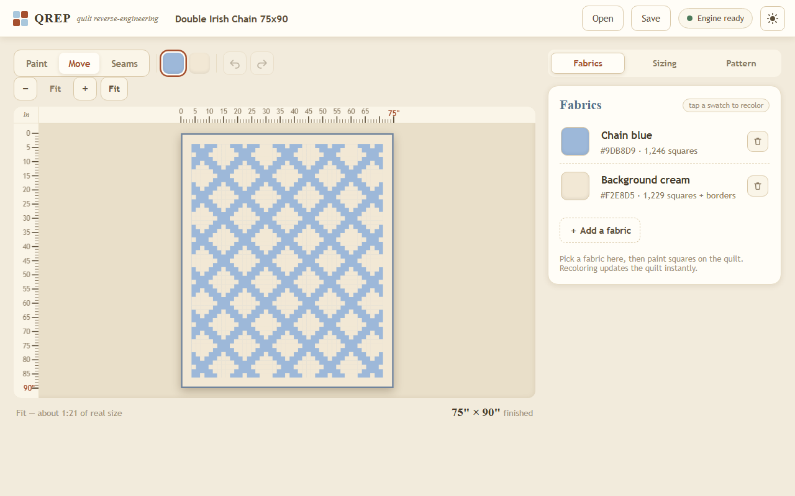

# QREP

[](https://github.com/jakemismas/QREP/actions/workflows/ci.yml)

QREP (Quilt Reverse Engineering Platform) turns quilts into production-ready
patterns: cut lists, yardage, strip-piecing plans, SVG diagrams, and a PDF
pattern booklet, from a photo or from scratch.

**Use it now: <https://jakemismas.github.io/QREP/>**

It runs entirely in your browser. Your photos and designs never leave your
device; there is no server and no account. The Python engine that passes this
repo's test suite runs unchanged in the page through a pinned, self-hosted
Pyodide runtime.



## The web app

Open the link, then load the demo quilt, start from a blank grid, or start
from a photo.

- Photo to pattern: drop a photo, the vision stages recover the grid, fabrics,
  repeats, and borders with honest per-stage and per-square confidence; adjust
  corner pins and re-run when a shot is skewed. The vision engine (about
  11.2 MB) loads on first photo use only.
- Edit: paint squares, manage fabrics (recolor is one edit), undo and redo
  deep history, resize with a proportion lock, add or remove border bands. All
  sizing math is computed by the Python engine; the app adopts its numbers.
- Output: three construction strategies with engine metrics, a per-fabric
  yardage table (binding, backing, batting), five downloads (cut list CSV and
  Markdown, yardage report, SVG diagram, PDF booklet), a one-page print plan,
  and a copy-my-settings summary.
- Saving: your durable save is the downloaded `.qrep.json` project file.
  Browser autosave is a convenience only; Safari deletes site storage after
  seven days away, so the app never pretends otherwise.

All lengths live as integer eighths of an inch, so pattern math is exact and
every export is deterministic: the cut list the browser produces is
byte-identical to the one the native test suite freezes as a golden file.

## The library and CLI (developer surface)

The same engine is a Python library with a pinned CLI, used as the test and
development harness.

### Install

```
git clone https://github.com/jakemismas/QREP.git
cd QREP
python -m venv .venv
.venv/Scripts/python -m pip install -e ".[dev]"
```

Python 3.12+ (3.12 and 3.13 are tested in CI, plus the full suite under the
pinned Pyodide runtime). On macOS/Linux the venv paths are `.venv/bin/...`.
The commands below assume the venv is on PATH.

### Walkthrough: the benchmark quilt end to end

Every command below was re-executed verbatim during Sprint 2 (see issue #47
for the run log). The benchmark model is committed at
`tests/fixtures/double_irish_chain.json`.

Validate the model:

```
qrep validate tests/fixtures/double_irish_chain.json
```

```
OK: Double Irish Chain 75x90 is valid (55x45 cells, 2 fabrics)
```

Plan construction with any of the three strategies (`historical`, `strip`,
`modern`) and compare their metrics:

```
qrep plan tests/fixtures/double_irish_chain.json --strategy strip
qrep plan tests/fixtures/double_irish_chain.json --strategy strip -o plan.json
```

```
strategy: strip
pieces in top: 2479
cut operations: 633
seams: 607
strip sets: 25 physical (5 distinct)
waste: 3.3%
bias edges: 0.0%
difficulty: 16 (rough heuristic)
time estimate: 3968 min (rough heuristic)
yardage - Chain blue (b): 4.25 yd
yardage - Background cream (c): 4.5 yd
yardage - backing, any 42-inch WOF fabric: 5.5 yd
```

Export the full pattern set (cut list markdown + CSV, yardage report, SVG
diagrams with inch rulers, PDF booklet):

```
qrep export tests/fixtures/double_irish_chain.json --strategy strip --out dist/
```

Emit the sizing viewer, a single self-contained HTML file quilters can open
from disk (the web app's Sizing panel supersedes it as the product surface;
the viewer remains a supported artifact):

```
qrep view tests/fixtures/double_irish_chain.json -o viewer.html
```

Render a synthetic photo of the quilt and reverse it back into a model. The
recovered JSON carries real confidence scores; `qrep compare` shows the
round trip side by side:

```
qrep render tests/fixtures/double_irish_chain.json --level 0 --seed 42 -o render_l0.png
qrep reverse render_l0.png -o recovered.json
qrep compare tests/fixtures/double_irish_chain.json recovered.json
```

```
grid dims: truth 55x45 vs recovered 55x45 (MATCH)
cell accuracy: 1.0000 over 2475 cells
palette mapping: f0 -> b, f1 -> c
stage confidence (truth | recovered):
  rectify: 1.0000 | 1.0000
  palette: 1.0000 | 1.0000
  grid: 1.0000 | 0.9647
  cells: 1.0000 | 1.0000
  repeat: 1.0000 | 1.0000
  border: 1.0000 | 1.0000
```

Difficulty levels 0-3 add texture noise, perspective + lighting, and
folds/clutter/occlusion; see [REPORT.md](REPORT.md) for measured accuracy per
level. Absolute scale is unknowable from a single photo, so the recovered
cell size is a labeled low-confidence guess you correct with one edit.

## Project shape

- `qrep/model` pydantic schema, integer-eighths units, benchmark fixture
- `qrep/construct` three construction strategies plus metrics and yardage
- `qrep/export` cut list, yardage, SVG diagrams, PDF booklet
- `qrep/render` seeded synthetic renderer (the CV test oracle), levels L0-L3
- `qrep/vision` rectify, palette, grid, cells, repeats, borders, compare
- `qrep/bridge.py` the engine-side seam the web app calls (JSON envelopes)
- `qrep/viewer` the static sizing viewer emitter (legacy surface)
- `web/` the app: React + TypeScript, Pyodide worker, vendored pinned runtime

Design decisions live in [qrep-design-doc.md](qrep-design-doc.md) and
[docs/sprint-2/qrep-web-design-doc.md](docs/sprint-2/qrep-web-design-doc.md);
sprint status and measured numbers in [REPORT.md](REPORT.md); known
limitations in [KNOWN_ISSUES.md](KNOWN_ISSUES.md) and issue
[#33](https://github.com/jakemismas/QREP/issues/33). MIT license.
