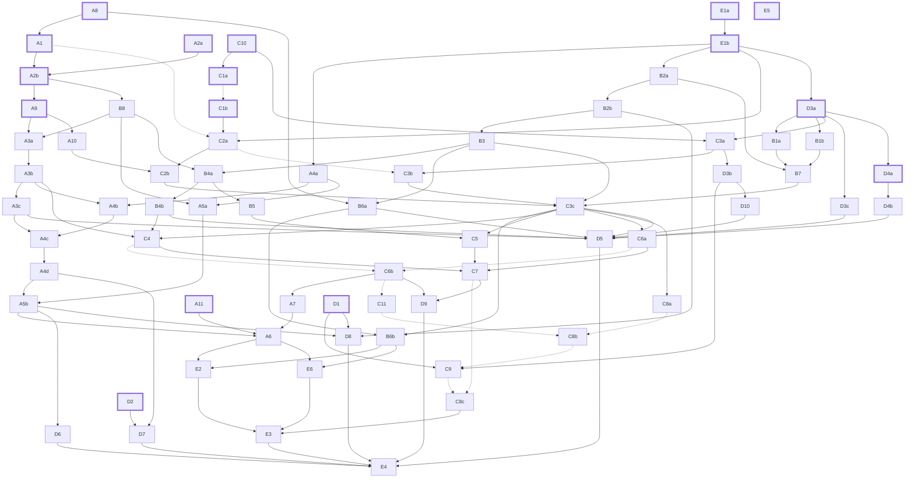

# QREP sprint 5 plan: confirmed read, one sewable pattern, honest math

## 0. Status and authority

**Binding status.** This plan is the binding contract for QREP sprint 5 from the moment its PR
(#107) merges to main. It decides scope, order, gates and authority for every sprint ticket.
Until it merges it is a proposal, and no sprint ticket starts. Why: workers run unattended in
separate tabs, so every rule they need has to live in a committed document, not in a chat.

**Reading order.** Read these before working a ticket. A document never overrides an earlier one
on a subject the earlier one owns.

| # | Document | Owns |
|---|---|---|
| 1 | CLAUDE.md | Non-negotiables: frozen tests and goldens, one-way expected values, a confidence on every CV value, Jake-only authorship, landing rules |
| 2 | docs/SPEC.md | The product contract for 0.4.0: flow, scope, read, pattern, math conventions |
| 3 | docs/sprint-5/qrep-sprint-5-plan.md (this file) | Sprint scope, decisions, tickets, order, gates, authority |
| 4 | docs/sprint-5/MATH.md | Every pattern formula (F1 to F14), defects (D-01 to D-18), hand-computed vectors (V-*), open questions (Q1 to Q11) |
| 5 | docs/sprint-5/PATTERN-SPEC.md | The one pattern document: sections S0 to S11, conventions C-*, method rules M-*, literals L-*, acceptance checks PS-01 to PS-44 |
| 6 | docs/sprint-5/REBASELINE.md | The closed record of retired tests, frozen literals and superseded criteria |
| 7 | docs/sprint-5/REVIEW.md | The verified code review: findings by id (vision-01, engine-13 and so on), each mapped to the ticket that owns its code |
| 8 | docs/sprint-5/ORCHESTRATOR.md | The overnight protocol |
| 9 | docs/sprint-5/WORKER.md | The worker template that carries every non-negotiable |

Precedence:
- CLAUDE.md wins over everything.
- SPEC.md is the product contract for 0.4.0 (its status line), and this plan is the work that
  builds it. SPEC.md changes only through a PR whose issue records Jake's decision: a ticket that
  updates the SPEC.md section its Files owned line names carries out a decision this
  Jake-approved plan records (J14), and any other change to SPEC.md's rules or scope stops at
  BLOCKED.
- MATH.md and PATTERN-SPEC.md are the only homes for numbers and document rules. This plan and
  the tickets cite their ids and never restate a value. Stated formulas with hand-computed
  vectors win; calculators and published patterns are recorded cross-checks, never the source
  of an assertion (Critique: CR-product-16).
- REBASELINE.md is the only authority for retiring a test, a frozen literal or a v1 criterion.
  A failing test it does not list is a bug.
- ORCHESTRATOR.md and WORKER.md say how work runs. Where either conflicts with this plan, this
  plan wins and the conflict is recorded as BLOCKED.
- REVIEW.md turns verified findings into acceptance criteria on the tickets that own the code.
  Findings in code scheduled for deletion become notes on the deletion ticket; a standalone
  issue is opened only for surviving code that no ticket owns (Critique: CR-sequencing-28). Jake
  reads REVIEW.md in the morning; the overnight run does not wait on it, because he approved an
  unattended run (Critique: CR-product-20, gating not adopted).

**What this plan supersedes.**
- The sprint-4 plan's remaining scope. #91 closes as superseded. #95 to #98 and #101 are
  rescoped into tickets: #95 into A4, #96 into C2, #97 into C7 (which fixes #90), #98 into E4,
  #101 into B2 and C3.
- The planning drafts (PLAN-DRAFT.md and ORCHESTRATOR-DRAFT.md), which were never committed.
- Through the governance PR (#106): every v1 build-contract criterion, web design doc item and
  PARITY or UI-SPEC row that REBASELINE.md marks superseded or suspended, and the v1 lines that
  froze today's math (qrep-design-doc.md:74 and :96-99, PARITY.md item 8,
  docs/sprint-4/DECISIONS.md D4; listed in MATH.md section 3.1). SPEC.md records those
  supersessions before A1 or A2 merges (Critique: CR-process-16, CR-sequencing-24).

**Where issue numbers live.** Tickets are named by id (A1, B2, C3 and so on). Their issue
numbers live on the parent issue #104, which carries one sub-issue per ticket, and in
.claude/sprint/STATE.md, which is gitignored and written only by the orchestrator (Critique:
CR-sequencing-27). This plan hard-codes only issues and PRs that already exist: #15 to #21, #50,
#54, #65, #66, #70, #82, PR #84, #86, #90, #91, #94 to #98, #101 and #104 to #108. Why: issue
numbers are assigned when the hierarchy is created, after this plan is written.

**Ticket naming.** Issue titles start with the ticket id, for example "A1: Backing, binding and
batting math", never the "S<n>:" prefix that CLAUDE.md reserves (sprint 4's S3 to S6 are #95 to
#98). Branch per ticket: slice/s5-<id lowercase>-<slug>. One fresh worker tab per ticket. A
writer may split a ticket (A2 into A2a and A2b) or add one with the next free number in its
track, but never renumbers or reuses an id.

## 1. Why: the evidence

[CP] below is the private corpus and prototype facts file, EV/work/facts/corpus-and-prototype.md,
where EV is the private evidence folder whose path STATE.md records (Appendix B), and exp0 to
exp13 are the critic experiments it summarizes in section 3.5. Finding ids (vision-01 and so on)
are verified recon findings; REVIEW.md publishes them. Appendix B indexes every source.

### 1.1 The strongest objection: the current product reads real quilts wrong and says it read them right

Polishing the current pipeline cannot reach a product Jake is proud of. Its automatic read fails
on real photos, and when it fails it often reports success. The green suite (569 passed,
1 skipped at 834d8be; HANDOFF section 4) cannot see either problem, because no test scores a read
against a real quilt (tests-02, vision-03, docs-02).

| What was measured | Result, with n | Evidence |
|---|---|---|
| Field screenshots, automatic path | 0 of 3 read. All three fall to the full-frame fallback (tier 3) and return no_grid, natively and after the Chromium downscale; the runs repeated under Pyodide agree | approaches-24, docs-01 |
| Museum photos, CC0 or public domain | 0 of 16 read (14 no_grid, 2 non_square_repeat), including the straight-set Double Irish Chain that matches the engine's own benchmark | data-16 |
| Museum photos with corners and the true fabric count supplied | Still no grid. On the straight-set Double Irish Chain the estimator locks onto the 5-square block period (80 to 84 px against squares of about 16 px) | data-20 |
| Synthetic photoreal fixtures, automatic path | 12 of 25 "readable" verdicts are wrong (wrong dims, or under 95 percent square accuracy). The 12 correct ones are all the same Irish chain render on different backgrounds | vision-01 |
| Same fixtures with their own sidecar corners supplied (newly verified) | 10 of 29 "readable" verdicts are wrong, including busy prints read as 53 x 45 against a true 13 x 11 | vision-01 (re-verification) |
| The real Irish chain screenshot with hand corners | "readable" in 30 of 30 jittered placements; the dims are never the true 40 x 40, and three border bands collapse into one | vision-02 |
| The same photo on the live site at phone width | "readable" at 42 x 43, labeled "Overall confidence 84% - solid" | docs-01 (re-verification) |
| A wrong read on a fixture | A 46 x 56 read of a 45 x 55 quilt shows "Overall confidence 90% - solid" with no caution layout | web-05, ux-14 |
| Same photo and pins at two window widths | Different size guesses (59 7/8 x 61 1/4 in on desktop against 39 1/8 x 38 1/4 in on a phone) and, in some runs, different square counts, because the staging cap follows the window width | ux-06 |

### 1.2 The confirmed-read prototype and its caveats

The fix is a product change, not more tuning: the user confirms the corners and the counts, and
the engine reads the fabrics. A prototype of that read was measured on one photo (image0, a
1290 x 2796 phone screenshot of a shop listing, 40 x 40 squares, 2 fabrics) and re-run with
identical output ([CP] sections 0 and 3.3):

- Exact corners: Lab 97.62 percent (38 of 1,600 squares wrong), L*0.5 99.00 percent (16 wrong),
  ab-only 99.88 percent (2 wrong). With a vote over the confirmed 10 x 10 block period, all three
  reach 100 percent.
- Random corner jitter, n = 60 trials per radius: without the vote, the share of trials at
  99 percent or better for L*0.5 is 1.00, 0.57 and 0.17 at 0, 2 and 4 px. With the vote it stays
  1.00 up to 4 px, then 0.87 at 6 px and 0.83 at 8 px (exp1).
- Speed: 16 to 88 ms per read natively; about 43 ms per 40 x 40 read under Pyodide in Node, not
  measured on a phone.

Caveats ([CP] sections 3.4 to 3.6):
1. n = 1: a flat, evenly lit studio shot with 2 chroma-distinct fabrics and a strictly periodic
   layout.
2. The corners and the truth phase were fitted to the same photo.
3. 2 of the 4 field corners are invisible: they merge into the blue inner border.
4. ab-only collapses on value-only fabrics (67.94 percent of squares right). Under 40 percent
   light falloff, L*0.5 drops to 70 percent on the color photo and about 69 percent on a
   value-only version; a label-aware shading fit lifts the value-only case to 90 percent (exp7).
   L*0.5 is the safer default.
5. Count suggestion is hard. A seam-energy scorer ranked the 8-block count first, so its top-1
   was exactly 40 x 40 in 0 of 37 trials; on a museum Trip Around the World it found 33 x 33 in
   9 of 10 trials at 8 px jitter (exp9, exp12).
6. A grid-fit score separated the true count from every single-axis miscount from 38 to 42 on
   this photo, but per-square margins flagged 0 of 400 squares at the harmonic 20 x 20 count, and
   the score's ROC is unmeasured (exp2).
7. The left-edge disagreement first blamed on grid drift is a color failure, not misregistration:
   a single grid from four field corners scores 1.000 there with the ab-only distance
   (approaches-33, refuted on re-verification). A local refit is a hypothesis to measure, not a
   known need.
8. The photo is a commercial shop image, so it is private test material and never committed.

### 1.3 The pattern is not sewable and the math does not check out

| Defect | Number | Evidence |
|---|---|---|
| The strip PDF lists squares the strip sets already make | 1,246 blue plus 1,229 cream squares listed as individual cuts beside strip sets SS1 to SS5. Strip is the web default, and the button says "ready to sew" | engine-01; HANDOFF section 4 |
| Yardage is area divided by WOF, with no strip yield and no margin | Fixture cream needs a 166 1/2 in strip plan at 40 in usable width; QREP buys 153 in | engine-02; MATH.md D-10, V-TOP-02 |
| Backing seams only run vertically, and the raw length is rounded | 92 1/2 x 115 queen: 10 1/4 yd today against 8 3/4 yd with the cheaper horizontal layout plus its allowance (a calculator gave 8 3/8 yd; the rest is the allowance and rounding policy in MATH.md Q2 and Q3). 90 x 108 queen: 9 3/4 against 8 1/2. This is the "wayyy too much" backing Jake's mother reported | engine-13; MATH.md D-01, V-BACK-01, V-BACK-07; HANDOFF 1.7 |
| The panel count ignores the backing seam | 76 x 85: two 42 in panels give 83 in after the seam, against 84 in needed | MATH.md D-02, V-BACK-10 |
| Binding ignores the fabric each diagonal join uses | 90 x 108 queen: 10 strips join to 395 in against a 396 in perimeter; it needs 11 | MATH.md D-08, V-BIND-16 |
| Borders longer than one strip | The cut list asks for 83 in pieces from 42 in fabric, with no joining step | engine-06; MATH.md D-11 |
| The PDF is a text booklet | 3 pages, 0 figures, 0 images; binding comes before layering; internal fabric ids are printed | engine-03, engine-08, engine-07 |
| Photo reads often cannot export | The default strip method errors on a third of readable photo reads | engine-04, ux-02 |

### 1.4 The strongest objection to this plan, and the answer

The objection: the confirmed read rests on one photo with corners fitted to it. Real phone
captures today: n = 0. Pin-placement measurements: n = 0 ([CP] 4.2). Triangles widen the scope
where the evidence is thinnest: clean, flag-cleared museum photos per class are squares 8,
HST 4, QST 1, flying geese 2 and snowball corners 0 ([CP] 1.3). A free per-square split detector
made false splits on 3.2 to 10.2 percent of an all-squares quilt (exp8), and 21 to 22 percent of
a star quilt's cells were neither solid nor a clean HST at 6.8 px per half-unit ([CP] 3.6). Users
may not count 40 squares on a phone, and Jake's hours sit on the critical path.

How the plan answers it:
1. Measure before freezing. B1, D3 and D4 run in Phase 1 on the samples already fetched, D3 and
   D4 from night 1. The read knobs (L weight, inset, vote policy, fit thresholds, pixel floor,
   triangle split threshold) ship PROVISIONAL and freeze only after D4 and D5 measure them on the
   corpus (Critique: CR-cv-07, CR-sequencing-11).
2. Gate per tier with n stated. Small tiers are reported as counts, not rates. Jake freezes the
   numbers after the new read is measured, a missed gate holds the release, and the bar is never
   lowered (section 7.2).
3. Real phone captures and a pin-placement test from Jake are required gate inputs: the release
   holds until the phone tier has at least 10 captures (sections 7.2 and 9).
4. Counting gets quilter units, harmonic alternates, a tap-one-square fallback and a grid-fit
   check that blocks a miscounted pattern (section 2), plus a go or no-go decision after B1
   (section 10).
5. The math, which is what Jake's mother rejected, is the first build work: A1 on track A on
   night 1, independent of vision and web (Critique: CR-product-04, CR-sequencing-06).

## 2. Product: the 0.4.0 flow and scope

### 2.1 The flow, screen by screen

Rules for every screen:
- The same photo and pins give the same quilt at any window width. The photo is staged at one
  resolution that does not depend on the viewport, and pins map to image fractions without the
  box padding (ux-06).
- Browser Back returns to the previous screen (ux-15). No screen scrolls sideways at 390 px or
  1440 px (web-02, ux-09). Errors are plain sentences, never engine terms (ux-11). On a phone the
  primary action is visible without scrolling (ux-20, web-17).
- Progress is one honest line. The first visit states the engine download size and shows byte
  progress while the user waits; the six stage meters go (ux-08, ux-13, web-08).

**Screen 1: Photo.**
- The user picks or drops a photo or screenshot of a quilt that lies flat and faces the camera,
  or taps "Try an example": a committed CC0 museum quilt whose stored corners, counts and bands
  open the Confirm screen pre-filled, so a first-time user sees how confirming works (C9;
  Critique: CR-product-23).
- The file is decoded when it is dropped. A non-image or corrupt file shows its error on this
  screen. EXIF orientation is honored, and iPhone HEIC is tested (ux-16; Critique: CR-cv-22).
- The copy invites traditional and antique quilts and quilts you own. It no longer invites shop
  listings, which the read never handled and which raise design-rights questions (ux-01, data-55;
  Critique: CR-product-24).
- Capture tips sit beside the file picker: the whole quilt flat and square-on with a margin
  around it, even light without glare, and, for a screenshot, the quilt zoomed to fill the screen
  before capturing. Why: they give the pixel-floor advice of section 2.3 before the photo is taken
  (C3b; Critique: CR-product-23).
- The visual scope picker follows (section 2.3).

**Screen 2: Confirm corners and grid** (one live-overlay screen; C3, which includes #101).
- Pins start at a neutral inset. QREP never presents a full-frame fallback as a detection
  (approaches-37). A corner suggestion ships only if B1 measures it reliable on the screenshot
  tier, and it proposes the outer quilt edge, which is what backdrop segmentation finds
  (Critique: CR-cv-20).
- Two ways to frame the quilt: pin the four corners of the pieced field, or pin the outer quilt
  edge and set border bands inward. Why: field corners are often invisible, as 2 of 4 were on the
  only real in-scope photo ([CP] 3.4; Critique: CR-cv-08).
- Pins have 44 px hit areas, a loupe while dragging, and pinch-zoom on the photo (ux-12;
  Critique: CR-product-07).
- Counts are entered in quilter units: blocks across x squares per block, and blocks down x
  squares per block, typed or with steppers. The screen shows the totals, for example
  "8 blocks x 5 squares = 40 squares". A quilt with no repeating block uses one block per axis.
  Why: entering the block period is how the user confirms it, and the block period drives the
  read and the method (Critique: CR-cv-03, CR-product-18).
- Suggested counts offer harmonic alternates (for example 40 x 1, 8 x 5 and 20 x 2) and a
  tap-one-square fallback, and appear only when B1 measures them reliable (approaches-07;
  Critique: CR-product-07, CR-cv-19).
- Border bands are a list set inward from the outer edge. Each band takes steppers or a typed
  width in inches, rounded to 1/4 in (vision-05; Critique: CR-cv-25).
- The grid overlay redraws live, in perspective, as pins and counts change.
- The crop happens at full resolution before any device cap: crop to the confirmed frame plus a
  margin, then cap the crop (#101; approaches-30, docs-03).
- Continue stays visible (sticky on a phone) and stays disabled until the photo is staged
  (web-09).

**Screen 3: Colors** (C4).
- A fabric-count stepper starts at the read's suggestion and stops at 12. The recovered quilt
  preview updates as the count changes.
- Color handling is value-aware: L*0.5 is the default color distance, and a label-aware shading
  correction applies to both the fabric list and the square assignment (exp7; Critique:
  CR-cv-10). The L weight is a provisional knob (section 1.4).
- Folding this step into Your pattern with merge chips (Critique: CR-product-19) is not adopted.
  The fabric count feeds the block-consistent vote and the method choice, so it is settled
  before Your pattern; the step costs one tap when the suggestion is right.

**Screen 4: Your pattern** (C2, which rescopes #96).
- The recovered quilt sits beside the photo, with a fabric census of letters, swatches and color
  names that match the PDF (PS-40; PATTERN-SPEC C-02, C-03).
- Finished size: the user picks a finished square size in rotary-friendly steps (the track A
  sizing work defines the list) and border widths in 1/4 in steps; the quilt size follows by
  whole squares and blocks, and the screen shows the achieved size. A size QREP chose by default
  is labeled as a default and never printed as a measurement (PS-09; engine-09; Critique:
  CR-product-12).
- Regions the grid-fit check flags are outlined, with the count of uncertain squares (web-04).
- The region re-read tool (section 2.4).
- One "Download pattern (PDF)" button is the primary action. There is no other download (ux-23;
  PATTERN-SPEC D-09).
- This screen is built before the editor is deleted, so main always has a download (C2 before
  C6; Critique: CR-sequencing-03, CR-sequencing-08).

### 2.2 The read contract: what the engine guarantees

- Inputs: the photo, the confirmed frame (field corners, or outer edge plus bands), counts in
  quilter units, and the fabric count. User-confirmed corners, counts and bands are recorded
  with confidence 1.0, and the output records that the corners were user-set, so evaluation can
  separate corner error from read error (data-48; Critique: CR-process-22).
- Every CV-derived value carries a confidence in [0, 1]: each square's fabric assignment (its
  margin), the suggested fabric count, suggested counts and corners, each square's unit type,
  and the grid-fit scores. A test asserts it (CLAUDE.md; Critique: CR-process-22).
- Block-consistent read. The confirmed block period drives a vote, and only when the grid-fit
  check passes. Squares that break the repeat are listed in the output; deliberate variations
  are kept and flagged, never voted away silently. Method selection consumes this output, so a
  few misreads cannot flip the pattern (PATTERN-SPEC M-03; Critique: CR-cv-03).
- Unit types. Each square is plain, a half-square triangle, a quarter-square triangle, or a
  stitch-and-flip corner (snowball or flying geese), with a fabric per part and a confidence.
  The classifier is constrained by the confirmed block period and measured on the corpus (B4;
  Critique: CR-cv-13, CR-sequencing-13).
- Sampling. The photo is area-downsampled before the warp, because warpPerspective ignores
  INTER_AREA (exp0). Each square is sampled inside an inset. The pixels-per-square floor is set
  from a corpus sweep together with measured pin error, never guessed. Triangles probably need
  about twice the squares' pixel budget; that is an inference from half-unit geometry, not yet
  measured ([CP] 4.1; Critique: CR-cv-24).
- Parity. Evaluation decodes photos through the browser path. Native and browser reads must
  match on every square above the confidence threshold. Native opencv moves to the browser's
  4.11 in B6a, after A8 has turned the legacy byte pins into semantic checks (Critique: CR-cv-21,
  CR-sequencing-04).

### 2.3 Scope: works with these, not yet these

In scope for 0.4.0 (Jake, HANDOFF 2.1; not to be relitigated): quilts on a square grid made of
- squares, including merged same-fabric runs (bars, Irish chains, nine patch, four patch, bricks);
- half-square triangles;
- quarter-square triangles (hourglass, star points);
- stitch-and-flip corners (snowball corners, flying geese);
- plain border bands, with up to about 12 fabrics.

Out of scope and refused early: curves, applique, on-point settings and medallions. Also not yet:
pieced borders (#15), diamonds and hexagons, sashing narrower than one grid square, scrappy
quilts with more than 12 fabrics, and partial views (#54). The scope now includes the
stitch-and-flip and flying geese units that the references Jake's mother curated rely on, while
planned-scrappy designs beyond the fabric cap stay out. D1's list of the most-made traditional
quilts anchors the corpus, the examples and the release demo (Critique: CR-product-06,
CR-cv-05).

**Read, with no quilter's method yet.** Trip Around the World and log cabin quilts are read like
any squares quilt, and the picker does not refuse them, but the methods quilters use for them
(strip tubes, and logs added around a center) are not in 0.4.0. PATTERN-SPEC M-04 merges runs
only along rows and M-05 caps a strip set at 7 strips, so A3b plans these quilts by rows, which
cuts each square that no row run merges. The examples and the release demo use quilts whose
method this section lists as working (C9; section 11). For these two families the plan declines
the critique's request, for the reasons Appendix A gives (Critique: CR-product-05, rejected in
part).

**The visual picker.** After the photo, QREP shows small QREP-drawn diagrams under "Works with
these" and "Not yet these" instead of a yes or no question. Choosing "not yet" ends at the
refusal screen. Why: an owner may call an on-point Double Irish Chain "only squares"; 5 of the 16
museum samples are set on point, and two of those are titled Double Irish Chain ([CP] 1.1;
Critique: CR-product-18, CR-cv-14).

**Refusals.** QREP never produces a PDF with approximations (PS-35, M-14). Every refusal screen
says what QREP reads today and offers next steps: try another photo, or open an example
(Critique: CR-product-23).

| Trigger | What the user is told |
|---|---|
| The picker answer is "not yet" | QREP reads squares and triangles on a straight grid; this design is not supported yet |
| B4 finds out-of-scope cells above its measured threshold | The same, naming what it found |
| Pixels per square fall below the measured floor | Camera photo: take a closer photo. Screenshot: zoom in on the quilt before taking the screenshot |
| The layout needs a partial or set-in seam | It cannot be sewn with straight seams yet (PS-34, M-13) |
| The fabric count would exceed 12 | Scrappy quilts are not supported yet |

### 2.4 The grid-fit check and the region re-read

**Grid-fit check** (B3). After every read, QREP scores seam alignment and within-square
homogeneity for the whole quilt and per region (exp2).
- A global failure blocks the download with "The grid does not line up with the quilt's seams.
  Check the corner pins and the counts." and a button back to Confirm that keeps the pins and
  counts. Why: with editing gone, a miscounted grid would otherwise produce a confident pattern
  nobody can fix (Critique: CR-product-09, CR-cv-12).
- A regional flag warns. Your pattern outlines the region and offers the region re-read; the
  download stays enabled, and the PDF prints the count of uncertain squares and dots them on the
  layout chart (PS-15, PS-31).
- Thresholds are PROPOSED from B3 and D4 measurements that include simulated miscounts and
  harmonic counts. G3 in section 7.2 gates detection (Critique: CR-product-11).

**The region re-read** (B5 engine, C5 interface). Jake's words (HANDOFF 2.2, 2026-10-06): "Use a
expanding square tool to highlight part of the quilt that is wrong, this could include a section
or the whole thing."

Working interpretation, FLAGGED FOR JAKE'S CONFIRMATION (section 9, item 1): on Your pattern the
user drags or expands a square selection over a wrong region, from a few squares up to the whole
quilt. QREP re-reads only that region (local grid refit, recount if needed, fabric
re-assignment) and shows a before and after to accept or discard. It is a re-read, not paint
editing. The grid-fit check still runs and flags suspect regions automatically. Tap-to-change
editing of single squares is not adopted, because Jake chose the re-read (Critique:
CR-product-10, CR-cv-23). Two sub-questions ride with the confirmation: may a whole-quilt
selection change the confirmed counts, and may a region re-read add a fabric? Because the one
drift case examined was a color failure (approaches-33), B5 measures whether a local refit helps
before relying on it.

### 2.5 One pattern outcome

- The engine chooses one construction method per quilt and states the deciding fact in one
  plain sentence, units first (PATTERN-SPEC section 3: M-01, M-02, M-07, M-09; Jake, HANDOFF 1.6).
- Same-fabric runs merge. Strip sets appear only where row signatures repeat. HST, QST, snowball
  and flying geese units each use the one technique quilters recognize. Every join is a straight
  seam, and a layout that needs a partial seam is refused (M-04, M-05, M-13; Critique:
  CR-product-05). The straight-seam rule stays in 0.4.0 because merged runs depend on it
  (Critique: CR-sequencing-21, not adopted).
- There is no strategy picker, strategy name, alternate method, difficulty score or time
  estimate anywhere (PS-05, PS-33; engine-15, ux-21). The strategy cards, the planning of all
  three strategies on every revision, and the stub strategies go (Critique: CR-sequencing-20).
- The PDF follows PATTERN-SPEC.md and is checked against PS-01 to PS-44. Every number comes from
  MATH.md through one cutting layout (M-10).

### 2.6 What is removed

Archived at tag archive/editor-v0.3 on commit 834d8be (Jake, HANDOFF 2.4), then deleted:
- The web editor (C6): paint, palette editing, the seams tool, the Sizing tab, undo and redo,
  autosave and resume, save and open project files, the blank-grid start, the failure-screen
  "Start in the editor", the round-trip panel, the spike page, the strategy cards and the five
  per-artifact download buttons.
- The automatic read (B6): rectify tiers 0 to 3 and GrabCut, grid estimation, periodicity,
  block-lattice SNR, the verdict tree and its copy, corroboration, the border scan, the palette
  detrend, the wasm gate, their frozen literals, and the stage meters and verdict story.
- Engine dead code (A7): resize_locked and resize_unlocked, the sprint-1 viewer package and
  qrep view, stub strategies and dead fields.

Restoring editing later is a re-port onto the new state hooks, not a revert; Jake accepted that
cost (HANDOFF 2.4; Critique: CR-product-22, CR-sequencing-29, CR-process-29). The qrep CLI stays
as the developer and test surface. Every deletion follows expand, then contract (section 4.4).

## 3. Approved decisions and limits of authority

### 3.1 Jake's decisions

Dates come from HANDOFF.md: sections 1 and 2 were answered in the planning chat on 2026-10-06;
section 8 was recorded on 2026-10-07 at 00:05.

| ID | Decision | Date | Source |
|---|---|---|---|
| J1 | Narrow the focus, remove editing for now, and reach a polished product he is proud of | 2026-10-06 | HANDOFF 1.1 |
| J2 | A full code review first; clean up messes; file new GitHub issues | 2026-10-06 | 1.2 |
| J3 | Real reference data (real quilts and patterns) to compare results against | 2026-10-06 | 1.3 |
| J4 | Spikes and research agents as needed | 2026-10-06 | 1.4 |
| J5 | Rotate chats at high context; worker chats he can watch in tabs | 2026-10-06 | 1.5 |
| J6 | ONE pattern outcome, formatted like the reference patterns his mother curated. The references are private: structure and conventions only, never their text or diagram art | 2026-10-06 | 1.6 |
| J7 | Fix the math his mother rejected; she called the backing "wayyy too much" | 2026-10-06 | 1.7 |
| J8 | An overnight unattended run with full system access, ending in a report, with agents that compare QREP against online calculators and real quilts | 2026-10-06 | 1.8 |
| J9 | Scope: squares and triangles now (HST, QST, stitch-and-flip corners including flying geese). Do not relitigate | 2026-10-06 | 2.1 |
| J10 | Misreads: an expanding-square region re-read (section 2.4; interpretation awaiting his confirmation) | 2026-10-06 | 2.2 |
| J11 | Re-baseline through one closed record that names every retired test, frozen literal and superseded criterion; a CLAUDE.md clause that any other failing test is a bug; test_roundtrip keeps its L0/L1/L2 thresholds with corners and counts from the hand-authored fixture; legacy byte pins become semantic checks, never re-captured; expand, then contract | 2026-10-06 | 2.3 |
| J12 | Delete editing, archived at archive/editor-v0.3; restoring it is a re-port | 2026-10-06 | 2.4 |
| J13 | WOF 40 in usable for strip cutting, configurable. Backing has its own width, 42 in by default, configurable, with a 108 in wide-back option. The pattern states both. This refines the WOF = 40 decision on #91 (2026-07-10) | 2026-10-06 | 2.5 |
| J14 | Approvals granted by pasting the setup prompt (section 3.2) | 2026-10-06; granted 2026-10-07 | 2.6, section 8 |
| J15 | Every chat, orchestrator and workers alike, is an agent tab in his QREP VS Code window, launched with zero clicks. He ticked VS Code's "don't ask again" for the launch links (2026-10-06) and approved bypassPermissions as the VS Code user-setting default (done) | 2026-10-07 | 8 |
| J16 | His mother is not available. D1 quilter-voice research and the D8 virtual quilter panel replace every item that asked her; her review stays optional if she becomes available | 2026-10-07 | 8 |
| J17 | Rules that follow from J15: the setup chat is the overnight orchestrator, one fresh tab works each ticket, and tabs stay open for him to read | 2026-10-07 | 8 |

### 3.2 Pre-authorized actions (the exact list)

Jake granted these by pasting the setup prompt, which names HANDOFF section 2.6 and section 8, in
the setup chat on 2026-10-07. Each is done by the setup chat or by the ticket named, and nothing
broader is implied.

1. Push tag archive/editor-v0.3 at 834d8be.
2. Land #105, the toolchain and CI PR, with the worker bootstrap and teardown scripts and the
   .gitignore entries.
3. Deploy Pages only on release tags or workflow_dispatch during the sprint, including a v* tag
   rule in the github-pages environment's deployment policy, which today admits only main and
   gh-pages (repo-facts finding 3).
4. Land #106, the governance PR (SPEC.md, REBASELINE.md, the CLAUDE.md amendments, the PARITY and
   UI-SPEC suspension), then post superseding comments on #65, #66, #91 and #94.
5. Land #107, this plan's PR.
6. Create the issue hierarchy under #104, one sub-issue per ticket, plus the Jake queue comment
   and the digest of verified findings and the prototype on #104.
7. Close #91 as superseded, and close #19 and #50.
8. Rescope #95 to #98 and #101 into tickets (section 0).
9. Add a backlog label to #15, #16, #17, #18, #20, #21, #54 and #86.
10. Relabel #90 and #86 to area: web.
11. Fold #82 into the corpus work (D3 and D4).
12. Protect main: the required checks in section 7.1, non-strict, admins enforced.
13. Run the worker bootstrap (scripts/worker_bootstrap.sh) for each worker.
14. Run one dry-run worker.
15. Launch the overnight run after the dry run passes.
16. Retire tests exactly as REBASELINE.md lists them, executed by A7, B6b, C3c, C6a and C6b
    (section 4.5), each retiring only the tests REBASELINE.md assigns to it. C3c retires one,
    web/e2e/verdicts.spec.ts, because once C3c sends every photo read to Your pattern, no read
    reaches the failure panel that the test checks.
17. Make the single consolidated [bless] commit in A6, naming its goldens.

### 3.3 Not approved

- Tagging or publishing a release, creating a GitHub release, or dispatching a Pages deploy.
- Force pushes and history rewrites of any kind.
- Any [bless] other than A6's.
- Any test retirement, threshold change, golden or frozen-fixture change, or acceptance-criterion
  change that REBASELINE.md and the ticket do not name.
- Repository settings other than items 3 and 12.
- Changes to Jake's machine: VS Code settings, power settings, hooks, aiguard.
- Merging over red CI, a worker merging its own PR, rm, and AI attribution anywhere.
- An agent merging a PR that changes .github/workflows/ or a scripts/*_guard.py. Jake reviews
  and merges it (section 7.1).

Anything not listed in section 3.2 goes to Jake's queue as BLOCKED. The orchestrator records it
in STATE.md, in the overnight report and in a comment on #104, and work continues on other
tickets.

### 3.4 Consequences and clarifications

- No agent message counts as Jake's approval; only his own messages or the permission system do.
  A worker that needs an approval not listed above stops and records BLOCKED; overnight it does
  not ask (Critique: CR-process-23).
- Jake did not see the generated REBASELINE.md list before approving the governance PR. The
  morning report lists every retirement executed, with its ticket, so he can review it (Critique:
  CR-process-02, CR-process-01).
- Order: archive tag, #105, #106, #107, tracking, branch protection, dry run, overnight run. No
  closure or rescope happens before #106 merges, and no Phase 2 ticket starts before it
  (Critique: CR-process-06, CR-sequencing-24).
- WOF (J13). Rounding increment and allowances remain open in MATH.md Q2 and Q3; the MATH.md
  defaults stand until Jake answers (Critique: CR-product-03, CR-sequencing-09).
- One bless. A6 blesses once, after the math (A1, A2) and the document bytes (A4, A5) settle,
  after C6 and A7, and after Jake answers MATH.md Q2, Q3 and Q7 or accepts the defaults (section
  9). A7 goes first because it retires tests/test_viewer.py, whose fixture test pins the stored wof
  of 336 that A6 regenerates to 320, and because A7 removes no planner or exporter that A6 moves
  (A7 keeps them for the KEEP tests). A6 blesses three goldens, cutlist_strip.md,
  cutlist_strip.csv and top.svg (the last only if its bytes change), and adds none: its
  browser-against-native text check compares two renders in one run (A6), and a new golden file
  needs an amendment. REBASELINE.md's [bless] policy items 2 and 5 must say the same, and section
  4.5's setup check confirms it. Every change to cut-list or SVG bytes, including construct and
  yardage cleanup, lands in A6 or before it; every ticket leaves the goldens unchanged except A6's
  [bless] commit, which golden-guard enforces (Critique: CR-product-17, CR-sequencing-07).
- Legacy pins (J11) become semantic checks against the hand-authored fixture: A8 replaces the
  byte comparison on night 1, and B6a moves the checks onto the confirmed read before B6b deletes
  the automatic pipeline. B6b retires only test_pin_committed, which checks that the pin files
  exist, together with those files. Retiring the checks outright is not adopted (section 4.5;
  Critique: CR-sequencing-05, CR-sequencing-26).
- Native dependencies stay pinned at today's versions (opencv-python-headless 5.0.0.93 in
  constraints.txt); B6a moves native opencv to 4.11 after A8 has converted the legacy byte pins,
  because pinning 4.11 first breaks one of them (Critique: CR-sequencing-04, CR-process-08).
- CLAUDE.md changes reach main only through Jake's own sessions: the setup chat's #106 or Jake's
  queue. Why: every worker gets its task by message, and Claude Code tells a session never to
  change CLAUDE.md because another session asked (cross-session messaging rules). Three lines ride
  in #106 while it is open: E5's rule that a tests/fixtures/ change needs a [bless] or
  `Rebaseline:` trailer; E2's status source, issue state plus sub-issue progress on the sprint
  parent (docs-09); and, on the xfail line, that the escape needs Jake's approval and stops at
  BLOCKED overnight (section 7.1). Any line #106 lacks once merged goes to section 9, item 11.
- His mother (J16). D1 stands in for her cases. If she supplies her exact backing case, it
  becomes V-MOM-01, a failing hand-computed test written before any fix (MATH.md Q1). D8 replaces
  her release review (Critique: CR-product-01, CR-product-02).
- Pages (item 3). v0.3.0 stays live until Jake publishes 0.4.0, so half-built states never reach
  the product URL (Critique: CR-product-14, CR-process-14).
- The VS Code bypass default (J15) is a user setting, so it applies to every VS Code workspace on
  the machine, not only QREP. Jake chose user scope; reverting it is in his queue (Critique:
  CR-process-10, workspace scope not adopted).
- The dry run proves the tab launch end to end, including one rotation-style launch. Overnight
  only the QREP window stays in front, and the dry run records which window received the tab
  (Critique: CR-product-21, CR-process-09, CR-sequencing-19).

## 4. Tracks, file ownership and contract files

### 4.1 Tracks

One writer per file at a time. Every ticket lists the files it owns, tests and docs included,
in its issue body (Critique: CR-process-19).

| Track | Owns | Notes |
|---|---|---|
| A: engine math, construction and pattern export | qrep/construct/, qrep/export/, sizing in qrep/model/ | Math first (A1 on night 1). One purchase-line function feeds the CLI, the metrics and every export (engine-14) |
| B: read (vision) | qrep/vision/ (the new confirmed read) and the deletion of the automatic stack | Read knobs ship provisional (section 1.4) |
| C: web | web/src/ except the contract files, and web/e2e/ | Your pattern (C2) before the editor removal (C6) |
| D: corpus, eval, research, comparisons | corpus/, scripts/eval/ (or qrep/eval/ excluded from the browser wheel), tests/eval/, docs/sprint-5/evidence/ | Report-only: never changes product behavior. Eval code stays out of the wheel the browser loads (vision-21) |
| E: docs and infra | docs/ except docs/sprint-5/evidence/, .github/, pyproject.toml, constraints.txt, CLAUDE.md, infra scripts in scripts/ | ci.yml is a contract file. A rule a worker needs before its PR merges goes in WORKER.md, not a branch-only CLAUDE.md edit (orchestration-19). No ticket edits CLAUDE.md; its changes go through the setup chat or Jake (section 3.4) |

### 4.2 Contract files, serialized

From the ticket skeleton: qrep/bridge.py, web/src/engine/worker.ts, the single TS result-types
file that E1 creates (none exists at 834d8be; repo-facts section 4.4), tests/test_bridge.py,
.github/workflows/ci.yml and tests/conftest.py.

Added by this plan:
- qrep/model/schema.py. Why: track A changes its settings (strip WOF default, backing width,
  wide-back width; MATH.md section 1.3) and track B adds per-square unit types (data-23,
  approaches-23), so the two would otherwise collide.
- qrep/contract.py, the Python half of the TS result-types file (web/src/engine/contract.ts). It
  holds CONTRACT_VERSION and the pydantic request and response models, and a test keeps their
  field names equal to the TS types (E1a, E1b). Every ticket that owns the TS result-types file
  owns qrep/contract.py too, and every owner of either also owns qrep/bridge.py, so the three
  leases move together. Why: a contract change edits both halves and bumps the version in one
  commit, so a ticket that held only one half would break the agreement test or stop at BLOCKED.

Rules:
- At most one open ticket at a time touches any contract file. The orchestrator records the
  lease in STATE.md, and the holder's PR merges before the next holder starts.
- A contract change bumps CONTRACT_VERSION in Python and TypeScript together. The web worker
  checks it at boot and fails with a clear error (E1).
- A missing field never defaults to a success value. Today a missing verdict renders as
  "readable" (web/src/model/verdictStory.ts:82; Critique: CR-sequencing-01).
- The orchestrator owns ci.yml and conftest.py; a ticket that needs a change asks for it through
  the lease (Critique: CR-sequencing-30).

### 4.3 Files outside every track

A file no track owns (for example qrep/cli.py, qrep/vision/compare.py,
scripts/sprint4_baseline.py, tests/test_smoke.py, web/scripts/compose-site.mjs, README.md and
docs/SPEC.md) is changed only by a ticket that lists it in Files owned, and the orchestrator lets
one open ticket at a time hold it, as for contract files (Critique: CR-sequencing-30). Two
named rules:
- CHANGELOG.md and the version strings (pyproject.toml, qrep/__init__.py, web/package.json)
  change only in E4's release PR (Critique: CR-sequencing-32, CR-process-27).
- docs/SPEC.md changes in the same PR as the behavior it describes (section 0).

### 4.4 Expand, then contract

Rule: a replacement lands and is live on main before the code it replaces is deleted. Why: main
and its tests stay green at every merge, and the app never loses its download (Jake, HANDOFF 2.3;
Critique: CR-process-04).

| Old surface | Replacement (expand) | Removed by | Removal waits for |
|---|---|---|---|
| Automatic read (section 2.6) | E1 bridge v2 beside v1; B2 confirmed read; B3 grid-fit check; C3 confirm screen | B6 | B2, B3 and C3 merged and the web calling the new read; B1's decision on which repeat and vote code a suggestion method reuses (approaches-40) |
| Web editor and the five per-artifact downloads | C2 Your pattern with one download; C3 | C6 | C2 and C3 merged; e2e specs that reach exports through the editor rehomed onto Your pattern (tests-18) |
| resize_locked, resize_unlocked, the viewer package, qrep view, stub strategies, dead fields | A3 one method; one sizing module in qrep/model/ | A7 | C6 merged, so the web no longer calls resize_*; PRESETS, round_div and any whole-block sizing that Your pattern needs moved into the sizing module first (Critique: CR-process-05, CR-product-15) |
| Bridge v1 methods | E1 v2 contract beside v1 | The removal ticket of each method's last caller (B6, C6, A7) | No web caller left (Critique: CR-sequencing-02). A method that a REBASELINE.md KEEP test calls, such as plan, export_cutlist_md or export_cutlist_csv, stays this sprint (A7 non-goals) |
| Native opencv 5.0.0.93 (constraints.txt) | Native opencv 4.11, the version the browser build runs | B6a | A8 merged, so the legacy byte pins are semantic checks |

More rules:
- Measurements of the old code run on the engine of the start SHA, the commit the overnight run
  starts from (ORCHESTRATOR.md section 6, step 2): D2's "before" column and D4a's baseline of the
  automatic read. The setup PRs change no file under qrep/, so its engine equals 834d8be's. The
  orchestrator bootstraps D2 from the start SHA once a commit since the start has touched qrep/
  (ORCHESTRATOR.md section 15). D4a starts from origin/main like any ticket, because it needs
  D3a's merged code, and measures its baseline first, before any merge of origin/main into its
  worktree; it changes no file under qrep/. Only B6b, in Phase 3, changes the automatic read's
  files (qrep/vision/ outside the new qrep/vision/read/), so D4a's tree still holds the start
  SHA's read, and D4a checks that before it measures. Each report records the SHA it measured.
  Why: WORKER.md R1 forbids a worker to create a worktree, and 834d8be predates constraints.txt,
  which the bootstrap requires. No deletion waits for these measurements (Critique:
  CR-process-28).
- No module that a measured suggestion method needs is deleted before B1 records its decision on
  the ticket (Critique: CR-sequencing-10).
- A deletion removes every registration of the old surface: worker allowlist entries, routes,
  menu entries, exports, e2e specs, CI steps and the support files REBASELINE.md lists. A
  reviewer treats an orphan as a major finding.

### 4.5 Who executes each REBASELINE.md entry

REBASELINE.md names the ticket that executes each retired or re-expressed test, and a ticket
executes exactly the entries that name it (section 3.2, item 16; CLAUDE.md). This plan owns
ticket scope, so the record's Ticket column uses this plan's ids. Its setup draft predates the
split tickets and A8 and names base ids, so this table maps those entries. A draft base id the
table does not mention means the part of the split that owns the test's file. Why: an entry that
names a ticket which cannot run it stops that ticket at BLOCKED overnight (REBASELINE.md binding
rule 7).

| Entries (ticket in the setup draft) | Executed by | Why |
|---|---|---|
| test_legacy_regression.py::test_legacy_path_byte_stable[0] to [2] (B2) | A8, then B6a | A8 replaces the byte comparison on night 1, because A1, A2b and A9 change the Settings those pins store; B6a moves the checks onto the confirmed read before B6b deletes the automatic pipeline |
| test_legacy_regression.py::test_pin_committed[0] to [2] (B2) | B6b | They check that the pin files exist, and B6b deletes those files |
| The other read re-expressions (B2) and test_rectify_tiers.py's one re-expression (B6) | B6a, except test_bridge.py's read test, which B6b re-expresses under its contract lease | Every read test moves to the confirmed read before B6b deletes the old path |
| The other detector entries (B6) | B6b | B6b deletes what they exercise |
| The A2 entries | A2b | A2a changes no existing file |
| test_pdf.py, test_wasm_artifacts.py and test_bridge.py's export_pdf test (A4) | A6 | A6 moves `qrep export` and the bridge exports onto the new document |
| test_construct.py's assembly-steps test (A3, A4) | A6, if a change needs it | A3 and A4 build new modules and leave the old planners' steps alone; A6 owns the file when it moves the exporters |
| verdictStory.test.ts with its two copy-audit ids and the three verdict and pill invariants (B6); the photoFlow.test.ts detection tests and crop.spec.ts's sample-bypass test (C3) | C6b | C6b deletes the verdict UI, the detection paths and the sample-photo path; C3b leaves PhotoFlowMachine unchanged (expand, then contract) |
| verdicts.spec.ts (C3) | C3b, then C3c, which retires it | Once C3c sends every photo read to Your pattern, no read reaches the failure panel that the test checks, so it would fail from C3c until C6b deletes the verdict UI. Before then, C3b moves its traversal of the solid photo onto the confirm screen with its assertions unchanged (the record's "Before then" note). It is the record's one retirement outside A7, B6b, C6a and C6b |
| app.spec.ts's two demo tests and exports.spec.ts's determinism test (C6), and photo.spec.ts's opencv-free test (C6, which retires it), all re-expressed on See a sample pattern | C2a | Section 5.C decision 2 keeps the sample pattern |
| exports.spec.ts's yardage-table test, re-expressed on Your pattern (C6, which retires it after A1's restatement); size.spec.ts's three tests (C2, C3, C6); copy-audit-verdicts.test.ts's lede test (C2) | C2b | Your pattern shows the yards and the size control (section 5.C decision 1) |
| crop.spec.ts's confirm-screen test, and photo.spec.ts's L0 read, cancel, corner-adjust, idle-prefetch, pre-prefetch loading-bar and vision-copy tests (C2, C3) | C3b, then C3c | C3b changes how each test reaches the read (it places or accepts the pins and enters the counts), and C3c lands the read on Your pattern; the record names both tickets on each of these entries |
| photo.spec.ts's session-only test (C6) | C3c, then C6a, which retires it | After C3c only the synthetic sample photo reaches the old results screen and its Open in the editor action, so C3c starts the test from that photo with its assertions unchanged (the record's "Before then" note) |
| The other editor entries (C6) | C6a | C6a deletes what they exercise |
| compose-site.test.ts's legacy-URL test (E2) | None: the record keeps it | It checks only that viewer.html and demo/booklet.pdf exist in the composed site (compose-site.test.ts:38-41), so it passes unchanged after A7 replaces docs/viewer.html with a redirect stub; A7 adds a new test for the redirect |

The record also carries these decisions of this plan: its [bless] policy item 6 names A8 and B6a
for the legacy semantic checks; criterion P2 keeps the demo quilt as See a sample pattern
(section 5.C decision 2); P25 lets Your pattern show the PDF's yards, as PATTERN-SPEC PS-40
requires, while the Pattern tab's yardage table leaves (decision 1); W23 and the record's closing
decision let C6a delete web/src/model/sizing.ts and web/src/shell/PalettePanel.tsx (decision 5);
and every criterion this plan cites, P13, W14 and S1-2 among them, has a row.

The record must also agree with two decisions of this plan, which several of its rows depend on:
- Section 3.4's bless: [bless] policy item 2 names exactly the three goldens A6 blesses, with no
  tests/golden/pattern_dic.txt; item 5 puts A6 after A7; and neither the
  test_build_view_config_fixture row nor criterion W14 asks A6 to restate a test that A7 retires
  or to keep a new golden. MATH.md section 3.2's tests/test_viewer.py row follows the same order.
- Section 5.C decision 4: the idle prefetch stays, so C8b executes no entry on photo.spec.ts's
  idle-prefetch, pre-prefetch and vision-copy tests and keeps them passing unchanged, and
  criterion P24 stays standing. An entry or criterion row that moves the vision load to photo
  start contradicts decision 4.

**Setup check.** Before #106 merges (#107 merges after it), the setup chat confirms every item in
this section against REBASELINE.md, the two decisions above included, and runs
`rebaseline_inventory.py --check`. It also confirms that #105's corpus-guard accepts D3a's data
paths and its file_sha256 column (section 5.D rules) and that #106's CLAUDE.md carries the lines
section 3.4 names. A mismatch is fixed in #106 or in this plan before either merges. After #106
merges, a mismatch needs an amendment that Jake approves (REBASELINE.md, Amending this record),
and the ticket it affects stops at BLOCKED. The same check confirms that SPEC.md section 2 lists
the screen order of section 2.1 (section 5.C decision 6) and that the note atop PARITY.md agrees
with decisions 2 and 4.

## 5. Tickets

Each ticket below is written to be pasted as the body of its sub-issue under #104, titled
"<ID>: <title>" (section 0). Its Depends on and Files owned lines are canonical: section 6 derives
the graph and the file overlaps from them and checks the night-1 order against them, so a
dependency or an owned file changes on the ticket first. Why: one home per fact, and a graph kept
by hand drifts from its tickets.

- A base id names every part of a split ticket: C3 means C3a, C3b and C3c.
- Each header's review level (core or standard) is defined in section 7.3.
- Finding ids (engine-13, ux-06 and so on) resolve in REVIEW.md; vector, check and literal ids
  resolve in MATH.md and PATTERN-SPEC.md; criteria and test ids resolve in REBASELINE.md.

| Track | Section | Tickets | Count |
|---|---|---|---|
| A | 5.A Engine math, construction and export | A1, A2a, A2b, A3a, A3b, A3c, A4a, A4b, A4c, A4d, A5a, A5b, A6, A7, A8, A9, A10, A11 | 18 |
| B | 5.B Read | B1a, B1b, B2a, B2b, B3, B4a, B4b, B5, B6a, B6b, B7, B8 | 12 |
| C | 5.C Web | C1a, C1b, C2a, C2b, C3a, C3b, C3c, C4, C5, C6a, C6b, C7, C8a, C8b, C8c, C9, C10, C11 | 18 |
| D | 5.D Corpus, eval, research and comparisons | D1, D2, D3a, D3b, D3c, D4a, D4b, D5, D6, D7, D8, D9, D10 | 13 |
| E | 5.E Docs and infra | E1a, E1b, E2, E3, E4, E5, E6 | 7 |
| All | | | 68 |

### 5.A Engine math, construction and export (track A)

Track A owns qrep/construct/, qrep/export/, the sizing and pattern fields of qrep/model/, the tests
of that code (tests/test_construct.py, test_exports.py, test_pdf.py, test_svg.py, test_fixture.py,
test_model.py, test_size_engine.py and the new test files below) and
tests/fixtures/double_irish_chain.json. qrep/cli.py and tests/test_cli.py belong to the track A
ticket that lists them, one at a time (section 4.3).

Rules for every track A ticket:

1. **Tests first, from hand arithmetic.** Write the failing tests before the code. Every expected
   value comes from a MATH.md section 4 vector or from arithmetic written in the test comment,
   never from running QREP and never from a calculator; MATH.md section 5.1 keeps calculator
   values as cross-checks. Why: CLAUDE.md's one-way rule, and this math is what Jake's mother
   rejected.
2. **Expand, then contract.** New behavior lands in new modules beside the old strategies and the
   old booklet. A7 deletes the dead code once C6 and A10 merge; then A6 moves the command line and
   the golden-pinned exporters onto the new pipeline and blesses once (section 3.4; REBASELINE.md
   [bless] policy item 3). The historical, strip and modern planners stay, because KEEP tests call
   them. Why: main stays green and always has a download (section 4.4; Critique: CR-process-04,
   CR-sequencing-07).
3. **The DIC fixture keeps its stored 42 in until A6.** qrep/model/io.py serializes every model
   field, so a new field changes the fixture's bytes, and the legacy byte pins store full
   recovered models, settings included. A8 converts those pins first. Then every ticket that adds
   a model field (A1, A2b and A9 here; B8 and B2a in track B) regenerates
   tests/fixtures/double_irish_chain.json with no value change and cites its REBASELINE.md entry
   in a `Rebaseline:` commit trailer, which E5 enforces. Only A6 regenerates it at the MATH.md
   defaults. Why: the cut-list goldens read the fixture, and only A6 may change goldens.
4. **Only REBASELINE.md-named tests change.** A ticket re-expresses or retires exactly the tests
   REBASELINE.md assigns to it. Any other failing test is a bug. A needed change outside the list
   stops the ticket as BLOCKED until REBASELINE.md is amended. Why: HANDOFF 2.3 and section 3.3.
5. **Defaults stand until Jake answers.** Tickets build on the MATH.md defaults and the
   PATTERN-SPEC L-01 to L-14 proposals (section 9, item 3). An answer that arrives after a ticket
   merges becomes a follow-up ticket with new vectors, never an edit of merged vectors.
6. **One writer per file.** qrep/model/schema.py is a contract file (section 4.2): A1, A2b, A9 and
   A7 take its lease in that order, interleaved with B8. A1, A2b and A9 add optional fields or
   change a default, so they do not bump CONTRACT_VERSION; A7's removals do. qrep/cli.py belongs
   to A2b in phase 1 and to A7, then A6, in phase 3. A ticket that changes binding behavior updates
   its docs/SPEC.md section in the same PR and holds the section 4.3 lease only for that commit.

Night 1 candidates in this track: A8, A1, A2a, A2b, A9 and A11. Section 6 orders them.

#### A1: Backing, binding and batting math

- Track A, phase 1, size M, review core
- Depends on: A8 (a new Settings field fails the legacy byte pins until A8 converts them)
- Files owned: qrep/construct/finishing.py (new); qrep/construct/yardage.py;
  qrep/construct/strategies.py (the import block at :8-24 and the binding count at :129-146 and
  :243 only); qrep/construct/__init__.py (the BACKING_NAME import and export at :20 and :29
  only, which follow that constant if this ticket replaces it); qrep/export/pdf.py
  (the backing, batting and binding lines only); qrep/export/yardage_report.py;
  qrep/model/schema.py (Settings; contract file, serialized by the orchestrator);
  tests/test_finishing_math.py (new); tests/test_construct.py; tests/test_exports.py;
  tests/fixtures/double_irish_chain.json; web/e2e/exports.spec.ts (the yardage-table test only;
  the orchestrator holds any C ticket that edits this file until A1 merges); docs/SPEC.md (math
  defaults section)
- Night 1: yes (the first build work, right after A8; no Jake input), Needs Jake: no (MATH.md
  defaults stand for Q2, Q3, Q5 and Q7; his mother's case, Q1, joins as V-MOM-01 if it arrives)

**Description**

QREP seams backing only vertically, ignores the seam allowance, adds no squaring allowance and
prints "42-inch" whatever the setting, so a 92 1/2 x 115 in queen buys 10 1/4 yd where 8 3/4 yd
covers it (MATH.md D-01 to D-04, V-BACK-01). Binding counts ignore the strip width each diagonal
join uses, so five of the sizes MATH.md checks come out shorter than the bare perimeter (D-08).
This ticket implements MATH.md F6 to F12 from vectors written first, gives backing its own width
setting (default 42 in, with a 108 in wide-back option; HANDOFF 2.5), and routes every backing,
binding and batting number through one function per line. It is the sprint's first build work
because this is the math Jake's mother rejected.

**Acceptance criteria**

- [ ] Write the tests before the code from MATH.md section 4, each with its arithmetic copied into
  a comment: V-UNIT-03, V-UNIT-06, V-BIND-01 to V-BIND-18, V-BACK-01 to V-BACK-23, V-WIDE-01 to
  V-WIDE-10 and V-BATT-01 to V-BATT-13. Build each test's settings explicitly, so no test depends
  on a default.
- [ ] Implement binding (F6, F7) in one helper, strips = ceil(T / (U - w)) with w from
  Binding.strip_width, and replace the copies at strategies.py:133, strategies.py:243 and
  pdf.py:211 (D-08).
- [ ] Implement backing (F8 to F10): both orientations, 1 in lost per seam, +9 in for two or more
  panels and +4 1/2 in for one, totals compared, vertical seams kept on a tie. Return the panel
  count, panel cut length, seam direction, length_needed, purchase and increments (D-01 to D-03;
  engine-13).
- [ ] Add Settings fields in eighths: backing width (default 336), wide-back width (864), pieced
  allowance (72), one-piece allowance (36) and purchase increment (72). Leave the strip-cutting
  `wof` default as it is; A2b changes it (D-05).
- [ ] Add the wide-back line (F11) only when the pieced layout needs two or more panels; omit it,
  rather than print zero, otherwise, and print no 108 in line when both backing dimensions exceed
  108 in (V-WIDE-05 to V-WIDE-07; D-06).
- [ ] Size batting from settings.backing_margin and name the smallest of the five MATH.md packages
  that covers it in either orientation, else "larger than a king package (124 x 120 in)"
  (F12; V-BATT-10). Delete the constant at pdf.py:37-39 (D-13).
- [ ] Build the backing line name and the PDF backing text from the backing width, printing the
  panel count times the panel length and the seam direction, and route pdf.py:226 through the
  shared backing function (D-04, D-14).
- [ ] Regenerate tests/fixtures/double_irish_chain.json so it carries the new settings keys at
  their defaults with no other byte change (tests/test_fixture.py:16-20), with its REBASELINE.md
  entry in a `Rebaseline:` trailer.
- [ ] Re-express exactly the pins REBASELINE.md assigns to A1, with values from MATH.md:
  tests/test_construct.py::test_fixture_backing_line (V-BACK-09: 1568 e, 23 qy); the backing
  assertions of ::test_yardage_hand_computed_on_tiny_quilt (V-TOP-04: 112 e raw, 148 e purchase,
  3 qy); tests/test_exports.py::test_yardage_report_has_binding_and_backing_lines (backing
  5 3/4 yd per V-BACK-09; binding stays 9 strips and 180 e, because the fixture still stores 42 in,
  V-BIND-09); and the web/e2e/exports.spec.ts yardage-table test (23 quarter yards, "5 3/4").
- [ ] Replace the private import of `_pytest.outcomes.Failed` at tests/test_exports.py:9 with
  `pytest.fail.Exception` (tests-19).
- [ ] Reserve vector id V-MOM-01. When Jake supplies his mother's case (MATH.md Q1), add it as a
  failing hand-computed test before any fix; until then D1's quilter-voice vectors stand in
  (Critique: CR-product-01).
- [ ] Leave every file under tests/golden/ unchanged: at the fixture's stored 42 in, the
  join-aware count still gives 9 binding strips (ceil(2720 / 316) = 9).
- [ ] Update the math defaults section of docs/SPEC.md, and pass ruff, the native suite and the
  Pyodide suite.

**Non-goals**

- Strip yields, borders, top-fabric yardage and the strip-cutting default (A2a, A2b).
- Web copy: the "wide backing fabric, seamed to fit" label at PatternPanel.tsx:294, the batting
  yards the web computes itself and the one-width footer (D-07, D-15, D-16) leave with the old
  panel; the Your pattern screen (C2) shows engine numbers only.
- The bridge summary's second width (D-17; E1b).
- Changing an expected value to match a calculator; D2 and D7 record differences (MATH.md 5.1).
- Removing Settings.binding_strip_width (D-09; A7).

**Evidence:** engine-13, tests-19. Critique: CR-product-01, CR-product-03, CR-product-04,
CR-product-16, CR-sequencing-06, CR-sequencing-09, CR-process-06.

#### A2a: Strip-yield, strip-set, border and top-fabric functions

- Track A, phase 1, size M, review core
- Depends on: none
- Files owned: qrep/construct/cutting.py (new); tests/test_cutting_math.py (new)
- Night 1: yes (new files only, so it can run beside A1), Needs Jake: no

**Description**

QREP buys quilt-top fabric by area divided by WOF, which assumes pieces nest with no strip
remainder and adds no margin, so the fixture's cream comes out 13 1/2 in short of its strip plan
(MATH.md D-10, V-TOP-02). This ticket writes MATH.md F2 to F5 as pure integer-eighths functions,
tested first against every section 4.1 and 4.2 vector. The functions take the strip width, margin
and increment as arguments and change no existing file, so they merge without moving any pin;
A2b wires them in.

**Acceptance criteria**

- [ ] Write the tests before the code, arithmetic copied into comments: V-UNIT-01, V-UNIT-02
  (including 200 e to 220 e, the value that catches a floating-point margin), V-UNIT-04, V-UNIT-05,
  V-YIELD-01 to V-YIELD-03, V-SET-01, V-SET-02, V-BORD-01 to V-BORD-04, and the top-fabric lines
  of V-TOP-01 to V-TOP-04.
- [ ] Implement F2: try both orientations, keep the shorter length, break a tie toward the
  narrower strip, and report the pieces from the last strip. When the long side exceeds U, use the
  joined cut, compare it with orientation 2 for every quantity (no fixed threshold), and raise an
  error when both sides exceed U.
- [ ] Implement F3: segments per set = floor(U / segment cut width), sets = ceil(needed / per
  set), and strips per fabric = sets x its count in the sequence.
- [ ] Implement F4 per piece: strip width b + 1/2 in, side length Li + 1/2 in, top and bottom
  length Wi + 2b + 1/2 in, a pair that fits one strip sharing it, k = ceil((Lp - j) / (U - j))
  strips for a piece longer than U, and an inner size that grows by 2b per band. Return the strips
  per piece and the cut lengths that A4c prints (PATTERN-SPEC X-05).
- [ ] Implement F5 with integers only: purchase = ceil(length x (100 + p) / 100) and increments =
  ceil(purchase / r), with no decimal factor (MATH.md 1.2).
- [ ] Take U, p, r, j and the seam allowance as arguments, and import nothing from
  qrep.construct.strategies or qrep.model.schema.
- [ ] Use no calculator figure as an expected value (MATH.md 5.1).

**Non-goals**

- Wiring the functions into purchase lines, the CLI or the exports (A2b).
- Pooled border counting, which MATH.md Q6 keeps out unless Jake picks it.
- Fat quarter recipes (MATH.md 1.1).

**Evidence:** engine-02 (vectors; the wiring is A2b), engine-06 (border data). Critique:
CR-sequencing-06, CR-product-16.

#### A2b: Purchase lines from the cutting layout and the 40 in default

- Track A, phase 1, size M, review core
- Depends on: A1, A2a (both change the purchase lines; V-TOP-04 needs A1's binding and backing)
- Files owned: qrep/construct/yardage.py; qrep/construct/strategies.py (the yardage import at
  :18-22, the cut-line grouping at :149-176, the waste metric at :279-285 and plan_modern's
  rectangles at :516-579 only); qrep/construct/__init__.py (the compute_yardage import and export
  at :25 and :41 only); qrep/model/schema.py (Settings; contract file, serialized by the
  orchestrator); qrep/model/fixtures.py; qrep/export/yardage_report.py; qrep/cli.py (the plan
  command and the module entry point); tests/test_construct.py; tests/test_exports.py;
  tests/test_cli.py; tests/fixtures/double_irish_chain.json; docs/SPEC.md (math defaults section)
- Night 1: yes (after A1 and A2a merge; no Jake input), Needs Jake: no

**Description**

The CLI, the metrics, the yardage report, the PDF and the web read different yardage computations,
and the CLI's figures disagree with the report's (engine-14). This ticket makes one purchase-line
function, built on A2a's strip plans, the only source of fabric amounts, deletes the area-based
paths, and moves the strip-cutting default to 40 in usable width, as Jake decided (HANDOFF 2.5).
The DIC fixture keeps its stored 42 in until A6, so no golden moves here.

**Acceptance criteria**

- [ ] Rebuild compute_purchase_lines on A2a: top-fabric lines from per-line strip plans (F2),
  strip-set strips (F3), border bands (F4) and the stated margin (F5), nothing from area (D-10,
  D-11; engine-02, engine-06).
- [ ] Group a rectangle and its quarter turn into one cut line, short side first, in the shared
  cut-line grouping (strategies.py:149-176) that plan_modern's merged rectangles feed
  (strategies.py:516-579) (PATTERN-SPEC C-10; engine-19).
- [ ] Feed `qrep plan`, the waste metric and every exporter from that one function, and delete
  compute_yardage and compute_yardage_from_components with every import and export of them
  (cli.py:8 and :78, strategies.py:20, qrep/construct/__init__.py:25 and :41; D-18; engine-14).
- [ ] Add a top-margin setting (default 10 percent), and make format_yards print mixed fractions of
  the configured purchase increment (F5, F13; PATTERN-SPEC GAP-06).
- [ ] Change the Settings.wof default from 336 to 320 (D-05). Pin make_double_irish_chain to an
  explicit wof of 336, so the committed fixture and every golden keep their bytes until A6
  (Critique: CR-process-16).
- [ ] Re-express exactly the v1 pins REBASELINE.md assigns to A2b. Where its row allows, pin the
  old hand computation to an explicit wof of 336 and add a new test at the new default instead of
  editing old arithmetic. This covers tests/test_construct.py::test_yardage_hand_computed_on_tiny_quilt
  against purchase lines (V-TOP-04, every line) and ::test_subcut_counts_hand_computed_on_checker_quilt.
- [ ] List in the PR body every pin the 40 in default touches, each with its REBASELINE.md entry
  (docs-05).
- [ ] Add a `__main__` guard to qrep/cli.py, so `python -m qrep.cli` runs the app instead of
  exiting silently (engine-20).
- [ ] Regenerate tests/fixtures/double_irish_chain.json for the new settings key only, with its
  REBASELINE.md entry in a `Rebaseline:` trailer, and leave every file under tests/golden/
  unchanged.
- [ ] Update the math defaults section of docs/SPEC.md.

**Non-goals**

- The one-method planner and merged strip sets (A3a, A3b); the old strategies keep their strip
  sets until A7.
- Printed cutting instructions (A4c).
- Regenerating the fixture at 40 in (A6).

**Evidence:** engine-02, engine-06, engine-14, engine-19, docs-05, engine-20 (entry point).
Critique: CR-sequencing-07, CR-process-16, CR-product-03, CR-sequencing-30.

#### A3a: Block structure, merged runs and strip-set signatures

- Track A, phase 2, size M, review core
- Depends on: A2b (cut lines), A9 (the confirmed block structure), B8 (the unit map)
- Files owned: qrep/construct/blocks.py (new); qrep/construct/decompose.py (new);
  tests/test_blocks_decompose.py (new); tests/fixtures/pattern_models/ (new hand-authored models)
- Night 1: no (phase 2), Needs Jake: no (the L-03 and L-13 proposals stand)

**Description**

Block inference accepts any period with eight or fewer types, so a random grid becomes
one-of-a-kind "blocks" and a strip plan of 80 single-use sets (engine-11), and strip sets sew a
fabric to itself in 74 of the fixture's 100 long seams (engine-05). This ticket builds the data
the one-method planner chooses from, per PATTERN-SPEC section 3: the block structure (from the
user's confirmed counts, else a plausibility gate), merged same-fabric runs, strip-set signatures
and the rows layout.

**Acceptance criteria**

- [ ] Take the block structure from the model's confirmed block structure (A9) when present.
  Otherwise apply the M-03 gate with the L-13 numbers (at most 8 types, every type used at least
  twice except at most one, types at most a quarter of the block count), and return none when it
  fails (engine-11).
- [ ] Return no block structure for random 40 x 40 two-fabric grids with seeds 1, 2 and 3, which
  today give 20 x 20 blocks with 4 single-use types (PATTERN-SPEC Appendix B, C5).
- [ ] Merge same-fabric runs of plain cells (M-04): consecutive cells of one fabric in a block row
  become one piece cut (run x cell) + 1/2 in, consecutive full-width single-fabric rows become one
  rectangle, and no merge includes a unit cell.
- [ ] Cap a merged run at the strip-cutting width, so no piece is longer than one strip (MATH.md
  Q8 default).
- [ ] Build strip-set signatures (M-05): 2 to 7 strips after merging, a signature and its reverse
  sharing one set, a signature filling at least half a set (L-03), a single-piece row cut as a
  rectangle, and a row with a unit never strip pieced (engine-05).
- [ ] Reproduce the PATTERN-SPEC section 3 worked example on the DIC built with an explicit wof of
  320: three three-strip signatures made in 5, 3 and 5 sets (13 sets, 26 long seams), 100 blue
  2 x 8 in and 49 cream 5 x 8 in rectangles, and cream (11) 2 in and (5) 5 in set strips plus
  (10) 5 in strips for the rectangles, each value hand-computed in a comment.
- [ ] Build the rows layout for a grid without blocks (M-07 c), switching to columns when that
  needs fewer pieces after merging. A hand-built 7-bar quilt plans merged bar pieces, never one
  square per cell (Critique: CR-product-05).
- [ ] Add the DIC with one deliberate odd block and a confirmed 5 x 5 block structure to
  tests/fixtures/pattern_models/ for A3b.

**Non-goals**

- Choosing the method, the reason sentence and refusals (A3b).
- Triangle and stitch-and-flip techniques (A3c).
- Optional plain sub-units (M-06, S5.6).

**Evidence:** engine-05, engine-11. Critique: CR-product-05, CR-cv-03.

#### A3b: One method per quilt, its reason and the straight-seam check

- Track A, phase 2, size M, review core
- Depends on: A3a
- Files owned: qrep/construct/method.py (new); tests/test_method_selection.py (new);
  docs/SPEC.md (construction section)
- Night 1: no (phase 2), Needs Jake: no

**Description**

The web defaults to the strip strategy, which raises an error on a third of the reads the old
detector called readable and on the fixture after 7 misread squares (engine-04). The modern
strategy can produce blocks that no straight-seam order can sew (engine-10), and the web plans all
three strategies on every change (engine-17). This ticket picks exactly one method per quilt with
a one-sentence reason, never fails silently, checks that every join is a full straight seam, and
plans only the chosen method.

**Acceptance criteria**

- [ ] Choose one method (M-07): (a) strip sets when a block structure exists and plain signatures
  repeat, (b) blocks from units and cut pieces, (c) rows. Break ties by the effort count (pieces
  cut + crosscuts + seams sewn, each strip-set seam counted once per set, plus a penalty for unused
  segments); triangle work never decides a tie.
- [ ] Fall back to rows with a reason, never an error, when no block structure exists: the DIC
  with the engine-04 perturbation (one flipped cell in each of 7 blocks) and no confirmed structure
  returns the rows method (engine-04).
- [ ] Return the rows method with its reason sentence, never strip sets or a refusal, for a
  hand-built 15 x 15 Trip Around the World and a hand-built quilt of 8 x 8 log cabin blocks with
  whole-square logs, whose quilter methods section 2.3 defers (M-04 merges only along rows; M-05
  allows at most 7 strips), and file the section 11 backlog issue for those methods with each
  plan's piece count (Critique: CR-product-05).
- [ ] Keep the method and list the exceptions when a confirmed structure exists: the A3a odd-block
  model keeps strip sets and names its odd block, never a silent fallback (Critique: CR-cv-03).
- [ ] Write the reason sentence (M-09) naming the deciding fact, with no strategy names and no
  effort numbers.
- [ ] Check every join for a full straight edge, in the order units, block rows, blocks, quilt
  rows, center, borders (M-13), and refuse a layout that needs a partial or set-in seam (PS-34,
  PS-35). Test the check on the engine-10 pinwheel decomposition of [[a, a, b], [b, c, b],
  [b, a, a]], which no straight-seam order sews.
- [ ] Return a typed refusal for a model with a cell outside plain, HST, QST, snowball and flying
  geese (M-14; PS-35).
- [ ] Expose the chosen method as a stable identifier plus the reason, so D4 can score agreement
  with the truth model's method (section 7.2 G6; Critique: CR-cv-04).
- [ ] Feed only the chosen plan's cut lines into the A2b purchase lines (M-10), and report in the
  PR the planning time for a random 221 x 186 two-fabric grid, a size on which engine-17 timed the
  modern scan at 62 to 119 s.
- [ ] Update the construction section of docs/SPEC.md.

**Non-goals**

- Deleting the historical, strip and modern planners (A7) or the strategy cards (C6).
- Unit techniques (A3c).

**Evidence:** engine-04, engine-10, engine-17. Critique: CR-cv-03, CR-cv-04, CR-sequencing-20,
CR-sequencing-21 (not adopted: HANDOFF 5 requires a straight-seam sewing order, so the check
stays).

#### A3c: Triangle and stitch-and-flip units

- Track A, phase 2, size M, review core
- Depends on: A3b, B8 (the unit map)
- Files owned: qrep/construct/units.py (new); tests/test_unit_construction.py (new);
  tests/fixtures/pattern_models/ (the unit quilts)
- Night 1: no (phase 2), Needs Jake: no (the L-06 oversize-and-trim and L-07 pressing proposals
  stand as settings until Jake freezes them)

**Description**

The 0.4.0 scope includes half-square triangles, quarter-square triangles and stitch-and-flip
corners (HANDOFF 2.1), and nothing in construct or export handles them today (PATTERN-SPEC GAP-13).
This ticket turns B8's unit map into cut lines, make counts, mirror pairs and one pressing plan,
with the MATH.md F14 cut sizes and one technique per unit type (M-02).

**Acceptance criteria**

- [ ] Write the tests before the code from MATH.md 4.8, arithmetic in comments: V-TRI-01 to
  V-TRI-09.
- [ ] Implement exactly one technique per unit type (M-02): HSTs two at a time, QSTs from two
  HSTs, snowball corners and flying geese by stitch and flip, with F14 cut sizes. Make the L-06
  cut mode a setting: oversize and trim by default, exact cut available (MATH.md Q9).
- [ ] Turn unit counts into cut lines through F2 (V-TRI-08), and report the spare units of an odd
  count (V-TRI-09).
- [ ] Count mirror-image QST units separately, with a warning flag and make counts that account
  for mirror pairs (PS-24), implementing PATTERN-SPEC Appendix A with its derivation in the test
  comment. Record on the issue that D1 or D8 must confirm or refute the rule before PS-24 counts
  toward the release gate.
- [ ] Reject snowball corners whose legs along one side exceed that side's finished length
  (PATTERN-SPEC S5.3).
- [ ] Produce one pressing plan per quilt (M-08, L-07): open when HST or QST points meet at seams,
  nest otherwise, border seams toward the border.
- [ ] Order the work units first: HST, QST, snowball, flying geese, strip sets (M-02).
- [ ] Add hand-authored models to tests/fixtures/pattern_models/: an HST quilt, a two-fabric
  hourglass quilt, a snowball quilt and a flying geese quilt, which A4b to A6 reuse.

**Non-goals**

- Three- and four-fabric hourglass counts beyond Appendix A (MATH.md F14 edge cases).
- Unit steps and figures (A4d, A5b).

**Evidence:** no verified finding; PATTERN-SPEC GAP-13, GAP-15 and GAP-16. Critique:
CR-product-06.

#### A4a: Pattern document renderer and page rules

- Track A, phase 2, size M, review standard
- Depends on: E1b (the interim qrep/export/pattern.py and the pattern summary type)
- Files owned: qrep/export/pattern/ (this package replaces E1b's interim module; A4a owns
  __init__.py, document.py and render.py); tests/test_pattern_render.py (new)
- Night 1: no (phase 2), Needs Jake: no (the L-10 type sizes stand as proposed)

**Description**

The current PDF has three pages, no figures, no footer or page numbers, and its bytes differ
between two command-line runs (PATTERN-SPEC GAP-01 to GAP-03; engine-20). This ticket builds the
renderer and the page rules every section uses: US Letter pages, the footer, type sizes,
deterministic bytes, the PS-02 section order, and typed figure requests that A5a and A5b draw.
The sections come in A4b to A4d; together the four tickets rescope #95.

**Acceptance criteria**

- [ ] Render US Letter portrait pages (612 x 792 pt) with side margins of at least 36 pt (G-01;
  PS-01, PS-38).
- [ ] Print a footer on every page with the pattern name, "page N of M" and the QREP version, and
  no date (G-02; PS-03).
- [ ] Keep text at or above 10 pt in the body, 9 pt in tables and 7 pt in figure labels (L-10;
  PS-42; GAP-25).
- [ ] Set reportlab invariant mode inside the renderer, so two command-line renders of one model
  give identical bytes (PS-04; engine-20).
- [ ] Lay out sections in the PS-02 order with the cover alone on page 1, keep each step on the
  same page as its figure, and never split a table row across pages (G-04; PS-44).
- [ ] Resolve figures through typed figure requests: the renderer asks qrep.export.figures to draw
  a request when that module provides the kind, and otherwise draws a labeled placeholder frame
  that the A11 checker reports.
- [ ] Format every length as a mixed fraction in eighths with an inch mark and every dimension
  with " x " (PS-06; C-07, C-09, C-10), keep all text extractable (G-10; PS-41), and print none of
  the PS-05 banned items, including difficulty, minutes and piece totals (engine-15).
- [ ] Keep build_pattern's interim output (E1b) until A4d switches it to the new document.

**Non-goals**

- Section content (A4b to A4d) and drawings (A5a, A5b).
- An A4 paper variant and metric output (PATTERN-SPEC section 1).

**Evidence:** engine-20, engine-15. Critique: CR-sequencing-18.

#### A4b: Cover, fabric requirements and Before you begin

- Track A, phase 2, size M, review core
- Depends on: A4a, A1, A2b, A3b (the build line), A9 (the size basis)
- Files owned: qrep/export/pattern/cover.py, requirements.py, basics.py, names.py and fabrics.py
  (new); qrep/export/pattern/document.py (adding these sections); tests/test_pattern_front.py
  (new)
- Night 1: no (phase 2), Needs Jake: no (the L-01, L-02 and L-11 proposals stand)

**Description**

Today's cover reads "QREP pattern booklet", the fabric table prints internal ids and hex codes,
photo reads name a fabric "Fabric 1" while the steps call it "f0", and a guessed size prints as
fact (PATTERN-SPEC GAP-05, GAP-19; engine-07, engine-09). This ticket writes the cover, the fabric
requirements and the Before you begin rules per PATTERN-SPEC S1 to S3. Fabric letters and plain
color names replace ids everywhere, and the size basis is stated honestly.

**Acceptance criteria**

- [ ] Assign fabric letters A to M without I in order of area, a binding-only fabric last, with
  unique plain color names and value words, "Background" for a light fabric A, and authored names
  kept (C-02, C-03; PS-10; engine-07). Support up to 12 fabrics (HANDOFF 5).
- [ ] Write the cover (S1): the model's name or a plain generated name checked against the
  denylist, never "in the style of" (C-01; PS-08); the finished size equal to the model's (PS-07);
  a build line naming the method in plain words; the fabric count; the size basis line from the
  model (PS-09; engine-09); the uncertain-squares pointer for photo reads; and one designer-respect
  line in QREP's words (L-11; Critique: CR-product-24).
- [ ] Write Fabric requirements (S2) from the A1 and A2b purchase lines only: a row per top fabric
  (swatch, letter, name, yards); the binding row with "(N) 2 1/2 in x WOF strips"; the backing row
  as N lengths of L in with the seam direction, plus the 108 in alternative or the no-single-width
  statement; the batting row with its package; the allowance line; both width assumptions; the
  supplies line, with a marking tool and a square ruler when units exist; and the 1 in test square
  with the print note on page 2 (PS-10 to PS-14, PS-20, PS-38; G-09).
- [ ] Write Before you begin (S3): the nine numbered rules plus the photo-read tenth, every number
  generated from settings (MATH.md 1.5) and every abbreviation defined before its first use
  elsewhere (PS-15).
- [ ] Print one binding strip count in every section, equal to MATH.md F7 for the quilt's
  perimeter (PS-11).
- [ ] Fill the pattern summary (E1b) from the same data, so the Your pattern screen shows the
  finished size, fabric names and yards the PDF prints (PS-40).
- [ ] Pass the A11 checks for PS-07 to PS-15 on the DIC fixture and the A3c unit quilts.

**Non-goals**

- The user's photo beside the cover render (L-14 stays off in 0.4.0).
- Fat quarter offers (M-12, PS-21; L-04 is not frozen).
- Recognizing traditional pattern names from a catalog (section 11; Critique: CR-sequencing-25).

**Evidence:** engine-07, engine-09. Critique: CR-product-24, CR-product-12, CR-cv-05, CR-cv-23,
CR-sequencing-25.

#### A4c: Cutting instructions and the cut-list text

- Track A, phase 2, size M, review core
- Depends on: A4b, A3c
- Files owned: qrep/export/pattern/cutting.py and cutlist_text.py (new);
  qrep/export/pattern/document.py (adding the section); tests/test_pattern_cutting.py (new)
- Night 1: no (phase 2), Needs Jake: no

**Description**

The strip-strategy PDF lists all 1,246 blue and 1,229 cream squares as cuts beside the strip sets
that already make them, and asks for 83 in border pieces from 42 in fabric (engine-01;
PATTERN-SPEC GAP-11, GAP-12). This ticket writes the cutting section as strips, then subcuts, from
the one cutting layout, with lettered pieces, per-strip yields and joined border strips. It also
renders the cut-list markdown and CSV that A6 re-blesses.

**Acceptance criteria**

- [ ] Write each fabric's numbered steps as "Cut (N) W in x WOF strips." with indented subcuts
  that give the label, count, size, per-strip yield and total, plus the partial last strip when
  there is one (S4; PS-16).
- [ ] List strip-set fabric only as strips, never as cut pieces (PS-17; engine-01).
- [ ] Label pieces with the fabric letter plus a number in cutting order, unique across the pattern
  and reused in every later section (C-05; PS-18).
- [ ] Make each label's total equal the sum over units and blocks of pieces per unit times make
  count, plus any stated spare (PS-19).
- [ ] Print border strips with the join and the two cut lengths from A2a's F4, the same computation
  that gives the strip count (PS-28; X-05; engine-06).
- [ ] Print binding strips under the binding fabric, and triangle-unit pieces at the A3c cut size
  with the unit they feed (S4).
- [ ] Order each fabric's steps as border strips, binding strips, strip-set strips, then the rest
  from the widest strip to the narrowest (M-11), and add the per-block tally when blocks repeat.
- [ ] Render the same layout as cut-list markdown and CSV text for A6's goldens, with structural
  tests only; no golden changes here.
- [ ] Pass the A11 checks for PS-16 to PS-20 on the DIC fixture and the A3c unit quilts.

**Non-goals**

- Re-blessing tests/golden/cutlist_strip.md and .csv (A6).
- Fat quarter diagrams (PS-21).

**Evidence:** engine-01, engine-06. Critique: none.

#### A4d: Construction steps, borders and finishing

- Track A, phase 2, size M, review standard
- Depends on: A4c
- Files owned: qrep/export/pattern/construction.py and finishing.py (new);
  qrep/export/pattern/document.py (adding the sections); qrep/export/pattern/__init__.py
  (switching build_pattern); tests/test_pattern_construction.py (new); docs/SPEC.md (pattern
  document section)
- Night 1: no (phase 2), Needs Jake: no

**Description**

The current steps bind the quilt before layering or quilting, describe binding twice, give
pressing only for borders and print one numbered step per block row (engine-08; PATTERN-SPEC
GAP-15 to GAP-17, GAP-21). This ticket writes Making the units, Making the blocks, Quilt assembly,
Borders and Finishing per PATTERN-SPEC S5 to S9 from A3b's plan and A3c's units, then switches
build_pattern to the new document.

**Acceptance criteria**

- [ ] Open construction with the method's reason sentence and the sewing order in one line (S5;
  PS-33).
- [ ] Write each unit with its piece list, numbered steps, a checkpoint and "Make N." (S5; PS-22,
  PS-23, PS-24). Write each block with its piece and unit list, steps, a checkpoint equal to its
  finished size plus 1/2 in, and a make count equal to its count in the layout (S6; PS-25, PS-26).
- [ ] Write quilt assembly in two or three sentences plus the quilt-center checkpoint, with no
  numbered step per row (S7; PS-27).
- [ ] Write borders sides first, then top and bottom, pressed toward the border, with a
  measure-and-trim instruction (S8; PS-28).
- [ ] Write finishing in sewing order: backing, layering and basting, quilting, binding. Describe
  the binding procedure only here; Before you begin keeps one sentence (S9; PS-29, PS-30;
  engine-08).
- [ ] State A3c's pressing plan in every step that presses (M-08).
- [ ] Request every figure by kind and cite it as "Fig. N" from its step (G-05; PS-36), and keep
  every number in a figure label equal to the text (PS-43).
- [ ] Switch build_pattern from E1b's interim booklet to the new document, and pass every A11
  scriptable check on the DIC fixture and the A3c unit quilts, the figure checks excepted until
  A5b.
- [ ] Update the pattern document section of docs/SPEC.md.

**Non-goals**

- Drawings (A5a, A5b) and goldens (A6).

**Evidence:** engine-08. Critique: none.

#### A5a: Figure toolkit and whole-quilt figures

- Track A, phase 2, size M, review standard
- Depends on: A4a, B8 (triangle units in the cover render)
- Files owned: qrep/export/figures/ (new package: __init__.py, base.py, cover.py, assembly.py,
  chart.py, coloring.py, backing.py); tests/test_figures_quilt.py (new)
- Night 1: no (phase 2), Needs Jake: no (the L-08 and L-09 proposals stand)

**Description**

The PDF has no image on any page, and the block, strip-set and assembly SVGs reach only the
command line (engine-03; PATTERN-SPEC GAP-18). Whether reportlab graphics run unchanged in the
pinned Pyodide runtime is unverified (GAP-18). This ticket proves that path first, then draws the
whole-quilt figures in QREP's own flat style: the cover render, the exploded assembly, the border
and backing figures, the layout chart and the coloring page.

**Acceptance criteria**

- [ ] Prove first that a reportlab graphics drawing embeds in a PDF under the pinned Pyodide
  runtime, with a test that the pyodide-tests job runs. If it fails, stop and report BLOCKED with
  the error instead of adding a dependency (GAP-18; Critique: CR-sequencing-18).
- [ ] Draw the G-07 symbols once: the pressing arrow, the press-open mark, the dashed sewing line
  and the dotted cutting line.
- [ ] Draw the cover render of the whole top, with borders, binding and triangle units drawn as
  triangles, and with width and height dimension lines that match the printed size (S1; PS-07).
- [ ] Draw the exploded quilt assembly with row numbers and the borders apart (S7; PS-27), the
  border figure (S8), and the backing layout with its seam direction and overhang (S9).
- [ ] Draw the layout chart (S10; PS-31): row and column numbers, a letter in every cell, split
  units, a dot on every square the read reports uncertain (B2a, B3), and split pages labeled with
  their ranges and one shared row or column. Draw the optional coloring page as the same outline
  unfilled (S11; PS-32; L-08 on by default).
- [ ] Label every patch in every figure so a grayscale print stays readable, outline every swatch
  (G-08; PS-37), and keep labels at or above the L-10 minimum.
- [ ] Draw from the model only, with fills that match the swatches (G-06; PS-36), and imitate no
  reference pattern's art or page design.

**Non-goals**

- Unit, strip-set, block and binding-corner figures (A5b).
- Changing render_top_svg; tests/golden/top.svg stays as it is.

**Evidence:** engine-03. Critique: CR-sequencing-18, CR-cv-23.

#### A5b: Unit, strip-set, block and binding figures

- Track A, phase 2, size M, review standard
- Depends on: A5a, A4d, A3c
- Files owned: qrep/export/figures/units.py, strips.py, blocks.py and binding.py (new);
  qrep/export/figures/__init__.py (registering the kinds); qrep/export/svg.py (:254-267 and
  :278-291 only); tests/test_figures_units.py (new)
- Night 1: no (phase 2), Needs Jake: no

**Description**

Block SVGs draw cells only, without labels or exploded rows; the strip-set SVG's crosscut marks
stop 18 px short of the bottom strip; and the no-block assembly SVG has no viewBox and draws only
a title (engine-18; PATTERN-SPEC GAP-18). This ticket draws the step figures for every unit
technique, the strip sets, the exploded blocks and the binding corner, so every step that names a
figure has one, and repairs the two old SVG defects.

**Acceptance criteria**

- [ ] Draw a figure per step for HST, QST, snowball and flying geese units, with pressing symbols,
  and mirror pairs side by side and labeled (S5.1 to S5.4; PS-22, PS-24).
- [ ] Draw each strip set with labeled strips in sewing order, a pressing symbol, and dotted
  crosscut lines across the full height of the set (S5.5; X-10; engine-18).
- [ ] Draw each block type exploded and assembled, every patch labeled, with pressing symbols that
  nest or press-open marks (S6; PS-25).
- [ ] Draw the two-panel binding corner (S9; PS-30).
- [ ] End svg.py's crosscut marks at the bottom of the set, and give the no-block assembly SVG a
  viewBox and a row schematic (engine-18).
- [ ] Keep every number in a figure label equal to the text (PS-43), cite every figure as Fig. N
  from a step, and match the legend to the symbols used (PS-36).
- [ ] Pass every A11 check on the DIC fixture and the A3c unit quilts with no placeholder frame
  left.

**Non-goals**

- New SVG exports; the PDF is the one download (PATTERN-SPEC D-09).

**Evidence:** engine-18. Critique: none.

#### A6: Fixture at the new defaults and the one consolidated [bless]

- Track A, phase 3, size M, review core
- Depends on: A4d, A5b, A7 (it retires the viewer test that pins the stored wof of 336), A10, A11,
  C6 (no web caller of the strategy-taking exports remains), and everything those depend on
- Files owned: qrep/model/fixtures.py (or the module A7 moves it to under the tests folder);
  tests/fixtures/double_irish_chain.json; tests/golden/ (the [bless] commit only); qrep/cli.py (the
  plan and export commands); qrep/export/__init__.py; qrep/export/cutlist.py (the golden-pinned
  exporters); tests/test_exports.py; tests/test_svg.py; tests/test_pdf.py;
  tests/test_wasm_artifacts.py; tests/test_cli.py; tests/test_construct.py; tests/test_bridge.py
  (contract file; serialized by the orchestrator); docs/SPEC.md (CLI section)
- Night 1: no (phase 3), Needs Jake: yes (answer MATH.md Q2, Q3 and Q7 or accept their defaults
  before the bless; section 9, item 3)

**Description**

HANDOFF 5 allows one consolidated [bless], after the math and the document bytes settle. This
ticket regenerates the DIC fixture at the MATH.md defaults (40 in strip cutting, 42 in backing),
moves the command line and the golden-pinned exporters onto the one-method pipeline, adds a test
that proves native and browser builds print the same pattern text, and blesses the three goldens
section 3.4 names, once. This plan names the bless, which is how Jake pre-approved it (section
3.2, item 17).

**Acceptance criteria**

- [ ] Remove A2b's explicit wof of 336 from make_double_irish_chain, and regenerate
  tests/fixtures/double_irish_chain.json at the defaults (U = 40 in, B = 42 in; MATH.md section
  1.3), the step REBASELINE.md's [bless] policy item 4 gives A6, with its REBASELINE.md entry in a
  `Rebaseline:` trailer.
- [ ] Make `qrep plan` print the chosen method and its reason, and make `qrep export` write the
  pattern PDF and A4c's cut-list text from the one-method pipeline (REBASELINE.md criterion S3-5).
- [ ] Move render_cutlist_md, render_cutlist_csv and their bridge wrappers onto A4c's cut-list
  text (REBASELINE.md [bless] policy item 3), so the golden tests keep their entry points and only
  their golden bytes change.
- [ ] Add a test to tests/test_wasm_artifacts.py that renders the committed DIC fixture natively
  through build_pattern and compares its normalized extracted text (PS-04's normalization) with the
  browser-produced PDF that C2a's spec saves from See a sample pattern. Add no golden file:
  section 3.4 names three goldens, which REBASELINE.md's [bless] policy item 2 must match
  (section 4.5), and a fourth needs an amendment (criteria W11, W14; PS-04; section 7.2 G9;
  Critique: CR-process-17).
- [ ] Re-express exactly the entries REBASELINE.md assigns to A6 (section 4.5: the fixture and math
  restatements, and the v1 booklet and wasm-artifact checks), with values from MATH.md (for example
  V-SET-01, V-BIND-01, V-BACK-09 and V-BORD-01) or hand arithmetic in comments, and stop as BLOCKED
  if any other test needs a change.
- [ ] Bless in one commit whose message contains [bless] and names every file under tests/golden/
  it writes: cutlist_strip.md, cutlist_strip.csv, and top.svg only if its bytes changed. Link this
  plan entry in the commit body as the approval record; no other commit touches tests/golden/
  (criterion S4-6; Critique: CR-process-23).
- [ ] Show in the PR that the blessed cut list matches MATH.md and PATTERN-SPEC for the DIC at the
  defaults: 10 binding strips (V-BIND-01), the border strips of V-BORD-01, and the strip sets of
  the PATTERN-SPEC section 3 worked example.
- [ ] Pass the A11 checker on the blessed DIC PDF and on each A3c unit quilt, and update the CLI
  section of docs/SPEC.md.

**Non-goals**

- Deleting dead code, which A7 does before this ticket.
- A second bless. A golden byte change after A6 is a bug unless Jake approves a new, named bless.

**Evidence:** none folded beyond the track A tickets above. Critique: CR-product-17,
CR-sequencing-07, CR-process-16, CR-process-17, CR-process-23.

#### A7: Engine cleanup (contract)

- Track A, phase 3, size M, review core
- Depends on: A10, C6 (the Sizing tab and the strategy cards are gone)
- Files owned: qrep/bridge.py, web/src/engine/worker.ts, web/src/engine/contract.ts,
  qrep/contract.py, qrep/model/schema.py and tests/test_bridge.py (contract files; serialized by
  the orchestrator); qrep/viewer/ (deleted); qrep/cli.py (the view command);
  qrep/model/finished_size.py (its import from the viewer's sizing module);
  qrep/construct/strategies.py; qrep/construct/__init__.py; qrep/model/fixtures.py (moved under
  the tests folder); tests/test_viewer.py (deleted); tests/test_smoke.py;
  tests/test_size_engine.py (the PRESETS import only; not concurrently with B6a or B6b);
  tests/test_construct.py; tests/test_cli.py; tests/test_fixture.py;
  tests/fixtures/double_irish_chain.json; docs/viewer.html (redirect stub);
  web/src/compose-site.test.ts (a new redirect test); docs/SPEC.md (removed surfaces)
- Night 1: no (phase 3), Needs Jake: no

**Description**

Editing-only and superseded engine code stays tested and shipped: locked and unlocked resize,
which misses requested sizes; the sprint-1 viewer and `qrep view`; four NotImplemented stub
strategies; a dead binding setting; and test-only helpers in the wheel (engine-12, engine-23,
engine-24). With the Sizing tab gone (C6) and sizing rebuilt in the model (A10), this ticket
deletes them and retires exactly the tests REBASELINE.md assigns to A7. It lands before A6,
because tests/test_viewer.py pins the fixture's stored wof of 336, which A6 regenerates (section
3.4). Old code goes only after its replacement is live (HANDOFF 2.3).

**Acceptance criteria**

- [ ] Delete resize_locked and resize_unlocked from qrep/bridge.py and the worker allowlist, and
  remove compare from the allowlist once C6 has removed its last web caller (Critique:
  CR-sequencing-02; CR-product-15, resolved by A10's model sizing).
- [ ] Repoint every import of the viewer's sizing module to qrep/model/sizing.py (A10):
  qrep/bridge.py:60 and :365, qrep/model/finished_size.py:23, and tests/test_size_engine.py:26,
  which re-expresses test_presets_bridge_export_verbatim as REBASELINE.md assigns to A7. Then
  delete qrep/viewer/, `qrep view` and tests/test_viewer.py, and show that a search of qrep/ and
  tests/ for the viewer package finds no import.
- [ ] Replace docs/viewer.html with a redirect stub to the app root, so the published URL keeps
  working. Leave compose-site.test.ts's 'keeps the legacy docs URLs alive (viewer.html, demo
  artifacts)' unchanged, because REBASELINE.md keeps it and it only checks that the files exist
  (section 4.5), and add a new test that the composed viewer.html redirects to the app root, as
  the existing /app/ test does (engine-24; tests-18).
- [ ] Delete the stub strategies at strategies.py:586-604, so the unknown-strategy message no
  longer lists them (engine-16).
- [ ] Leave the historical, strip and modern planners and the strategy-taking v1 bridge methods
  (plan, export_cutlist_md, export_cutlist_csv, export_yardage and export_pdf) in place: KEEP tests
  in REBASELINE.md call them, for example tests/test_bridge.py::test_plan_historical_piece_count,
  the golden byte tests and
  tests/test_construct.py::test_fixture_modern_piece_count_below_historical. File a backlog issue
  that lists them for removal under a future amendment (Critique: CR-sequencing-20, in part;
  engine-10).
- [ ] Remove Settings.binding_strip_width (D-09), correct the QuiltingLayer docstring, drop the
  duplicate import at bridge.py:184, and move the test-only helpers and qrep/model/fixtures.py
  under tests/, so the wheel stops shipping them (engine-23).
- [ ] Regenerate tests/fixtures/double_irish_chain.json for the removed key, with its REBASELINE.md
  entry in a `Rebaseline:` trailer, and bump CONTRACT_VERSION in qrep/contract.py and
  web/src/engine/contract.ts for the removed methods (section 4.2).
- [ ] Retire exactly the tests REBASELINE.md assigns to A7. At 834d8be the engine dead-code group
  holds 37: 16 resize tests and 1 stub test in tests/test_bridge.py, 4 in tests/test_construct.py,
  1 in tests/test_cli.py, 1 in tests/test_smoke.py and 14 in tests/test_viewer.py. Re-express
  test_viewer.py::test_round_div_half_up against qrep/model/sizing.py unless A10 already did.
  Remove files only with git rm.
- [ ] Leave every file under tests/golden/ unchanged, update the removed-surfaces section of
  docs/SPEC.md, and pass the native suite, the Pyodide suite and the web build with the trimmed
  allowlist.

**Non-goals**

- Deleting the automatic read stack, detect_quad or the wasm gate (B6b).
- Deleting the editor's web code (C6).

**Evidence:** engine-12, engine-23, engine-24, tests-18 (and the stub message of engine-16 and
the modern planner of engine-10). Critique: CR-product-15, CR-process-05, CR-sequencing-02,
CR-sequencing-20, CR-sequencing-30, CR-process-01.

#### A8: Convert the legacy byte pins to semantic checks

- Track A, phase 1, size S, review core
- Depends on: none
- Files owned: tests/test_legacy_regression.py
- Night 1: yes (first in build lane 1, because A1 needs it; no Jake input), Needs Jake: no

**Description**

tests/test_legacy_regression.py compares the full recovered-model JSON of the L0 to L2 renders,
settings included, with pins captured in sprint 3 (tests/fixtures/legacy_regression/capture.py
serializes every model field). The new Settings fields in A1 and the new default in A2b fail those
pins although the read does not change, and the pins hold observed output of a detector this
sprint deletes. HANDOFF 2.3 turns them into semantic checks against the hand-authored fixture and
never re-captures them. This ticket does that first, so the math tickets can change Settings on
night 1 instead of waiting for B6.

**Acceptance criteria**

- [ ] Replace the byte comparison in test_legacy_path_byte_stable[0], [1] and [2] with semantic
  checks on the seed-42 renders read with their sidecar corners: interior dims of 45 x 55, 2
  fabrics, and cell accuracy of 1.0 at L0, at least 0.98 at L1 and at least 0.90 at L2, the S7
  thresholds kept verbatim (REBASELINE.md criteria S7-1 to S7-3).
- [ ] Take every expected value from the hand-authored fixture and the sidecars, and never
  re-capture output (HANDOFF 2.3).
- [ ] Build the renders without tests/fixtures/legacy_regression/capture.py, which B6b deletes
  together with the pin files.
- [ ] Leave test_pin_committed[0] to [2] and the pin files in place: B6b retires them with the pin
  files (section 4.5), so this ticket retires nothing.
- [ ] Drop the module's Pyodide skip, which exists only for byte promises, unless the semantic
  checks fail there; a failure under Pyodide is filed as a bug (criterion W14).
- [ ] Show in the PR that a scratch run with a dummy Settings field leaves the module green.

**Non-goals**

- Retiring the other detector tests (B6b).
- Moving the checks onto the confirmed read, which B6a does before B6b deletes the automatic
  pipeline (section 4.5).

**Evidence:** tests-14. Critique: CR-sequencing-05 and CR-sequencing-26 (not adopted: HANDOFF 2.3
converts the pins instead of retiring them), CR-process-01, CR-process-08, CR-sequencing-04.

#### A9: Model fields for confirmed blocks and the size basis

- Track A, phase 1, size S, review core
- Depends on: A2b (qrep/model/schema.py changes in the order A1, A2b, A9; B8 takes the same lease
  for the unit map)
- Files owned: qrep/model/schema.py (contract file; serialized by the orchestrator);
  tests/test_model.py; tests/fixtures/double_irish_chain.json; docs/SPEC.md (model section)
- Night 1: yes (after A2b; no Jake input), Needs Jake: no

**Description**

Construction must use the block period the user confirmed instead of re-inferring it, or a few
misread squares flip the method (Critique: CR-cv-03). The PDF must say how the size was set, but
apply_finished_size's requested and achieved sizes are kept nowhere (PATTERN-SPEC GAP-19). This
ticket adds both as optional fields under schema_version 1. B8 adds the unit map, B2a fills the
confirmed block structure and A10 fills the size basis.

**Acceptance criteria**

- [ ] Add an optional confirmed block structure (blocks across, blocks down, and squares per block
  on each axis), recorded as user-confirmed at confidence 1.0 (HANDOFF 5; criterion S7-5b).
- [ ] Add an optional size basis: its source (typed, preset or default), the requested and
  achieved size in eighths, and the rounding applied (PS-09; engine-09).
- [ ] Keep schema_version major 1: both fields are optional with defaults, and a test loads a
  model without them unchanged (criterion S1-2).
- [ ] Add, or extend if B8 or B2a already added it, the test that walks the schema and fails on
  any CV-derived field without a confidence in [0, 1] or any user-confirmed field not at 1.0
  (CLAUDE.md; criterion S7-6; Critique: CR-process-22).
- [ ] Regenerate tests/fixtures/double_irish_chain.json for the two new keys with no value change,
  with its REBASELINE.md entry in a `Rebaseline:` trailer.
- [ ] Update the model section of docs/SPEC.md.

**Non-goals**

- The unit map (B8).
- Filling the fields (B2a, A10).

**Evidence:** engine-09 (the stored size basis). Critique: CR-cv-03, CR-process-22,
CR-product-18.

#### A10: Rotary-friendly finished sizing in one model module

- Track A, phase 2, size M, review core
- Depends on: A9 (the size basis field)
- Files owned: qrep/model/sizing.py (new); qrep/model/finished_size.py; qrep/viewer/sizing.py (a
  re-export shim only); tests/test_sizing.py (new); docs/SPEC.md (sizing section)
- Night 1: no (phase 2), Needs Jake: no (the 1/4 in step is a setting)

**Description**

Typed or preset sizes produce squares of any eighth from 3/4 in to 4 in; the same photo got
39 1/8 x 38 1/4 in on a phone and 59 7/8 x 61 1/4 in on a desktop; and sizing math lives in four
places with drifting clamps (Critique: CR-product-12; engine-22). This ticket gives the model one
sizing module that defines the rotary-friendly square sizes Your pattern offers, snaps borders to
1/4 in, reports the achieved size beside the request and records the size basis. PRESETS and
round_div move here, so A7 can delete the viewer.

**Acceptance criteria**

- [ ] Move PRESETS (qrep/viewer/sizing.py:15-22), round_div and the clamps into
  qrep/model/sizing.py, and keep qrep/viewer/sizing.py as a re-export shim until A7, so no contract
  file changes here (engine-22; tests-18).
- [ ] Define the finished square sizes the pattern offers: every 1/4 in step from 3/4 in to 4 in
  (the frozen CELL_MIN and CELL_MAX, REBASELINE.md literals B8 and B9), so every cut size is a
  whole quarter inch, with the step as a setting. The references cut 2 1/2, 4 1/2 and 1 1/4 in
  pieces (Critique: CR-product-12).
- [ ] Snap border widths to 1/4 in, at least BAND_FLOOR (1/4 in, literal B10) and at most the
  bridge's band cap of 112 e (14 in, literal C3), which the model lacks today (engine-22).
- [ ] Compute the achieved quilt size from a chosen square size and border widths, in whole
  squares and blocks, and, for a typed or preset size, return the nearest achievable size with a
  stated tie rule (section 2.1, screen 4).
- [ ] Add a step parameter to apply_finished_size whose default of one eighth keeps
  tests/test_size_engine.py passing unchanged; the pattern path uses the 1/4 in step.
- [ ] Write the size basis (A9) and never record a default size as typed (HANDOFF 5; PS-09).
- [ ] Provide qrep.model.sizing:size_pattern for E1b's size_pattern entry point.
- [ ] Hand-compute tests in comments, including the DIC at 75 x 90 in, which returns exactly
  75 x 90 in with 1 1/2 in squares (45 x 1 1/2 + 2 x 3 3/4 = 75; 55 x 1 1/2 + 2 x 3 3/4 = 90), a
  request between steps that shows the tie rule, and a request below the smallest square that
  clamps to 3/4 in.
- [ ] Update the sizing section of docs/SPEC.md.

**Non-goals**

- Changing the block count to reach a size, which is editing (HANDOFF 2.4).
- Metric display (#86).

**Evidence:** engine-22, tests-18 (the PRESETS move). Critique: CR-product-12, CR-product-15.

#### A11: Scripted PATTERN-SPEC acceptance checks

- Track A, phase 1, size M, review standard
- Depends on: none
- Files owned: tests/pattern_checks.py (new); tests/test_pattern_checks.py (new)
- Night 1: yes (new files; no Jake input), Needs Jake: no

**Description**

PATTERN-SPEC section 6 defines 44 checks so a script or a reviewer can judge a generated PDF, and
no checker exists. This ticket writes one, independent of qrep.export, that applies every
scriptable check to a PDF plus its model JSON, so A4a to A6, the virtual quilter panel (D8) and
the release gate (section 7.2 G8) share one judge. It recomputes the MATH.md formulas it needs on
its own, which is why it never imports qrep.construct: a shared bug would pass both.

**Acceptance criteria**

- [ ] Implement every [S] check of PATTERN-SPEC section 6 with the text normalization it specifies
  (collapse whitespace, drop straight double quotes), except PS-40, which needs the web screen
  (C2's e2e), and PS-04, which compares two generations and so cannot run on one PDF: A4a (two
  command-line renders), C2a (two browser downloads) and A6 (native against browser text) carry it.
- [ ] Implement the [M] parts of PS-11, PS-12, PS-13, PS-19, PS-20 and PS-26 by recomputing
  MATH.md F4 to F12 and the checkpoint sums independently, importing nothing from qrep.construct or
  qrep.export. PS-16 is tagged [S] only, so the first criterion covers its strip arithmetic.
- [ ] Give each check a passing and a failing case on small PDFs that the test builds with
  reportlab directly.
- [ ] Report one line per check (id, pass or fail, evidence), runnable as
  `python tests/pattern_checks.py <pdf> <model.json>`.
- [ ] Run PS-39 only when a local path to the private reference extractions is passed, never in CI.
- [ ] Import pypdf lazily, so the module also loads under the Pyodide suite.

**Non-goals**

- The [V] checks, which D8's panel and E4 apply by eye.

**Evidence:** no verified finding; PATTERN-SPEC section 6. Critique: none.

### 5.B Read (track B)

Track B owns qrep/vision/. The confirmed read is built in a new package, qrep/vision/read/,
beside the automatic stack, which stays untouched until B6b deletes it (expand, then contract;
section 4.4). Elsewhere in this plan, B1, B2, B4 and B6 mean both halves of each split (B1a and
B1b, and so on).

Rules for every B ticket:
- Contract files. B2b, B3, B4a, B5, B6b and B7 change the bridge v2 surface, and B8 changes
  qrep/model/schema.py, so the orchestrator leases their contract files to one ticket at a time
  (section 4.2). Each does its engine work and tests first and makes the contract edit last, so
  the lease stays short. Every other B ticket stays out of the contract files.
- Both runtimes. Every new test passes in the `test` and `pyodide-tests` jobs, so read code uses
  only APIs the browser build has (OpenCV 4.11.0.86 and numpy 2.2.5, web/vendor.lock.json). Why:
  the browser runs this same engine under Pyodide.
- Provisional knobs. Read constants (the L weight, pixels per square, the inset, the pixel floors,
  the vote and fit thresholds) live in one table with their sources and stay provisional until D5
  measures the new read and Jake freezes them (section 7.2). L*0.5 is Jake's default color
  distance; a measurement can recommend a change, never make one.
- Confidence. Every CV-derived output carries a confidence in [0, 1], and user-confirmed corners,
  counts and bands are recorded at 1.0 (CLAUDE.md; section 2.2).
- One module per ticket. B2a creates qrep/vision/read/__init__.py with no re-exports, and callers
  import each module directly, so no two B tickets edit the same file.
- SPEC.md. A B ticket that changes what main does updates the read section of docs/SPEC.md in the
  same PR (section 0); docs/SPEC.md is leased like a contract file (section 4.3).
- Dev split only. No spike, ROC or tuning run reads the holdout (section 8.2). Every report prints
  the resolved qrep path, the git SHA and the cv2 version (section 7.1).
- Evidence ids. exp0 to exp13 name the critic experiments on the confirmed-grid prototype, whose
  digest is on #104 (Critique: CR-process-21). Finding ids resolve in REVIEW.md, which turns each
  verified finding into a criterion on the ticket that owns the code instead of a standalone issue
  (Critique: CR-sequencing-28).

Order (the graph is in section 6): B1a, B1b and B8 in Phase 1; B2a, B2b, B3, B7, B4a, B4b and B5
in Phase 2; B6a and B6b in Phase 3.

#### B1a: Spike: count suggestions and the tap-one-square seed

- Track B, Phase 1, size M, review standard
- Depends on: D3a
- Files owned: scripts/eval/spikes/b1a_counts.py, tests/eval/test_b1a_scoring.py,
  docs/sprint-5/evidence/B1a-count-suggestions.md, docs/sprint-5/evidence/B1a-count-suggestions.json
- Night 1: no (it needs the v0 corpus from D3a, and the night-1 spike lane is full), Needs Jake: no

**Description**

Counting 40 or more rows on a phone is the main friction of the confirm step, so the confirm
screen offers suggested counts with harmonic alternates and a tap-one-square fallback when B1
measures them reliable (section 2.1). The evidence is mixed: a seam-energy scorer never ranked
40 x 40 first on image0 (exp9: 0 of 37 trials, with a top 3 of 8, 40 and 10 every time), yet it
found 33 x 33 on a Trip Around the World in 9 of 10 trials at 8 px of jitter (exp12). This spike
measures candidate methods on the v0 dev split and records the go or no-go decision that B7
builds.

**Acceptance criteria**

- [ ] Write the scoring helpers test-first in tests/eval/test_b1a_scoring.py, with hand-worked
  cases in comments (for example: truth 40 x 40 and candidates 8, 40, 10 give a top-1 miss, a
  top-3 hit and a harmonic top-1).
- [ ] Measure at least three count methods on the field warped from the annotated corners plus
  random-direction jitter of 0, 2, 4, 6 and 8 px (the section 7.2 radii): the autocorrelation
  period, the exp9 seam-energy scorer, and the exp2 fit score (seam to centre ratio plus
  within-square chroma MAD) over candidate counts.
- [ ] Report top-1 and top-3 recall separately for periodic and non-periodic quilts, and the
  harmonic-error rate (a top-1 that divides, or is a multiple of, the truth), per tier with n,
  printing each number's truth provenance (proposed-a, proposed-b or verified-jake).
- [ ] Express every candidate in quilter units (blocks across x squares per block, for each axis)
  and list the harmonic alternates of each top-1.
- [ ] Measure the tap-one-square seed: one simulated tap on a square (truth plus jitter) gives a
  pitch by local autocorrelation and then counts; report its recall the same way.
- [ ] Record the decision on this issue and on #104 with this rule: a method ships in B7 when its
  top-3 recall on the in-scope dev photos is at least 0.8 and the exp2 fit score rejects every
  wrong top-1 it produced, so a wrong suggestion cannot pass unnoticed. This plan sets the 0.8 bar;
  Jake may change it. With no method over the bar, 0.4.0 ships typed counts, steppers and the fit
  check, and scope does not change (section 10, risk 2).
- [ ] Name every function in code that B6b deletes (for example `detect_repeat` or the
  autocorrelation helpers in qrep/vision/repeats.py) that a shipping method needs, so B7 moves it
  first.
- [ ] Read dev-split photos only, and print the qrep path, the git SHA and the cv2 version in the
  report header.

**Non-goals**

- Production suggestion code (B7) and corner suggestions (B1b).
- Counting with a vision language model, which miscounts simple grids (D3b).

**Evidence:** findings approaches-07, approaches-17. Critique: CR-product-07, CR-cv-19, CR-cv-12,
CR-sequencing-10, CR-sequencing-33, CR-process-03.

#### B1b: Spike: outer-edge corner suggestion

- Track B, Phase 1, size M, review standard
- Depends on: D3a
- Files owned: scripts/eval/spikes/b1b_corners.py, tests/eval/test_b1b_scoring.py,
  docs/sprint-5/evidence/B1b-corner-suggestions.md, docs/sprint-5/evidence/B1b-corner-suggestions.json
- Night 1: no (it needs D3a, and the night-1 spike lane is full), Needs Jake: no

**Description**

The old tiered detector fell back to the full frame on 11 of 16 museum photos and on all 3 field
screenshots (data-17, approaches-24), and 2 of the 4 field corners on image0 have no visible
feature. The new flow lets the user pin the outer quilt edge and set border bands inward
(section 2.1), and the outer edge is what backdrop segmentation finds. This spike decides whether
an outer-edge suggestion is accurate enough to pre-place the pins.

**Acceptance criteria**

- [ ] Write the corner-error helpers test-first, with hand-worked distances in square units on a
  known quad.
- [ ] Measure at least two outer-edge methods on the museum dev tier and the private screenshot
  tier: backdrop segmentation of the uniform field around the quilt, and the existing tier 1 and
  tier 2 rectify code as a reference.
- [ ] Report per tier with n: the median and 90th-percentile corner error in square units, the
  share of photos with every corner within 0.22 of a square, and the share with no suggestion. A
  missing suggestion is never replaced by the full frame; document scanners also leave every
  corner to the user's drag.
- [ ] Measure a band proposal set inward from the outer edge (a 1D change-point search on the
  warped edge profiles) and report the band-edge error in squares, or record that it was not
  attempted.
- [ ] Record the decision on this issue and on #104: go when the 90th-percentile corner error is
  at most 0.22 of a square on both the screenshot tier and the museum tier, the largest radius at
  which the voted read in exp1 kept a 1.00 share of trials at 99 percent or better (4 px at about
  18 px per square); otherwise C3 starts the pins at a neutral inset.
- [ ] Read dev-split photos only, and print the qrep path, the git SHA and the cv2 version in the
  report header.

**Non-goals**

- Production code (B7).
- Detecting field corners, which can be invisible.

**Evidence:** findings approaches-19. Critique: CR-cv-20, CR-cv-08, CR-sequencing-10.

#### B2a: Confirmed read: geometry and sampling

- Track B, Phase 2, size L, review core
- Depends on: E1
- Files owned: qrep/vision/read/__init__.py, qrep/vision/read/geometry.py,
  qrep/vision/read/sample.py, qrep/vision/read/diagnosis.py, tests/test_read_geometry.py,
  tests/test_read_sample.py
- Night 1: no (Phase 2; it needs the v2 request types from E1, and the night-1 build lanes are
  full), Needs Jake: no

**Description**

The automatic read found a grid on 0 of 16 museum photos and labels wrong results readable,
including a hand-cropped real Irish chain read at 44 x 41 instead of 40 x 40 (vision-02,
data-16); even supplied corners plus the true fabric count left it at no grid (data-20).
Published automatic lattice detection is unreliable as well (approaches-01, approaches-03,
approaches-05), while a known count turns finding the squares into division (approaches-20). The
confirmed read takes the user's frame and counts; B2a builds its geometry and sampling half beside
the old read and deletes nothing.

**Acceptance criteria**

- [ ] Accept, in the v2 request shape from E1, either four field corners or four outer-edge
  corners plus a list of border bands from the outside in, each with a width in squares (bands
  need not be whole squares; C3 converts a typed inch width), and counts as blocks across x
  squares per block and blocks down x squares per block. Derive rows, cols and the block size, and
  record every confirmed input at confidence 1.0.
- [ ] Record in the result whether the corners were set by the user or accepted from a
  suggestion, so evaluation separates corner error from read error.
- [ ] Validate before reading: a convex, non-degenerate quad in a consistent order; positive
  counts; band widths that leave a field. A corner outside the image returns the typed error
  `corner_outside_image` naming the corner, and no code path slices an image with a negative
  index.
- [ ] Derive the field quad from the outer edge and the bands in the rectified plane, and return
  each band's geometry separately, never one averaged band.
- [ ] Downsample the source with INTER_AREA to about 2P px per square when it holds more, then warp
  the field to cols x P by rows x P px with P = 32 (the prototype value, provisional), because
  warpPerspective ignores INTER_AREA (exp0). Accept a full-resolution crop plus its offset, which
  C3 sends under #101.
- [ ] Sample every square as the median float CIELAB of its inner 60 percent (inset 0.2,
  provisional), and return per-square samples and spreads plus band strip samples for B2b and B3.
- [ ] Return the typed diagnosis `too_few_pixels` with the measured source pixels per square when
  the field holds fewer than 7 (provisional: L*0.5 stayed at or above 0.98 down to 7 px after JPEG
  q70 with exact corners, exp3; D5 and D10 set the final floor). C3 owns the copy for camera photos
  and for screenshots.
- [ ] Report every read outcome as a typed diagnosis value, never by matching exception text.
- [ ] Write the tests first, with expected values worked by hand in comments: a synthetic 4 x 3
  grid of solid 40 px squares maps each square center to the pixel the homography predicts and
  samples each fill exactly; an outer-edge quad with one band of 1 square yields the hand-computed
  field quad; the outside-corner and degenerate-quad cases return their typed errors; a 20 x 20
  grid at 6 px per square returns `too_few_pixels`.
- [ ] Leave the old pipeline and every contract file unchanged, import cv2 lazily, and pass the
  suite natively and under Pyodide.

**Non-goals**

- Fabrics, the vote and the bridge wiring (B2b); the fit check (B3); triangles (B4a).
- Sashing narrower than one square: sash-and-block quilts read only when the sashing is a whole
  number of squares at the confirmed grid (section 2.3).
- Finished sizes and rounding band widths to cut widths, which the track A sizing module owns.
- EXIF orientation and the decode of 24 to 48 MP photos: the browser decodes and crops (C3), and
  the real-iPhone check is on Jake's queue (section 9, item 8).

**Evidence:** findings vision-02, vision-05, vision-15, vision-18, data-20, data-48, approaches-01,
approaches-03, approaches-05, approaches-20. Critique: CR-cv-08, CR-cv-24, CR-cv-25, CR-cv-22,
CR-sequencing-01, CR-sequencing-18, CR-process-22.

#### B2b: Confirmed read: fabrics and the block-consistent vote

- Track B, Phase 2, size L, review core
- Depends on: B2a, E1
- Files owned: qrep/vision/read/fabrics.py, qrep/vision/read/vote.py, qrep/vision/read/knobs.py,
  tests/test_read_fabrics.py, tests/test_read_vote.py,
  tests/test_read_confidence.py, docs/SPEC.md (read section, leased); contract files, leased by
  the orchestrator: qrep/bridge.py, qrep/contract.py, tests/test_bridge.py, the TS result-types
  file
- Night 1: no (Phase 2; it needs B2a), Needs Jake: no

**Description**

Euclidean distance in 8-bit Lab is dominated by lightness, so shading flips labels: on image0 with
exact corners, full Lab scored 97.6 percent, L*0.5 99.0 and a,b only 99.9 (vision-06), and a,b
only collapses on fabrics that differ only in value (exp7). The old detrend fit the palette on
corrected pixels but assigned squares on raw ones (vision-07). The confirmed block period drives a
vote, so a few misreads cannot flip the construction method, while squares that confidently break
the repeat stay visible instead of being voted away (section 2.2).

**Acceptance criteria**

- [ ] Cluster square samples in float CIELAB with the L channel weighted 0.5 by default
  (configurable), choosing k by silhouette over 2 to 12 unless the request sets k. Validate a
  requested k as an integer from 2 to 12 and return a typed error otherwise; when the silhouette is
  undefined, set the palette confidence to 0, never 1.
- [ ] Return the typed outcome `too_many_fabrics` when the silhouette still rises at k = 12 or the
  request asks for more than 12; C4 shows it as the scrappy-quilt refusal (section 2.3). Never
  merge fabrics silently.
- [ ] Fit one label-aware shading correction (quadratic in position, per label) and apply the same
  correction to palette fitting and to square assignment. Test it on a synthetic value-only
  two-fabric grid with a 30 percent light falloff in which the two fabrics' lightness ranges
  overlap without correction: every square reads right with the correction (labels known by
  construction).
- [ ] Assign each square to its nearest center with confidence (d2 - d1) / d2, in [0, 1].
- [ ] Vote by block position modulo the confirmed block size, grouping block copies by type so
  alternating layouts (the two blocks of a Double Irish Chain) vote within each type. Never vote
  with a period of 1. A square takes the block majority only when its own confidence is below the
  provisional vote threshold; every confident square that disagrees keeps its read and is listed
  in `repeat_breaks` with both labels.
- [ ] Derive the repeats-across and repeats-down figures only from the confirmed block period.
- [ ] Read the L0 render of the fixture with its sidecar corners (the outer edge), one border band
  of 2.5 squares and counts of 11 x 5 squares down by 9 x 5 across: 100 percent cell accuracy, 2
  fabrics, every border strip read as the border fabric, and, with the vote on, element-wise
  identity and a reported 10 x 10 repeat (REBASELINE criteria S7-1, S7-5a, S7-5b and S7-5c
  replacements).
- [ ] Assert in tests/test_read_confidence.py that every CV-derived field of the result (palette
  entries, square labels, vote changes, the fabric count) carries a confidence in [0, 1] and every
  confirmed input carries 1.0 (criteria S7-6 replacement).
- [ ] Keep every knob (the L weight, P, the inset, the k range, the vote threshold) in knobs.py with
  its source and the status provisional; this ticket freezes none.
- [ ] Move the rebuilt vote out of qrep/vision/repeats.py into qrep/vision/read/ so B6b can delete
  that module, and fix the return annotation of `vote_cells` (it returns three values) while the
  old function lives.
- [ ] Switch the read stub from E1 to the real read, add a bridge-level test with the L0 render,
  its sidecar corners, the band and the fixture counts (rows 55, cols 45), add any new result
  field to the TS result-types file, and update the read section of docs/SPEC.md.
- [ ] After merge, post the dev-split numbers from `python scripts/eval/run_eval.py --read
  confirmed` (D4a) on this issue.

**Non-goals**

- Changing the L*0.5 default, which is Jake's decision; D5 reports a weight sweep.
- Snapping blocks to a catalog: there is no catalog matching in 0.4.0, and the confirmed period
  drives the vote.
- Gating the vote on the fit check (B3 adds that).

**Evidence:** findings vision-06, vision-07, vision-08, vision-16, vision-19, vision-22,
approaches-18, approaches-34, approaches-40. Critique: CR-cv-03, CR-cv-10, CR-cv-07,
CR-sequencing-11, CR-product-18, CR-process-22.

#### B3: Grid-fit check

- Track B, Phase 2, size M, review core
- Depends on: B2b
- Files owned: qrep/vision/read/fit.py, tests/test_read_fit.py, docs/sprint-5/evidence/B3-fit-roc.md,
  docs/SPEC.md (read section, leased); contract files, leased: qrep/bridge.py, qrep/contract.py,
  tests/test_bridge.py, the TS result-types file
- Night 1: no (Phase 2; it needs B2b), Needs Jake: no

**Description**

Per-square confidence misses whole-grid errors: on image0 a 20 x 20 harmonic count left 0 of 400
squares low-confidence, and a center bulge of 0.35 square dropped accuracy to about 0.93 with no
signal (exp2, exp4). Seam alignment and within-square homogeneity separated the true 40 x 40 from
every 38 to 42 miscount on that one photo (exp2: seam to centre ratio 1.76 against 1.51 or less;
chroma MAD 1.22 against 1.66 or more), but nobody has measured the rate on more photos. The check
runs after every read, blocks or flags as section 2.4 sets out, and feeds the region re-read (B5).

**Acceptance criteria**

- [ ] Compute the seam to centre ratio and the median within-square chroma MAD for the whole field
  and per region (per block, or per tile of squares when the quilt has no blocks), each with a
  confidence in [0, 1].
- [ ] Write the tests first on rendered synthetic grids, with outcomes fixed by construction in
  comments: a 12 x 12 two-fabric grid read at 12 x 12 passes; reads at 11 x 12, 13 x 12, 6 x 6 and
  24 x 24 fail the global check; shifting the right third of the image by half a square fails only
  the right-hand regions.
- [ ] Return `fit.global` and `fit.regions[]`, each with ok, both scores and the worst regions
  named. A failed global check blocks the pattern and a failed region only flags that region, as
  section 2.4 specifies; C2 and C3 own the copy.
- [ ] Gate the B2b vote on the global check: no vote when the global fit fails.
- [ ] Measure the ROC on the dev split with simulated miscounts (one square and one block off on
  either axis, half and double counts, as G3 in section 7.2 defines) and deformations (center
  bulges of 0.35 and 0.5 square), choose provisional thresholds at the measured operating point,
  and publish the ROC table with n per tier in B3-fit-roc.md.
- [ ] Expose the miscount detection rate (the share of simulated miscounts the check fails) to the
  D4a harness, which reports it as G3.
- [ ] Add the fit fields to the TS result-types file with a bridge round-trip test, and update the
  read section of docs/SPEC.md.

**Non-goals**

- Correcting counts automatically: the user changes counts on the confirm screen.
- Fit rules for triangle units (B4a measures its own failures).

**Evidence:** findings: none in the vision, data and approaches reports. Critique: CR-product-09,
CR-cv-12, CR-product-11, CR-cv-03.

#### B4a: Triangle units: half-square and quarter-square triangles

- Track B, Phase 2, size L, review core
- Depends on: B2b, B3, B8
- Files owned: qrep/vision/read/units.py, tests/test_read_units.py,
  docs/sprint-5/evidence/B4a-triangles.md, docs/SPEC.md (read section, leased); contract files,
  leased: qrep/bridge.py, qrep/contract.py, tests/test_bridge.py, the TS result-types file
- Night 1: no (Phase 2), Needs Jake: no

**Description**

Jake chose squares and triangles for 0.4.0 (HANDOFF 2.1), and B8 gives units a place in the
model. A free per-square split detector is not good enough: the prototype's triangle rule called
3.2 to 10.2 percent of an all-squares quilt's squares split (exp8) and left 21 to 22 percent of the
star screenshot's cells neither plain nor a clean HST at 6.8 px per half-unit. So the triangle read
is constrained: it runs only when the user picks a scope with triangles (C4), it classifies per
block position and votes across block copies, and it refuses photos below a measured triangle
pixel floor.

**Acceptance criteria**

- [ ] Classify each square as plain, HST (which diagonal, and a fabric per half) or QST (a fabric
  per quarter), sampling triangle interiors inset from seams and diagonals, each with a confidence
  in [0, 1]. Write every unit kind (plain, hst, qst, corner, goose) into the read result and into
  the model through the B8 unit map.
- [ ] Classify per block position and vote across block copies with the B2b vote, so a few noisy
  squares cannot change a unit type; confident disagreements become `repeat_breaks`.
- [ ] Skip the classifier when the user's scope pick is squares only.
- [ ] Write the tests first on synthetic renders with unit maps known by construction: an HST
  pinwheel block, a two-fabric hourglass QST block and an all-squares control, read at exact
  corners, give exact unit maps and zero triangle calls on the control.
- [ ] Measure on the dev split and publish in B4a-triangles.md: the false split rate on
  all-squares photos and triangle recall on HST and QST photos at 0, 4 and 8 px of jitter, with n
  per class. The setup screen found 4 clean HST and 1 clean QST museum photos, so report counts,
  not rates, where n is that small.
- [ ] Measure accuracy against source pixels per square on synthetic HST and QST renders with JPEG
  q70, set a provisional triangle floor where the read holds, and return `too_few_pixels` with that
  floor below it. The estimate that triangles need about twice the squares' floor is an unmeasured
  inference (section 2.2).
- [ ] Add the unit fields to the TS result-types file with a bridge round-trip test, and update
  the read section of docs/SPEC.md.

**Non-goals**

- Snowball corners, flying geese and the out-of-scope signal (B4b).
- Construction methods for units (A3); curves and applique, which the C4 picker refuses.

**Evidence:** findings approaches-29. Critique: CR-cv-13, CR-sequencing-13, CR-product-18.

#### B4b: Stitch-and-flip corners and the out-of-scope signal

- Track B, Phase 2, size M, review core
- Depends on: B4a
- Files owned: qrep/vision/read/units_corner.py, qrep/vision/read/scope.py,
  tests/test_read_units_corner.py, tests/test_read_scope.py,
  docs/sprint-5/evidence/B4b-corners-scope.md, docs/SPEC.md (read section, leased)
- Night 1: no (Phase 2), Needs Jake: no

**Description**

Snowball corners and flying geese are the stitch-and-flip units the curated references rely on
(section 2.3). The refusal promise also needs a measured detector, because the picker alone fails
when an owner sees an on-point Double Irish Chain as squares; 5 of the 16 museum samples are set on
point. B4b classifies corner units and combines the classifier's unresolved share with the B3 fit
into the out-of-scope signal that section 2.3's refusal table uses.

**Acceptance criteria**

- [ ] Classify snowball-corner squares (one to four corner triangles of another fabric, with the
  corner leg as a fraction of the square), and record a flying goose as one goose unit when two
  adjacent squares carry mirrored diagonals that share the goose fabric.
- [ ] Write the tests first on synthetic renders with unit maps known by construction: a snowball
  block with a corner leg of one third, a strip of flying geese, and controls of plain squares and
  HSTs.
- [ ] Return `out_of_scope_suspected` with its evidence (the unresolved-square share in voted
  blocks and the global fit) when the signal passes a provisional threshold.
- [ ] Measure refusal recall on the refusal tier and the false-warning rate on the in-scope tiers
  with the simulated picker answer "Works with these" for every photo (G4 and G5 in section 7.2),
  and publish both with n; report a zero false-warning count with its rule-of-three bound, 3/n.
- [ ] Report corner-unit results by class with n. The setup screen found 2 clean flying-geese
  museum photos and 0 snowball photos, so synthetic and private photos carry these classes.
- [ ] Update the read section of docs/SPEC.md.

**Non-goals**

- Detecting on-point settings beyond the fit and unresolved signals.
- Changing the picker (C4).

**Evidence:** findings: none in the vision, data and approaches reports. Critique: CR-cv-14,
CR-sequencing-14.

#### B5: Region re-read engine

- Track B, Phase 2, size L, review core
- Depends on: B3, B4a
- Files owned: qrep/vision/read/region.py, tests/test_read_region.py,
  docs/sprint-5/evidence/B5-refit.md, docs/SPEC.md (read section, leased); contract files, leased:
  qrep/bridge.py, qrep/contract.py, web/src/engine/worker.ts, tests/test_bridge.py, the TS
  result-types file
- Night 1: no (Phase 2), Needs Jake: no (B5 builds the working interpretation; Jake's confirmation
  is section 9, item 1)

**Description**

Jake's fix for misreads replaces the paint editor: the user selects a wrong region, from a few
squares up to the whole quilt, and QREP re-reads only that region and shows a before and after
(section 2.4). Tap-to-change editing and a hold-for-retake rule were proposed and not chosen. A
local grid refit needs evidence before it ships: naive corner snapping made 3 px pins worse
(exp13), banded seam snapping helped a,b at 4 to 6 px but hurt L*0.5 and large bulges (exp5), and
re-verification traced the left-edge misreads on image0 to lightness falloff, not grid drift
(approaches-33).

**Acceptance criteria**

- [ ] Accept a region as row and column bounds on the confirmed grid (1 x 1 up to the whole grid)
  with the original read, and return before and after labels and units, per-square confidence and
  the list of changed squares.
- [ ] Re-assign fabrics in the region against the global palette with a region-local shading
  correction. Until Jake answers the two sub-questions of section 9, item 1, the re-read changes
  neither the counts nor the palette: it reports an implied count when the region's seam spacing
  disagrees with the confirmed grid, and it reports colors that match no palette fabric.
- [ ] Compare at least two refit methods on the dev split (none, and banded per-seam snapping),
  ship a refit only where it raises the share of fully correct regions, and publish the table in
  B5-refit.md, because a deformed-lattice refit is a hypothesis, not a known fix.
- [ ] Write the tests first: a synthetic quilt whose region is shifted by half a square gets its
  known labels back after the re-read; re-reading an untouched region changes nothing; the same
  inputs give byte-identical results.
- [ ] Add `reread_region` to the bridge, the worker allowlist and the TS result-types file with a
  bridge test, and update the read section of docs/SPEC.md.

**Non-goals**

- Paint or per-square editing.
- The selection interface and the accept or discard step (C5).

**Evidence:** findings approaches-02. Critique: CR-product-10, CR-cv-23, CR-cv-09.

#### B6a: Re-express the read tests, add the parity check, move native OpenCV to 4.11

- Track B, Phase 3, size M, review core
- Depends on: B2b, B3, A8 (the 4.11 move needs the legacy byte pins converted)
- Files owned: tests/test_roundtrip.py, tests/test_l3.py, tests/test_robustness_33.py,
  tests/test_legacy_regression.py, tests/test_vision_units.py, tests/test_rectify_tiers.py (its
  one re-expressed test), tests/test_size_engine.py (its four reverse tests; not concurrently with
  A7), tests/test_read_parity.py, qrep/cli.py (the reverse command; leased, not concurrently with
  A7), constraints.txt, docs/SPEC.md (CLI section, leased)
- Night 1: no (Phase 3), Needs Jake: no

**Description**

Tests that reach the read through the automatic path move to the confirmed read before B6b
deletes that path, and they keep their accuracy thresholds (Jake, HANDOFF 2.3). The legacy byte
pins fail under OpenCV 4.11 (test_legacy_path_byte_stable[2]); A8 turned them into semantic
checks on night 1, so this ticket can move native OpenCV to the browser's 4.11.0.86 (section 4.4).

**Acceptance criteria**

- [ ] Re-express exactly the entries REBASELINE.md assigns to B6a (section 4.5): the read tests in
  test_roundtrip, test_l3, test_robustness_33, test_legacy_regression, test_vision_units,
  test_rectify_tiers and test_size_engine's reverse tests. No other test changes class.
- [ ] Supply the sidecar corners (the outer edge), the 2.5-square border band and the fixture
  counts to the confirmed read in the round-trip tests, keeping the issue #10 thresholds verbatim:
  L0 100 percent, L1 at least 98 percent, L2 at least 90 percent (REBASELINE criteria S7-1 to
  S7-6 and S8-2).
- [ ] Move A8's semantic checks in test_legacy_regression.py onto the confirmed read, with the
  same sidecar corners, band and counts and the same thresholds. Never re-capture observed output.
- [ ] Route `qrep reverse` to the confirmed read, with corners and counts in quilter units as
  required options, as the re-expressed CLI test in test_roundtrip expects (criteria S7-spec), and
  update the CLI section of docs/SPEC.md.
- [ ] Add tests/test_read_parity.py, which needs no captured reference: in each runtime, every
  square whose confidence is above the parity threshold equals the hand-authored truth on the L0
  and L1 renders and on the photoreal fixtures whose sidecars carry cell truth. It runs in both the
  `test` and `pyodide-tests` jobs without a workflow change, and D4b measures browser-decode
  parity (G9).
- [ ] Set `opencv-python-headless==4.11.0.86` in constraints.txt after the conversion. Before
  opening the PR, run the full suite under the new constraints in a fresh venv, and show the
  native and Pyodide suites green.

**Non-goals**

- Deleting detector code or retiring tests (B6b).
- The bridge-level reverse test, which lives in a contract file (B6b).

**Evidence:** findings approaches-52. Critique: CR-sequencing-04, CR-sequencing-05,
CR-sequencing-26, CR-cv-21, CR-process-08.

#### B6b: Delete the automatic detection stack

- Track B, Phase 3, size L, review core
- Depends on: B6a, B7, C3
- Files owned: in qrep/vision/: rectify.py, grid.py, verdict.py, borders.py, repeats.py,
  palette.py, cells.py, pipeline.py, __init__.py; the test files and rows that REBASELINE.md
  assigns to B6b (section 4.5; among them tests/test_block_lattice_s1.py,
  tests/test_bridge_detect_quad.py, tests/test_corroboration_s2.py, tests/test_grid_guards.py,
  tests/test_rectify_tiers.py, tests/test_repeats_verdict.py, tests/test_wasm_gate.py, the
  detect_quad test in tests/test_size_engine.py and the test_pin_committed tests in
  tests/test_legacy_regression.py); the support files
  tests/fixtures/wasm_gate/, tests/fixtures/legacy_regression/, scripts/local_photo_smoke.py,
  scripts/photoreal_baseline.py, scripts/sprint4_baseline.py (leased) and
  web/scripts/wasm-gate-perf.mjs; the verdict UI files web/src/model/verdictStory.ts and
  web/src/model/verdictStory.test.ts, where C6b has not removed them (C3c retires the verdict e2e
  spec before this ticket starts); docs/SPEC.md (leased); contract files, leased: qrep/bridge.py,
  qrep/contract.py, web/src/engine/worker.ts, tests/test_bridge.py, the TS result-types file
- Night 1: no (Phase 3; contract files), Needs Jake: no (REBASELINE.md names every retirement)

**Description**

The old stack certifies wrong reads and fails on real photos (deletion notes below), and the
confirmed read replaces it. It goes only after the web calls the new read (C3) and after B7 has
moved what the suggestions reuse, so main always has a working read (section 4.4). The before
scorecards do not wait for this ticket: D2 and D4a measure the old code at the start SHA (section
4.4).

**Acceptance criteria**

- [ ] Delete with `git rm` from Bash only: rectify tiers 0 to 3 and GrabCut, grid estimation and
  its guards, periodicity, the block-lattice SNR and coherence code, the verdict tree and
  corroboration, the border scan, the palette detrend, the old palette and cell modules once
  nothing imports them, the automatic pipeline, `bridge.detect_quad`, the v1 automatic `reverse`,
  and the verdict story and stage meters (section 2.6).
- [ ] Retire exactly the tests REBASELINE.md assigns to B6b, with their support files.
  REBASELINE.md is the authority: its setup draft gives B6 191 pytest ids, and section 4.5 adds
  the three test_pin_committed ids and gives the web verdict entries to C3c and C6b. The morning
  report lists every retirement executed.
- [ ] Remove the frozen literals with their modules (T1 to T5, RESCUE_MIN_PITCH_PX, LADDER_SIGMAS,
  INTEGER_RATIO_EPSILON, FEEDBACK_REFINE and the other literals REBASELINE.md lists); a grep of
  qrep/ and tests/ for their names returns nothing.
- [ ] Show that the collected pytest count equals the count before the PR minus the B6b list plus
  the tests this PR adds, and that the suite is green natively and under Pyodide. Any other
  failing test is a bug to fix, never a retirement.
- [ ] Re-express tests/test_bridge.py::test_reverse_recovers_fixture_dims on the v2 read, remove
  `detect_quad` from the worker allowlist and the TS result-types file, bump CONTRACT_VERSION in
  qrep/contract.py and the TS result-types file for the removed methods (section 4.2), and keep
  the E1 allowlist check green.
- [ ] Remove every registration of the deleted surface (allowlist entries, exports, e2e specs, CI
  steps, the support files on the REBASELINE.md list); ruff finds no dead import; the worktree is
  clean after the deletions; docs/SPEC.md no longer describes the automatic read.

**Non-goals**

- The editor and its tests (C6).
- Engine dead code such as the resize methods and the viewer (A7).

**Deletion notes** (findings resolved by this deletion): vision-01 (the verdict tree; the
truth-scored D4a and D5 metrics replace scalar confidence gates), vision-04 (the T2 skip that
certified curves; the C4 picker and the B4b signal refuse them), vision-09 (period feedback),
vision-10 (tiered quad detection; C3 starts the pins at a neutral inset), vision-12 (inferred
failure reasons), vision-14 (the isotropy guard; triangles go to B4a), vision-17 (the SNR ladder
recompute), vision-20 (duplicated detector logic), data-17 (rectify tier-3 fallbacks),
approaches-38 (stage meters and the verdict taxonomy; C2 shows per-square confidence and fit
flags).

**Evidence:** findings approaches-58. Critique: CR-sequencing-01, CR-process-04,
CR-sequencing-10, CR-process-01, CR-process-24, CR-process-28.

#### B7: Suggestion engine for counts and corners

- Track B, Phase 2, size M, review core
- Depends on: B1a, B1b, B2a, E1
- Files owned: qrep/vision/read/suggest.py, tests/test_read_suggest.py, docs/SPEC.md (read
  section, leased); contract files, leased: qrep/bridge.py, qrep/contract.py,
  web/src/engine/worker.ts, tests/test_bridge.py, the TS result-types file
- Night 1: no (Phase 2), Needs Jake: no

**Description**

B7 builds what B1a and B1b decided, so the confirm screen (C3) can offer counts in quilter units
with harmonic alternates, the tap-one-square seed, and an outer-edge pin suggestion where B1b
recorded go. It also moves every helper the suggestions need out of the modules B6b deletes. If
B1a recorded no-go for every method, B7 ships only what cleared the bar, and C3 ships typed counts
and steppers.

**Acceptance criteria**

- [ ] Implement `suggest_counts` with the method B1a chose, returning up to three candidates in
  quilter units (blocks across x squares per block, both axes), each with its harmonic alternates
  and a confidence.
- [ ] Implement `suggest_from_tap` if the tap seed cleared the B1a bar: one tapped square gives a
  pitch by local autocorrelation, then counts in quilter units.
- [ ] Implement `suggest_outer_edge` only if B1b recorded go. It returns four corners with a
  confidence, or no suggestion, and never the full frame.
- [ ] Write the tests first on synthetic grids, with expected values worked by hand: a 12 x 12 grid
  of 3 x 3 blocks yields 4 x 3 on both axes among its candidates; a tap on one 40 px square of a 40
  px grid yields a 40 px pitch.
- [ ] Move every helper the suggestions use out of qrep/vision/repeats.py, grid.py and rectify.py
  into qrep/vision/read/.
- [ ] Add the suggestion methods to the bridge, the worker allowlist and the TS result-types file
  with bridge tests, and update the read section of docs/SPEC.md.

**Non-goals**

- The confirm screen (C3).
- Count methods that B1a did not choose.

**Evidence:** findings: none in the vision, data and approaches reports (the tap-seed finding
sits with B1a). Critique: CR-product-07, CR-cv-19, CR-cv-20.

#### B8: Unit map in the quilt model

- Track B, shared prerequisite of A3, A5 and B4a; Phase 1, size M, review core
- Depends on: A1, A2 (they hold the qrep/model/schema.py lease first, for the Settings block)
- Files owned: qrep/model/unitmap.py, qrep/model/__init__.py, tests/test_model_unitmap.py,
  docs/SPEC.md (model section, leased); contract file, leased: qrep/model/schema.py (the grid
  region and unit types only)
- Night 1: no (A1 and A2 hold the schema.py lease on night 1), Needs Jake: no

**Description**

The model's only region type is a grid of solid square cells (qrep/model/schema.py:58-68), so
neither the triangle read nor the triangle construction has anywhere to put its result, and
PATTERN-SPEC records its document work as blocked on a unit map (GAP-13). B8 adds an optional
per-square unit map for the 0.4.0 scope: plain squares, HSTs, QSTs, snowball corners and flying
geese.

**Acceptance criteria**

- [ ] Add an optional unit map to the grid region with the kinds plain, hst (a diagonal and a
  fabric per half), qst (a fabric per quarter: top, right, bottom, left), corner (a fabric for each
  corner that has a triangle, and the leg as a fraction of the square) and goose (two adjacent
  squares, horizontal or vertical, with body and sky fabrics).
- [ ] Validate that every fabric id exists, every unit fits inside the grid, and every goose
  covers exactly two squares.
- [ ] Keep models without a unit map valid and byte-identical on save, so the committed fixtures
  and goldens do not change.
- [ ] Bump the schema minor version; a missing or unknown major version still raises a clear
  error (REBASELINE criteria S1-2).
- [ ] Keep the finished-area check exact with triangles by comparing doubled areas in integer
  eighths (criteria S2-4 note).
- [ ] Write the tests first with hand-authored models at confidence 1.0: an HST pinwheel block, a
  two-fabric hourglass block, a snowball block and a flying-geese row, each round-tripping exactly
  through JSON (criteria S1-1).
- [ ] Update the model section of docs/SPEC.md.

**Non-goals**

- Reading units (B4a, B4b).
- Construction methods and figures for units (A3, A5); curves, applique and on-point settings.

**Evidence:** findings data-23 (new ticket), approaches-23. Critique: CR-product-06.

### 5.C Web (track C)

Track C owns web/src/ (except the contract files) and web/e2e/ (section 4.1). It rebuilds the app
around the section 2.1 flow: Photo, the scope picker, Confirm corners and grid, Colors, and Your
pattern with one Download pattern (PDF) button. Elsewhere in this plan, C1, C2, C3, C6 and C8 mean
every part of each split (C3a, C3b and C3c, and so on).

Rules for every C ticket:
- **Files.** A ticket owns only the files it lists. New code goes in new folders
  (web/src/confirm/, web/src/pattern/, web/src/scope/, web/src/examples/, web/src/dev/), so tickets
  that can run at the same time never share a file (Critique: CR-process-19, CR-sequencing-30). A
  dependency marked "files" only serializes a shared file, and the orchestrator may run that pair in
  either order; a "functional" dependency keeps its order. The contract files, docs/SPEC.md and
  web/scripts/compose-site.mjs are leased (sections 4.2 and 4.3).
- **Tests first.** Write the failing vitest or Playwright spec before the code, with hand-computed
  expected values in comments. Tag every layout or touch spec @phone. C7 adds the WebKit iPhone
  project that runs them; until then Chromium iPhone emulation stands in, as section 10 risk 16
  records (Critique: CR-sequencing-22, adopted in part).
- **Layout.** C10 adds the no-horizontal-overflow guard and fixes today's overflow, and every
  other C ticket depends on C10, directly or through another ticket (section 6). Every screen a
  PR adds or visibly changes passes the guard at 390 x 844 and 1440 x 900 in the PR's own specs,
  and a PR that only moves code (C1a, C1b) keeps C10's layout.spec.ts green. The guard saves a
  390 px and a 1440 px screenshot of each screen it checks under web/test-results/spike/layout/,
  CI's web-spike job uploads that folder in its spike-artifacts artifact, and the PR body links
  that CI run instead of attaching images (section 7.1; web-02, ux-09).
- **Numbers.** Show only values that bridge calls return, and do no yardage, size or confidence
  math in TypeScript, so the screen cannot disagree with the PDF (REBASELINE criteria P13;
  PATTERN-SPEC PS-40; MATH.md D-15).
- **Privacy.** The photo stays on the device and out of browser storage (criteria P19, W18).
- **Expand, then contract.** The editor stays until C6a and the old photo-flow screens until C6b,
  so main always has a photo-to-PDF path (section 4.4; Critique: CR-process-04). Delete only with
  `git rm` from Bash (Critique: CR-process-24). Among track C tickets, only C3c, C6a and C6b
  retire tests, each exactly the rows REBASELINE.md assigns to it (sections 3.2 item 16 and 4.5).
  C3c retires only verdicts.spec.ts, because once it sends every photo read to Your pattern, no
  read reaches the failure panel that spec checks. Other tickets re-express in place only the
  tests REBASELINE.md assigns to them as REEXPRESS, or change a test as a row's "Before then" note
  says. A mechanical edit that changes no assertion, such as an import or a source path repointed
  to moved code (C1a, C1b), needs no entry (REBASELINE.md binding rule 4). The copy audits create
  one test per source file and stylesheet under web/src, so deleting a file removes two test ids;
  the deleting ticket names them.
- **Styles.** Component stylesheets on tokens.css, one button set, and no injected style strings
  (web-24; C1b sets the convention).
- **SPEC.md.** A ticket that changes what the web app does updates the web section of docs/SPEC.md
  in the same PR (section 0).

Decisions this section makes. Section 4.5 lists the REBASELINE.md text they need, and its setup
check confirms that text, and SPEC.md section 2's screen order, before #106 merges:
1. Your pattern shows each fabric's yards in the census and lists binding, backing and batting,
   all from the engine's summary, because PATTERN-SPEC PS-40 requires the screen to show the PDF's
   finished size, fabric names and yards. The Pattern tab's yardage table, the print sheet and
   copy-my-settings leave with the editor (C6a; criteria P9, P25 and P28).
2. The hand-authored demo quilt stays as See a sample pattern, which opens Your pattern without a
   read. It gives a first-time user a sample PDF, and it gives the export specs and A6's
   browser-against-native text check a fixed model (Critique: CR-product-23). The synthetic sample
   photo keeps its old path until C6b removes it, and C9's CC0 examples replace it (criteria P2,
   U3-9).
3. The scope you pick in the picker travels with the read, because B4a skips the triangle
   classifier for squares-only quilts.
4. The vision wheel keeps PARITY item 17's idle prefetch, which stays binding (the note atop
   PARITY.md; REBASELINE.md re-expresses its tests in C3). C8b verifies, retries and measures the
   load and states the full first-run size (ux-08).
5. Bridge presets() is the size control's only preset source, so C6a deletes
   web/src/model/sizing.ts with its resize mirrors, and the read-only FabricsPanel shows the
   census, so C6a deletes PalettePanel.tsx. REBASELINE.md binding rule 5 removes their copy-audit
   ids with the files.
6. The screens run in this order: the start screen, Photo, the picker, Confirm, Reading, Colors
   and Your pattern (section 2.1). The picker follows the photo and comes before any pin or count,
   so an out-of-scope quilt is turned away before the confirm work; Colors follows Reading,
   because its stepper starts at the read's suggested fabric count.

Order (the graph is in section 6): C10, C1a and C1b in Phase 1, all eligible for night 1, C10
first because C1a and C1b keep its guard green; C2a, C2b, C3a, C3b, C3c, C4 and C5 in Phase 2; C6a,
C6b, C7, C8a, C8b, C8c, C9 and C11 in Phase 3. C3a starts as soon as E1b, D3a and C10 merge,
because D3b and D10 need its dev annotate page.

#### C1a: Plain model state and a three-module split of project.tsx

- Track C, Phase 1, size L, review core
- Depends on: C10 (functional: its layout guard and tooltip fix are on main before C1a changes a
  screen file, section 5.C rules; the two also share Header.tsx)
- Files owned: web/src/state/project.tsx; new web/src/state/model.tsx, web/src/state/photo.tsx and
  web/src/state/pattern.tsx; web/src/shell/photoApi.ts; web/src/engine/useEngine.tsx;
  web/src/engine/rpc.ts (getVision only); the useProject import lines in web/src/App.tsx,
  web/src/shell/, web/src/viewer/ and web/src/model/verdictStory.ts
- Night 1: yes (build lane 2 after E1a and E1b, once C10 has merged, per the night-1 order; no
  Jake input), Needs Jake: no

**Description**

web/src/state/project.tsx is a 1,749-line provider. Exports, plans, validation and the round trip
read the editor's store through storeRef, so nothing can be deleted or rebuilt without touching
editing code, and the context value is rebuilt on every render (web-06). This ticket gives the app
plain model state and splits the provider into model, photo-flow and pattern modules with
memoized values, leaving the editing actions in project.tsx for C6a. The split is what lets C2, C3
and C8 own separate files. Behavior does not change; the only visible difference is the
punctuation of moved messages (below).

**Acceptance criteria**

- [ ] Read the current model from plain React state in exports, plans, validation, the fabric
  census and the round trip; no code reads storeRef or EditorStore for them (web-06:
  project.tsx:500-505, 541-547, 1118-1122, 1544-1548 and 1600-1608).
- [ ] Move model state (the model, its name, the census and a setter that replaces the model) to
  state/model.tsx, the photo flow (staging, analysis, vision state, size entry) to
  state/photo.tsx, and plans and exports to state/pattern.tsx. Keep only editing actions,
  including openInEditor and autosave, in project.tsx.
- [ ] Create every context value with useMemo and explicit dependencies, and stop the engine value
  from changing on every status change (web-06: the api literal at project.tsx:1639-1740 has no
  useMemo; useEngine.tsx:42-54 memoizes on client and status).
- [ ] Declare each result type once, in the state module that owns it, and reduce photoApi.ts to
  type re-exports with no redeclared types and no as-unknown-as cast; keeping the file keeps its
  two copy-audit test ids (web-23: photoApi.ts:22-93 and 101-111).
- [ ] Delete EngineClient.getVision and its useEngine export, which nothing calls (web-23:
  rpc.ts:88, useEngine.tsx:51).
- [ ] Keep every moved string word for word, except an em dash in a moved line: replace it with a
  comma or a colon, because a moved line is an added line, and G6 fails on any added line that
  carries an en or em dash (WORKER.md R15 and 4.1). At 0f58109 these include the plan, photo,
  sample, round-trip, size, export and copy-settings messages at project.tsx:558, :935, :977,
  :1145, :1255, :1590, :1593 and :1617; no test pins them. Leave the dashes in lines that stay in
  project.tsx unchanged.
- [ ] Pass the existing vitest and Playwright suites with no test edits other than import paths,
  and typecheck and oxlint with no new warnings.

**Non-goals**

- Deleting editing actions (C6a) or the old detection hooks (C6b).
- Any visible change other than that punctuation.

**Evidence:** findings web-06, web-23. Critique: CR-sequencing-23 (storeRef first, as it asks; the
split stays because it gives later tickets disjoint files).

#### C1b: One file per photo-flow screen, each with its own stylesheet

- Track C, Phase 1, size M, review standard
- Depends on: C1a (files: App.tsx and PhotoFlow.tsx imports); C10 (functional: the layout guard
  its moved screens keep green, section 5.C rules)
- Files owned: web/src/shell/PhotoFlow.tsx (keeps the screen switch); new web/src/shell/photo/
  (DropzoneScreen, CropScreen, ProgressScreen, ResultsScreen, Lightbox, RoundTripPanel,
  PinOverlay and SizeBlock, each a .tsx with a sibling .css, plus one shared.css);
  web/src/App.tsx (imports); web/src/copy-audit-verdicts.test.ts (the dropzone sub-copy path
  only); web/README.md; new web/e2e/lightbox.spec.ts; new web/src/css-collisions.test.ts
- Night 1: yes (build lane 2 after C1a, if time allows; no Jake input), Needs Jake: no

**Description**

PhotoFlow.tsx holds four screens, five components and a 165-line style string that it injects only
while it is mounted. Its components lose their styles anywhere else: the editor's compare
lightbox renders unstyled and widens the page (web-03), and global class names collide across
components (web-24). One file per screen with a sibling stylesheet removes that root cause, gives
C2a, C3b and C7 separate files to own, and sets the CSS convention every later C ticket follows
(Critique: CR-sequencing-22).

**Acceptance criteria**

- [ ] Write the failing e2e first: open Compare with your photo in the editor and assert that the
  lightbox root computes position fixed and its scrim a non-transparent background (web-03:
  position static and scrim rgba(0,0,0,0) at 834d8be).
- [ ] Move each screen and component out of PhotoFlow.tsx into web/src/shell/photo/, each
  importing its own stylesheet, and delete the PF_CSS string and its injected style element
  (web-24: PhotoFlow.tsx:1044-1217).
- [ ] Give each class one home: a component's own rules in its stylesheet, and rules that several
  screens share (such as .pf-btn) in one shared photo stylesheet, keeping today's class names so no
  spec changes. Add a vitest that fails when two component stylesheets (every .css file under
  web/src except ui/tokens.css and index.css) define the same class selector; the .pp-* collision
  in web-01 is the failure it prevents.
- [ ] Replace the Vite template in web/README.md with how to build, test and run the app locally,
  including the worker port in .qrep-worker.env and the prebuild step from #105 that refuses a
  stale wheel (web-19), and the CSS convention: component stylesheets, tokens.css variables, and
  .btn (index.css:81-129) as the one button set (web-25).
- [ ] Pass every existing vitest and Playwright spec with one edit only: the "dropzone sub-copy"
  test at web/src/copy-audit-verdicts.test.ts:108-111 reads web/src/shell/PhotoFlow.tsx by path,
  so point that path at shell/photo/DropzoneScreen.tsx, where the sub-copy moves, and keep its
  assertion verbatim. It is a mechanical edit under REBASELINE.md binding rule 4, and criterion
  A3-11 keeps the dropzone line.

**Non-goals**

- Restyling or rewriting any screen (C2, C3, C7, C8c); deleting the round-trip panel (C6a).

**Evidence:** findings web-03, web-24. Critique: CR-sequencing-22.

#### C2a: Your pattern screen with one Download pattern (PDF) button (rescopes #96, part 1)

- Track C, Phase 2, size L, review core
- Depends on: C1a, C1b, C10 (functional: the state modules, the screen files, the guard); E1b
  (functional: export_pattern with no strategy argument, whose interim build_pattern picks strip
  when blocks are found and historical otherwise, and its summary); A1 (files: A1 updates
  web/e2e/exports.spec.ts first, and the orchestrator holds this ticket until A1 merges)
- Files owned: new web/src/pattern/ (YourPatternScreen, MethodLine, FabricCensus, FlaggedOverlay,
  DownloadPatternButton, their stylesheets and tests); web/src/viewer/FabricsPanel.tsx (revived in
  place for the census); web/src/state/pattern.tsx; web/src/state/model.tsx; web/src/App.tsx;
  web/src/shell/StartScreen.tsx (the sample entry); web/src/shell/photo/ResultsScreen.tsx (the new
  primary action); web/src/copy-audit.test.ts (the allowlist); web/e2e/app.spec.ts,
  web/e2e/exports.spec.ts and web/e2e/photo.spec.ts (the re-expressions below); new
  web/e2e/pattern.spec.ts; docs/SPEC.md (web section, leased)
- Night 1: no (it needs C1a, C1b, C10 and E1b), Needs Jake: no

**Description**

Today the only way to a pattern is results, Open in the editor, then the Pattern tab, and a
photo-recovered quilt without block structure cannot be exported at all: the default strip plan
errors and the downloads produce nothing (ux-02, docs-06). This ticket builds Your pattern
(section 2.1, screen 4): the recovered quilt beside the photo, a census with the engine's letters
and names, the method in one line, the flagged squares, and one Download pattern (PDF) button that
never asks for a strategy. You reach it from the current results screen and from a new See a
sample pattern entry, so main has this download before C6a deletes the editor (HANDOFF 5;
Critique: CR-sequencing-03).

**Acceptance criteria**

- [ ] Write the failing specs first; tag the layout checks @phone.
- [ ] Open the hand-authored fixture from a new start-screen entry, See a sample pattern, and show
  it true to scale with rulers and a census of 1246 and 1229 squares for its two fabrics.
  Re-express app.spec.ts's 'demo quilt renders true to scale with correct rulers' and 'fabric
  summary counts match the fixture census via bridge data' in place this way (REBASELINE.md;
  literals kept).
- [ ] Add See your pattern as the primary action on the results screen, and keep Open in the
  editor and the old demo entry as secondary actions until C6a.
- [ ] Show the recovered quilt beside the photo at 720 px and wider (the app's breakpoint,
  App.tsx:55) and stacked below it, and open Compare with your photo in the existing lightbox.
- [ ] List each fabric with its letter, swatch, the engine's name and its square count, using the
  letters and names the PDF prints, with no internal ids or hex codes (PATTERN-SPEC C-02, C-03,
  PS-40; ux-14: photo reads named their fabrics Fabric 1 and Fabric 2).
- [ ] State the method in one line with the engine's one-sentence reason, and show no strategy
  cards, difficulty, minutes or piece totals (section 2.5; ux-21: seven metrics on each card;
  engine-15).
- [ ] Make Download pattern (PDF) the primary action: call export_pattern with no strategy, show
  a busy state and ignore repeat clicks while the export runs, and name the file from the
  engine's pattern name in kebab case (web-18; ux-23; #96).
- [ ] Turn an engine failure into a plain sentence with Retry, never an endless spinner, and cover
  it with a vitest that uses a fake worker (ux-02: a raw strip error toast and 'Working out the
  yardage...' that never resolves).
- [ ] Re-express exports.spec.ts's 'exports are deterministic within a session; PDF saved for
  pypdf' in place: download the sample pattern twice through Your pattern, assert identical bytes
  that start with %PDF-, and save web/test-results/downloads/booklet.pdf for the CI pypdf step
  (REBASELINE.md; PATTERN-SPEC PS-04, browser half). If tests/test_wasm_artifacts.py's strip-plan
  expectations fail on the engine's chosen method, stop and ask the orchestrator: A6 owns that
  test (PATTERN-SPEC GAP-01).
- [ ] Re-express photo.spec.ts's 'editor and export flows never need opencv' in place on the
  sample pattern path: with every OpenCV fetch aborted, as the test does today, See a sample
  pattern opens, the census shows and Download pattern (PDF) completes with no error toast; the
  idle prefetch may fail silently, which is its contract (section 4.5; criteria W8).
- [ ] Add a photo-to-PDF test to pattern.spec.ts: the L0 fixture render with pins moved onto its
  sidecar corners, Analyze, See your pattern, Download pattern (PDF), and a file that starts with
  %PDF- (ux-02: no e2e went from a photo to an export).
- [ ] Outline the flagged squares and show their count, taken from the read result and never from
  the editor model (web-04: the results toggle never rendered; lighting_gradient_1400 has 4081
  squares below 0.9). Use the existing UNCERTAIN_THRESHOLD (project.tsx:63) only until C3c
  switches to the engine's fit flags (criteria P18).
- [ ] Show no averaged confidence pill and no stage meters (web-05: a 65 x 64 read of a 45 x 55
  quilt shown as a normal success; ux-05: 85% solid while 1,126 of 1,722 squares were flagged).
- [ ] Lay the screen out once for every width: at 390 x 844 show Download pattern (PDF) without
  scrolling and above the census details (web-17: the PDF button at y 1316; ux-20: a 2,097 px
  results page); keep the quilt in view while the side column scrolls on desktop (ux-22); let a
  one-finger drag scroll the page unless the quilt is zoomed (web-17).
- [ ] Record the network from photo to download, and assert no request other than GET and no photo
  data in localStorage, sessionStorage or IndexedDB (criteria P19; this re-asserts the property of
  the photo.spec.ts session-only test that C6a retires).
- [ ] Add Download pattern (PDF) to the copy-audit allowlist, which keeps loading copy free of the
  word download (web-25: copy-audit.test.ts:17-26; criteria P23).
- [ ] Update the web section of docs/SPEC.md.

**Non-goals**

- Fabric widths, size and the shopping lines (C2b); the picker, Colors and refusals (C4); the
  region re-read (C5).
- Putting the user's photo in the PDF (PATTERN-SPEC L-14 is open).

**Evidence:** findings web-04, web-05, web-17, web-18, ux-02, ux-05, ux-14, ux-20, ux-21, ux-22,
ux-23. Critique: CR-sequencing-03, CR-sequencing-08, CR-product-14, CR-process-17,
CR-sequencing-20, CR-cv-23, CR-product-23. Related: docs-06, engine-15, ux-03 (the PDF has no
quilt picture or diagrams; A4b and A5a own the document).

#### C2b: Fabric widths, finished size and shopping lines on Your pattern (rescopes #96, part 2)

- Track C, Phase 2, size M, review standard
- Depends on: C2a (functional, files); A1 and A2b (functional: the purchase lines and the width
  settings); A10 (functional: the square-size list, border snapping and size_pattern); E1b
  (functional: the summary and size_pattern; a field this ticket needs and E1b lacks is added under
  the orchestrator's lease first)
- Files owned: new web/src/pattern/ files (PatternSettings, SizeControl, ShoppingLines, their
  stylesheets and tests); web/src/pattern/YourPatternScreen.tsx and FabricCensus (the yards
  column); web/src/state/pattern.tsx; web/src/model/sizeEntry.ts; web/src/shell/StartScreen.tsx
  (the lede); web/src/copy-audit-verdicts.test.ts (the lede test); web/e2e/size.spec.ts and
  web/e2e/exports.spec.ts (the re-expressions below); new web/e2e/pattern-settings.spec.ts;
  docs/SPEC.md (web section, leased)
- Night 1: no (it needs C2a, A1, A2b and A10), Needs Jake: no

**Description**

A quilter shops and cuts from the finished size and the fabric amounts, and Jake's mother's main
complaint was the backing estimate (HANDOFF 1.7). This ticket adds the two width settings, a size
control in rotary-friendly steps that shows the achieved size and labels a default as a default,
and each fabric's yards with the binding, backing and batting lines, all rendered from the
engine's summary so the screen and the PDF agree (PS-40). It replaces the editor's yardage table,
whose amounts overflow their panel and run off the screen (web-01, ux-09).

**Acceptance criteria**

- [ ] Write the failing specs first, with expected values checked against the MATH.md vectors
  named below in comments.
- [ ] Add Fabric width for cutting strips (default 40 in) and Backing fabric width (default 42 in,
  with a 108 in wide-back choice), both configurable; changing either re-requests the pattern
  (J13; MATH.md section 1.3, U, B and BW).
- [ ] Render each fabric's yards and the binding, backing, wide-back and batting lines from the
  summary strings as the engine formats them (MATH.md F13): binding as a strip count and yards,
  backing as lengths at the backing width with its seam direction, the wide-back line only when
  the engine returns it (MATH.md section 1.5, item 6), and batting as a size with its package
  class (F12).
- [ ] Show, for the sample pattern at the default backing width, backing 5 3/4 yd (23 quarter
  yards, V-BACK-09) and batting 83 x 98 in (V-BATT-01), and show the binding line exactly as the
  summary gives it: the fixture stores 42 in until A6 regenerates it, so the count moves from
  (9) strips (V-BIND-09) to (10) (V-BIND-01) without a web change. Re-express exports.spec.ts's
  'yardage table: binding, backing 5 1/2 yd, batting row, engine usable width' in place with these
  values on Your pattern (REBASELINE.md; MATH.md section 3.2).
- [ ] Name both widths in the copy, 40 in for cutting and 42 in for backing (criteria P20; MATH.md
  D-16), and never call the pieced backing wide backing (MATH.md D-07: PatternPanel.tsx:294).
- [ ] Assert in pattern-settings.spec.ts that the screen shows the summary's finished size, fabric
  names and yards verbatim, which is the screen half of PS-40; the summary is filled from the PDF's
  own data (A4b).
- [ ] Compute no yardage, batting or backing number in TypeScript (criteria P13; MATH.md D-15:
  patternText.ts:57-58).
- [ ] Pick the finished square size from A10's list and each border width in 1/4 in steps; the
  quilt size follows in whole squares and blocks (section 2.1; Critique: CR-product-12). Also accept a target size, through preset chips from presets()
  or a typed W x H with the shared fraction contract and the in or cm toggle, which size_pattern
  snaps to that list (criteria U3-11, U3-12; E1b).
- [ ] Show the achieved size beside the asked size, and label a size QREP chose by default as a
  default wherever the size appears (criteria U3-14; PS-09; engine-09).
- [ ] Change the size without re-running the read, and re-express size.spec.ts's three tests in
  place on the sample pattern: 'inline size edit from results sticks without a re-run' (criteria
  U3-15), '86 x 67.5 entered...' with the achieved size hand-computed in a comment from A10's tie
  rule, and 'size block renders usable at phone width' (REBASELINE.md).
- [ ] Rewrite the start-screen lede to say that you confirm the corners and counts and that the
  pattern prints a size you chose or one labeled as a default, and re-express
  copy-audit-verdicts.test.ts's 'start-screen lede honest size line' against the new sentence
  (criteria A3-11; REBASELINE.md).
- [ ] Keep every amount inside its column at 1280 x 860, 1366 x 768, 1440 x 900 and 390 x 844,
  and pass the C10 guard (web-01: a 428 px table in a 376 px panel; ux-09: amounts cut off at 1440
  and 1366 px).
- [ ] Take presets from presets() instead of web/src/model/sizing.ts, so C6a can delete that file
  (web-23; engine-22).
- [ ] Update the web section of docs/SPEC.md.

**Non-goals**

- An overhang setting (MATH.md Q5 is open; add one only after Jake answers yes).
- Remembering settings between visits; metric display beyond echoing a typed cm size (#86).

**Evidence:** findings web-01, ux-09. Critique: CR-product-12, CR-product-03, CR-product-15.
Related: engine-09, engine-22.

#### C3a: Confirm-screen components, the dev annotate page and the pin drill

- Track C, Phase 2 (it starts as soon as its dependencies merge), size L, review core
- Depends on: E1b (functional: the read request types in web/src/engine/contract.ts); D3a
  (functional: corpus/schema/annotation.schema.json); C10 (functional: the guard)
- Files owned: new web/src/confirm/ (geometry, PinLayer, Loupe, GridOverlay, CountsPanel,
  BandsControl, their stylesheets and tests); new web/annotate.html and web/src/dev/annotate/;
  web/vite.config.ts (the annotate input); web/scripts/compose-site.mjs (leased, section 4.3) and
  web/src/compose-site.test.ts; new web/e2e/annotate.spec.ts
- Night 1: no (it needs E1b, D3a and C10), Needs Jake: no (afterwards he verifies corpus truth and
  places pins on this page, section 9, items 4 and 6)

**Description**

The confirmed read depends on the user placing corners, counts and border bands precisely on a
phone, even when two field corners are invisible ([CP] 3.4; Critique: CR-cv-08). The same
interaction produces the human-verified corpus truth the release gate needs (section 8.2). This
ticket builds the geometry layer once, as engine-free components with hand-computed tests, and
ships it first in a dev annotate page that reads and writes D3a's annotation files, so Jake can
verify truth before the product screen exists (Critique: CR-sequencing-16). A pin drill mode
records the placements and counts that D10 needs to measure real pin error, which nobody has
measured yet (Critique: CR-cv-02, CR-product-08).

**Acceptance criteria**

- [ ] Write the geometry tests first, with these hand-computed values in comments:
  - a pin at display x 636.35 over an image whose rect starts at x 595.42 and is 249.14 px wide
    sits at fraction (636.35 - 595.42) / 249.14 = 0.1643, where the 834d8be crop screen stored
    0.1982 by measuring the padded box (ux-06);
  - an axis-aligned quad from (100, 50) to (500, 450) with 4 x 4 squares puts the interior
    vertical lines at x 200, 300 and 400, a pitch of (500 - 100) / 4 = 100 px;
  - 9 blocks across of 5 squares give 45 columns, and 11 blocks down of 5 give 55 rows;
  - pins 400 px apart and a tapped square 25 px wide give 400 / 25 = 16 squares;
  - a band 40 px deep on each side of a 400 px outer edge leaves a 400 - 2 x 40 = 320 px field.
- [ ] Map every pin from the image element's own rect into source-image pixels, and clamp pins to
  the image (ux-06; vision-15 records that today's crop screen clamps).
- [ ] Give each pin a hit area of at least 44 x 44 CSS px, magnify the area under the active pin
  with a loupe while you drag, and move the active pin with the arrow keys (criteria U3-3; ux-12:
  30 x 30 px pins; web-16: pins worked only with a pointer).
- [ ] Support both frames from section 2.1: the four field corners, or the outer quilt edge with a
  list of border bands set inward. Set each band by dragging its inner line, with steppers, or by
  a typed width in inches rounded to 1/4 in and converted with the current finished square size
  (A10's default until Your pattern sets one), and emit the frame in E1b's request shape: the four
  outer-edge corners plus each band's width in squares, a dragged line converted in the rectified
  plane (Critique: CR-cv-25).
- [ ] Redraw the grid overlay live, in perspective, from pins, counts and bands, with no engine
  call (criteria W9).
- [ ] Enter counts as blocks across x squares per block and blocks down x squares per block, typed
  or with steppers, and show the totals, for example 8 blocks x 5 squares = 40 squares; a quilt
  with no repeating block uses one block per axis (section 2.1; Critique: CR-product-07).
- [ ] Seed the counts from one tapped square with the geometric estimate above; C3c adds B7's tap
  seed when B1a adopts it.
- [ ] Pinch to zoom and pan with two fingers; a one-finger drag moves a pin only when it starts on
  one (Critique: CR-product-07).
- [ ] Load a photo and an optional annotation on web/annotate.html, and save the frame, bands,
  counts and construction class (squares, HST, QST, snowball, flying geese, out of scope) as JSON
  that validates against corpus/schema/annotation.schema.json, with the provenance code
  verified-jake (section 8.2; Critique: CR-sequencing-02, CR-product-13).
- [ ] Add a pin drill mode: it hides a loaded annotation, records each placed pin and each count
  entered with the photo id, and saves the records as JSON for D10, which computes the errors
  (section 9, item 4).
- [ ] Document serving the page to a phone on the home network for one session (`npm run preview
  -- --host`), and keep it out of the Pages artifact: compose-site.mjs leaves annotate.html out,
  and compose-site.test.ts asserts it (ux-24: the spike page is public today).
- [ ] Drive the page in annotate.spec.ts, tagged @phone, with a mouse and with touch emulation:
  drag each pin, see the loupe, nudge with keys, set counts by stepper and by typing, and save JSON
  whose values match a generated test image's hand-computed geometry.

**Non-goals**

- The product confirm screen and photo staging (C3b); suggestions (C3c, B7).
- Gold cell layouts and adjudication (D3b); analyzing the drill (D10).

**Evidence:** findings: none mapped here; it builds the parts that close ux-06, ux-12 and the pin
item of web-16 (C3b, C8c). Critique: CR-sequencing-16, CR-cv-02, CR-product-08, CR-cv-08,
CR-cv-25, CR-product-07, CR-sequencing-02, CR-product-13, CR-sequencing-17. Related: vision-15.

#### C3b: Confirm screen in the photo flow, with crop-aware staging (includes #101)

- Track C, Phase 2, size L, review core
- Depends on: C3a (functional: the components); C2a (files: photo.spec.ts and pattern.spec.ts);
  C1a, C1b (functional: state/photo.tsx and CropScreen.tsx)
- Files owned: web/src/shell/photo/CropScreen.tsx (rewritten as the confirm screen) and
  DropzoneScreen.tsx; new web/src/confirm/confirmFlow.ts and web/src/confirm/stagePhoto.ts with
  their tests;
  web/src/state/photo.tsx; web/src/model/downscale.ts and downscale.test.ts; web/e2e/crop.spec.ts,
  web/e2e/photo.spec.ts and web/e2e/pattern.spec.ts (the photo steps); web/e2e/verdicts.spec.ts
  (its path to the read only); new web/e2e/confirm.spec.ts; docs/SPEC.md (web section, leased)
- Night 1: no, Needs Jake: no (his phone pass in section 9, item 8, covers EXIF rotation and a 24
  to 48 MP photo on a real iPhone; this ticket asks that pass to add one HEIC photo from the iPhone
  picker, which section 2.1 requires and the e2e fixtures do not cover)

**Description**

The crop screen measures pins against a padded box and stages the photo at a cap picked from the
window width, so the same photo and pins give different quilts on a phone and a desktop (ux-06).
On a phone a quilt that fills part of a screenshot drops to about 9 px per square before any crop
(docs-03, approaches-30; #101). Staging also races: Analyze works before the new photo is staged,
and after Cancel it can read the previous photo (web-09, ux-16). This ticket replaces the crop
screen with the confirm screen built from C3a's components, stages one viewport-independent crop
at full resolution, closes the races, and rewrites the dropzone copy. Until C3c lands, Continue
sends the confirmed corners to the existing read, and the counts ride along unused (expand, then
contract).

**Acceptance criteria**

- [ ] Write the failing tests first: the staging tests below, the stale-photo e2e and the
  1440-against-390 identity e2e.
- [ ] Replace the crop screen with the confirm screen and a new state module,
  web/src/confirm/confirmFlow.ts; start the pins at a neutral inset and stop calling detect_quad,
  with no automatic quad (criteria U3-4; approaches-37: a full-frame fallback snapped into the
  pins). Send the corners from confirmFlow.ts on every read, so confirmed corners always ride along
  (criteria U3-5), and keep PhotoFlowMachine and its tests unchanged; C6b removes the machine's
  detection paths.
- [ ] Decode the file when it is dropped; show an undecodable file (a text file, a truncated JPEG)
  as an error on the dropzone and never open the confirm screen; make the accept list match the
  copy (ux-16: PhotoFlow.tsx:132 and 137).
- [ ] Rewrite the dropzone copy to invite traditional and antique quilts and quilts you own, keep
  photos and screenshots, and drop the shop-listing claim (section 2.1, screen 1; ux-01;
  criteria A3-11; Critique: CR-product-24).
- [ ] Show the capture tips of section 2.1, screen 1, beside the file picker, and cover them in
  confirm.spec.ts at 390 x 844 and 1440 x 900 (Critique: CR-product-23).
- [ ] Clear the previous staged bytes and token before decoding a new photo, keep Continue
  disabled until staging finishes, and bind each read to its staging sequence. An e2e that reads
  photo A, cancels, drops photo B and presses Continue at once finds photo B in the request
  (web-09: the request carried the old photo's 511818 bytes; ux-16).
- [ ] Stage one crop: the confirmed frame's bounding box plus at least one square of margin,
  clamped to the image, cut at full decoded resolution and then capped at 2000 px on its longest
  side for every viewport (downscale.ts:9). Send the corners in the crop's pixel frame with the
  crop offset, as B2a accepts (#101).
- [ ] Prove the cap with a generated 1290 x 2796 image that holds a 40 x 40 grid of 18.5 px
  squares: the staged crop keeps 18.5 px per square, where the 834d8be phone path gave
  18.5 x 1400 / 2796 = 9.26 px (docs-03).
- [ ] Produce byte-identical staged bytes and identical corners for the same photo and pins at
  1440 x 900 and 390 x 844 (ux-06: grid scores 0.246 and 0.062, and 41 x 42 against 43 x 42
  squares, at 834d8be).
- [ ] Stage a generated JPEG with EXIF orientation 6 upright, with pins mapping to the displayed
  pixels, and stage a generated 8000 x 6000 (48 MP) JPEG, recording the time on the issue
  (Critique: CR-cv-22).
- [ ] Export the staging function from web/src/confirm/stagePhoto.ts, so D4b decodes eval inputs
  through the same browser path (Critique: CR-cv-21).
- [ ] Give the photo the available height, and keep Continue in a bar that stays visible without
  scrolling at 1440 x 900 and 390 x 844 (ux-12: Analyze at y 926 in a 900 px window); pass the C10
  guard.
- [ ] Start a second photo from default pins and empty counts (criteria U3-8), return to the
  dropzone with Back (U3-6), and render the pins before the engine finishes booting (criteria W7).
- [ ] Keep the size block on the confirm screen until C3c removes it, so size entry has a home
  until C2b's size control has carried size.spec.ts onto Your pattern (expand, then contract).
- [ ] Re-express crop.spec.ts's 'crop screen: pins immediately, quad snaps in, analyze reaches
  results, adjust returns seeded' in place, with the pins placed by hand on the screenshot
  fixture's sidecar quad (REBASELINE.md), and change how each photo.spec.ts test the record
  assigns to C3b reaches the read (the L0 read, cancel, corner-adjust, idle-prefetch,
  pre-prefetch and vision-copy tests): place or accept the pins and enter the counts on the
  confirm screen, keeping their assertions (section 4.5).
- [ ] Move verdicts.spec.ts's path for the solid photo onto the confirm screen (the default pins
  and counts) with its assertions unchanged, as REBASELINE.md's "Before then" note says; it still
  reaches the failure panel through the existing read until C3c retires it (section 4.5).
- [ ] Update the photo steps of C2a's photo-to-PDF test for the confirm screen, and the web
  section of docs/SPEC.md.

**Non-goals**

- Wiring the confirmed read, the suggestions and the fit check (C3c).
- Deleting the old crop machine or the sample-photo path (C6b).
- A corner suggestion, which ships only if B1b records go, and then proposes the outer edge
  (Critique: CR-cv-20).

**Evidence:** findings web-09, ux-01, ux-06, ux-12, ux-16. Critique: CR-cv-21, CR-cv-22,
CR-cv-20, CR-product-23, CR-product-24, CR-sequencing-18. Related: docs-03, approaches-30,
approaches-36, approaches-37.

#### C3c: Read with confirmed corners and counts: suggestions, one progress line and the fit check

- Track C, Phase 2, size L, review core
- Depends on: C3b (functional, files); C2b (functional: its size control replaces the size block
  this ticket deletes; files: YourPatternScreen.tsx); E1b (functional: read_confirmed and its
  outcome field); B2a, B2b and B3 (functional: the confirmed read and its fit result); B7
  (functional, for whatever B1a and B1b adopted; without it the screen ships typed counts and
  steppers)
- Files owned: web/src/state/photo.tsx; web/src/shell/PhotoFlow.tsx; new
  web/src/shell/photo/ReadingScreen.tsx and its stylesheet; new web/src/confirm/SuggestionChips.tsx;
  web/src/shell/photo/CropScreen.tsx (suggestions, the fit and pixel messages); `git rm` of
  web/src/shell/photo/SizeBlock.tsx and its stylesheet (in-sprint files from C1b);
  web/src/pattern/YourPatternScreen.tsx and FlaggedOverlay (the engine's flags);
  web/e2e/photo.spec.ts; web/e2e/crop.spec.ts (its confirm-screen test); `git rm` of
  web/e2e/verdicts.spec.ts; web/e2e/confirm.spec.ts; docs/SPEC.md (web section, leased)
- Night 1: no, Needs Jake: no

**Description**

This ticket switches the photo flow to the confirmed read: the engine gets the staged crop, the
confirmed frame and bands, and the counts, and returns fabrics, flags and a grid-fit result
(section 2.2). It replaces the six progress spinners that never fill (web-08, ux-13) with one
honest line, sends a failed fit back to Confirm with a message about the pins and counts instead
of a wrong cause (ux-07), shows the pixel-floor advice, and offers count suggestions only as
alternates you tap. After it lands, only the synthetic sample photo still reaches the old results
screen, so C6b can delete it.

**Acceptance criteria**

- [ ] Write the failing e2e first: the L0 confirmed read, the fit-failure path and the suggestion
  chips.
- [ ] Send the staged crop, the corners or outer edge, the bands and the counts in quilter units
  through read_confirmed (criteria W6), with the default scope (every in-scope unit type) until
  C4's picker supplies yours. Mark the values you confirmed as user-confirmed so the engine records
  them at confidence 1.0, and treat pre-filled values as confirmed only after you press Continue
  (CLAUDE.md; section 2.2; Critique: CR-process-22).
- [ ] Confirm the L0 sidecar corners (the outer edge), its 2.5-square band and counts of 9 x 5
  across and 11 x 5 down, and show 45 x 55 squares and a census of 1246 and 1229 on Your pattern;
  re-express photo.spec.ts's 'L0 photo reverses in-browser to 45x55 with the palette mapped' in
  place this way (REBASELINE.md; criteria W30).
- [ ] Show the engine's suggested counts and their harmonic alternates as blocks x squares per
  block chips that you tap to apply, and apply nothing on your behalf; with no suggestion, offer
  typed counts, steppers and tap-one-square (section 2.1; criteria U3-13; Critique: CR-cv-19,
  CR-sequencing-33: on image0 the scorer ranked the block count 8 above the true 40).
- [ ] Show one progress line while the read runs, with the vision load state when it applies.
  Cancel returns to the dropzone and restarts the engine; re-express photo.spec.ts's cancel test
  in place (web-08: no row finished in 106 samples; ux-13; criteria P30, U3-7).
- [ ] Re-express photo.spec.ts's idle-prefetch, pre-prefetch loading-bar and vision loading copy
  tests in place: from the confirm screen that C3b gave them, land each read on Your pattern, and
  keep their assertions (section 4.5; PARITY item 17).
- [ ] Return a read whose global fit fails to Confirm with your pins and counts kept, saying "The
  grid does not line up with the quilt's seams. Check the corner pins and the counts." and naming
  the worst region; offer no download for that read (section 2.4; Critique: CR-product-09,
  CR-cv-12; ux-07: the photo tips never mentioned the pins).
- [ ] Return a too_few_pixels diagnosis to Confirm with both pieces of advice: for a camera photo,
  take a closer photo; for a screenshot, zoom in on the quilt before taking it (section 2.3; B2a
  assigns this copy to C3; Critique: CR-cv-24).
- [ ] Show any other refused outcome as a plain sentence with Try another photo, until C4's refusal
  screen replaces it.
- [ ] Move size entry off the photo flow, where C2b's size control on Your pattern now carries it
  and size.spec.ts, and delete SizeBlock.tsx and its stylesheet, in-sprint files whose copy-audit
  test ids go with them.
- [ ] Drive the flagged outline on Your pattern from the engine's regional fit flags and its
  repeat breaks, with the engine's count (section 2.4; criteria P18; Critique: CR-cv-03).
- [ ] Route every v2 result from Reading to Your pattern, never to the old results screen, where a
  missing verdict renders as readable (verdictStory.ts:82; Critique: CR-sequencing-01).
- [ ] Retire web/e2e/verdicts.spec.ts with `git rm` from Bash in this PR, the one test REBASELINE.md
  assigns to C3c as RETIRE: after this routing no read reaches the failure panel it checks. Retire
  nothing else, and leave the verdict UI code to C6b (section 4.5).
- [ ] Re-express crop.spec.ts's 'crop screen: pins immediately, quad snaps in, analyze reaches
  results, adjust returns seeded' in place: land the read on Your pattern and return through
  Adjust corners and counts, keeping 'pins render immediately' and 'adjust returns seeded with
  the confirmed quad' (REBASELINE.md).
- [ ] Start photo.spec.ts's 'the photo bitmap is session-only (PARITY 7)' from the synthetic sample
  photo, which still reaches the old results screen and its Open in the editor action until C6a,
  with its assertions unchanged, as REBASELINE.md's "Before then" note says.
- [ ] Reopen Confirm with your values from Your pattern's Adjust corners and counts, and update Your
  pattern after the new read; re-express photo.spec.ts's 'corner adjust re-runs reverse with user
  corners' in place this way (criteria U3-1).
- [ ] Re-run C2a's privacy check through the confirm flow.
- [ ] Record on the issue the median of 5 read times for a 40 x 40 and a 100 x 100 grid in
  Chromium (Node Pyodide took about 43 ms and 273 ms, [CP] 3.3); D9 measures both browser classes
  for the R1 row (Critique: CR-sequencing-34).
- [ ] Keep the default timeouts in every re-expressed spec, and follow the flake policy for
  photo.spec.ts:204 (section 7.1; Critique: CR-process-13).
- [ ] Update the web section of docs/SPEC.md.

**Non-goals**

- Deleting the old screens and the verdict code (C6b); the picker, Colors and the refusal screen
  (C4); the region tool (C5).
- Measuring the fit check's ROC (B3, D4a).

**Evidence:** findings web-08, ux-07, ux-13. Critique: CR-process-22, CR-cv-19,
CR-sequencing-33, CR-product-09, CR-cv-12, CR-cv-24, CR-cv-03, CR-sequencing-01,
CR-sequencing-34, CR-process-13, CR-sequencing-25 (progress honesty folds into this ticket).

#### C4: Scope picker, Colors and refusals

- Track C, Phase 2, size M, review standard
- Depends on: C3c (functional; files: PhotoFlow.tsx and state/photo.tsx); B2b (functional: the
  requested fabric count and too_many_fabrics); B4a and B4b (functional: the scope field and
  out_of_scope_suspected); A3b (functional: the straight-seam refusal)
- Files owned: new web/src/scope/ (ScopePicker, RefusalScreen, the QREP-drawn diagrams, their
  stylesheets and tests); new web/src/shell/photo/ColorsScreen.tsx and its stylesheet;
  web/src/shell/PhotoFlow.tsx; web/src/state/photo.tsx; new web/e2e/scope.spec.ts; docs/SPEC.md
  (web section, leased)
- Night 1: no, Needs Jake: no

**Description**

0.4.0 reads squares, half-square triangles, quarter-square triangles and stitch-and-flip corners,
and refuses curves, applique, on-point settings and medallions (HANDOFF 2.1). A yes or no question
would let an owner call an on-point Double Irish Chain "only squares" (Critique: CR-product-18,
CR-cv-14), so after the photo this ticket shows QREP-drawn diagrams under Works with these and Not
yet these, sends the pick with the read, and shows one refusal screen for every refusal trigger in
section 2.3. It also adds Colors (section 2.1, screen 3), where the fabric count is settled before
Your pattern.

**Acceptance criteria**

- [ ] Write the failing scope.spec.ts first, tagged @phone.
- [ ] Show after the photo QREP-drawn diagrams under Works with these (squares, half-square
  triangles, quarter-square triangles, stitch-and-flip corners including flying geese) and Not yet
  these (curves, applique, on-point settings, medallions), with no third-party images (section
  2.3).
- [ ] Send the pick with the read as its scope, so B4a skips the triangle classifier for squares
  only.
- [ ] End a Not yet pick at the refusal screen, which says what QREP reads today and offers next
  steps: try another photo, or open an example (See a sample pattern until C9 lands) (section 2.3;
  Critique: CR-product-23).
- [ ] Show the refusal screen, never a pattern or a download, for every trigger that reaches the
  web: out_of_scope_suspected (B4b), too_many_fabrics (B2b: "Scrappy quilts are not supported
  yet") and a layout that needs a partial or set-in seam (A3b; PS-34, PS-35). The pick never
  bypasses the engine's checks, so G4 can simulate Works with these (section 7.2; Critique:
  CR-cv-14, CR-sequencing-14, CR-product-11).
- [ ] Insert Colors between Reading and Your pattern: a fabric-count stepper starts at the read's
  suggestion and runs from 2 to 12; each change re-reads fabrics with that count, without a grid
  refit, and updates the recovered preview; Continue opens Your pattern (section 2.1; B2b).
- [ ] Offer no merge chips and no palette editing (section 2.1 keeps Colors as its own step;
  Critique: CR-product-19, not adopted there).
- [ ] Cover the picker, both refusal paths and the stepper in scope.spec.ts, using fixtures that
  B4b's and B2b's tests classify.
- [ ] Update the web section of docs/SPEC.md.

**Non-goals**

- The classifiers (B4a, B4b) and the method check (A3b).
- The pixel-floor advice, which returns to Confirm (C3c).

**Evidence:** findings: none mapped here (ux-01's copy is C3b's). Critique: CR-product-18,
CR-cv-14, CR-sequencing-14, CR-cv-13, CR-sequencing-13, CR-product-11, CR-product-19,
CR-product-23.

#### C5: Region re-read tool

- Track C, Phase 2, size M, review standard
- Depends on: C3c (functional; files: YourPatternScreen.tsx); B5 (functional: reread_region,
  which B5 adds to the bridge, the worker allowlist and contract.ts under its lease); B3
  (functional: flagged regions)
- Files owned: new web/src/pattern/RegionTool.tsx, web/src/pattern/regionGeometry.ts and
  web/src/pattern/regionState.ts with their stylesheet and tests (an overlay above the quilt view;
  QuiltCanvas.tsx is not edited); web/src/pattern/YourPatternScreen.tsx; new
  web/e2e/region.spec.ts; docs/SPEC.md (web section, leased)
- Night 1: no, Needs Jake: yes (final acceptance waits for his answer to section 9, item 1: the
  interpretation and its two sub-questions; the ticket builds the working interpretation meanwhile)

**Description**

With editing removed, the only correction path is Jake's expanding-square tool: drag or expand a
square selection over a wrong region, from a few squares up to the whole quilt, and QREP re-reads
only that region and shows a before and after to accept (HANDOFF 2.2; section 2.4). It is a
re-read, not paint editing (Critique: CR-product-10). The grid-fit check's flagged regions become
one-tap selections, so the same tool answers where to look (Critique: CR-cv-23).

**Acceptance criteria**

- [ ] Write the selection tests first, hand-computed: on a grid of 20 px squares from (0, 0), a
  drag from (45, 65) to (115, 155) selects columns 2 to 5 and rows 3 to 7, because
  floor(45 / 20) = 2, floor(115 / 20) = 5, floor(65 / 20) = 3 and floor(155 / 20) = 7.
- [ ] Drag or expand a square selection over the recovered quilt, snapped to whole squares, from
  one square up to the whole quilt, and move or resize it with the arrow keys.
- [ ] Offer each region that the fit check flags as a one-tap selection (section 2.4).
- [ ] Send the selection to reread_region and show before and after side by side, stacked below
  720 px; Accept replaces only that region through state/model.tsx's setter, Discard restores the
  previous result, and nothing outside the region changes.
- [ ] Show the engine's notes when it reports an implied count or colors that match no palette
  fabric, and change neither the counts nor the palette until Jake answers the two sub-questions
  (B5).
- [ ] Assert in region.spec.ts, tagged @phone, that after Accept the model equals the engine's
  after result and after Discard it equals the before result.
- [ ] Link Jake's answer in the PR, or state that the working interpretation shipped pending it.
- [ ] Update the web section of docs/SPEC.md.

**Non-goals**

- Tap-to-change or paint editing (Jake chose the re-read, HANDOFF 2.2).
- The engine re-read (B5).

**Evidence:** findings: none mapped. Critique: CR-product-10, CR-cv-23.

#### C6a: Remove the editor (archived at archive/editor-v0.3)

- Track C, Phase 3, size L, review core
- Depends on: C2b (functional: the size control replaces the Sizing tab; files:
  state/pattern.tsx); C3c (functional: section 4.4 waits for C2 and C3); C3a (files:
  vite.config.ts and compose-site.test.ts); #106 (functional: REBASELINE.md names the retirements);
  the archive tag (section 3.2, item 1)
- Files owned: `git rm` of web/src/state/editor.ts, web/src/viewer/EditorToolbar.tsx,
  web/src/viewer/paintGeometry.ts, web/src/model/seams.ts and web/src/model/sizing.ts with their
  tests, web/src/shell/SizingPanel.tsx, PalettePanel.tsx, OpenModal.tsx and PatternPanel.tsx,
  web/src/state/patternText.ts, web/src/shell/photo/RoundTripPanel.tsx and its stylesheet,
  web/src/spike/, web/spike.html, web/e2e/editing.spec.ts, sizing.spec.ts and spike.spec.ts; edits
  to web/src/state/project.tsx (removed once empty), web/src/state/pattern.tsx, web/src/App.tsx,
  web/src/shell/Header.tsx, web/src/shell/StartScreen.tsx, web/src/shell/photo/ResultsScreen.tsx,
  web/src/viewer/QuiltCanvas.tsx, web/src/index.css, web/vite.config.ts,
  web/src/compose-site.test.ts, web/src/copy-audit.test.ts, web/e2e/app.spec.ts,
  web/e2e/exports.spec.ts and web/e2e/photo.spec.ts; docs/SPEC.md (web section, leased);
  .github/workflows/ci.yml (contract, leased: the spike booklet step) and
  .github/workflows/pages.yml (track E, under the same lease: the live-site booklet path)
- Night 1: no, Needs Jake: yes (he reviews and merges its PR, because it changes ci.yml and
  pages.yml, section 7.1; section 3.2 approves the deletion, and REBASELINE.md names the
  retirements)

**Description**

Jake chose to delete editing and archive it at tag archive/editor-v0.3 on commit 834d8be; bringing
it back later is a re-port, not a revert (HANDOFF 2.4; section 2.6). Once Your pattern carries the
download and the size control, the editor is dead weight that holds the worst phone bug (web-02)
and editor-only defects (web-10, web-21). This ticket deletes the editor surfaces REBASELINE.md
lists, removes the strategy plumbing, and retires exactly the tests REBASELINE.md assigns to it.
It also unblocks A6, A7 and E2, and A7's removal of resize_locked and resize_unlocked in
particular, which only the Sizing tab calls (Critique: CR-process-05).

**Acceptance criteria**

- [ ] Delete every surface in REBASELINE.md's editor schedule (paint, palette editing, the seams
  tool, the Sizing tab, undo and redo, autosave and resume, save and open, the blank-grid start,
  the failure-screen Start in the editor, the round-trip panel, the spike page) with `git rm` from
  Bash.
- [ ] Retire exactly the rows REBASELINE.md assigns to C6a (section 4.5). Its setup draft lists:
  editing.spec.ts (8), sizing.spec.ts (8) and spike.spec.ts (1); app.spec.ts's two open-project
  tests; exports.spec.ts's strip CSV and MD, SVG, strategy-card, seams, copy-my-settings and print
  tests (6; its yardage-table test goes to C2b); photo.spec.ts's round-trip test and its
  session-only test, whose property C2a re-asserts; editor.test.ts (16), paintGeometry.test.ts
  (19), seams.test.ts (8) and sizing.test.ts (13); and the copy-audit ids of every deleted file.
  Under REBASELINE.md binding rule 5 those ids leave with their files, including PatternPanel.tsx,
  patternText.ts, PalettePanel.tsx and model/sizing.ts, which the record keeps only while the files
  exist (section 5.C decision 5). Stop and ask the orchestrator if any other test fails.
- [ ] Re-express app.spec.ts's 'the editor is interactive before the engine finishes booting' as
  its REBASELINE.md row says: stall the Pyodide wasm and show that the start screen and its photo
  entry render and respond while the chip says booting, keeping the no-download wording check
  (criterion W7).
- [ ] Re-express compose-site.test.ts's 'ships the runtime, wheels, and .nojekyll' without the
  spike.html check (REBASELINE.md).
- [ ] Drop ci.yml's spike booklet pypdf step, and point pages.yml's live-site pypdf check at
  web/test-results/downloads/booklet.pdf, which C2a's spec writes (web-25; Critique:
  CR-process-14).
- [ ] Remove the strategy plumbing: no strategy cards, no three-way requestPlans and no strategy
  argument from the UI (section 2.5; Critique: CR-sequencing-20; engine-17).
- [ ] Remove Open, Save and rename from the header and Open in the editor and Start in the editor
  from the results screen, and run the C10 guard on Your pattern at 390 x 844 (web-02: the header
  grew to 470 px once a quilt was open).
- [ ] Delete the inert resume-accept test hook and the stale comments at App.tsx:11-14 and 32-34
  and StartScreen.tsx:2-3, and drop the download-* test ids from the copy-audit allowlist once
  nothing uses them (web-25; ux-24).
- [ ] Keep QuiltCanvas's read-only viewer, rulers, zoom and flagged outline, and delete its paint
  and seam gestures.
- [ ] Find no reference to EditorStore, storeRef, writeAutosave, OpenModal, PalettePanel,
  SizingPanel, PatternPanel, patternText or spike under web/src or web/e2e.
- [ ] State the archive tag and the re-port rule in the PR body (HANDOFF 2.4; Critique:
  CR-product-22, CR-sequencing-29, CR-process-29).
- [ ] Update the web section of docs/SPEC.md.

**Non-goals**

- The old photo-flow screens and the verdict code (C6b).
- Engine dead code, including resize_locked and resize_unlocked (A7).

**Deletion notes** (findings resolved by this deletion): web-02 (the header overflow goes with Open
and Save; C10's guard keeps it from returning), web-10 (the stale resume banner goes with
autosave), web-21 (the Ctrl+Z hijack and the no-op resize go with the toolbar and the Sizing tab).

**Evidence:** findings web-25. Critique: CR-sequencing-03, CR-product-14, CR-process-04,
CR-sequencing-24, CR-product-22, CR-sequencing-29, CR-process-29, CR-process-05, CR-process-14,
CR-sequencing-20, CR-process-24. Related: tests-18, engine-17, docs-06.

#### C6b: Remove the old photo-flow screens and the web verdict surface

- Track C, Phase 3, size M, review core
- Depends on: C4 (files: PhotoFlow.tsx and state/photo.tsx); C6a (files: ResultsScreen.tsx); #106
  (functional: REBASELINE.md)
- Files owned: `git rm` of web/src/shell/photo/ResultsScreen.tsx and ProgressScreen.tsx with their
  stylesheets, and web/src/model/verdictStory.ts and verdictStory.test.ts (C3c has already
  retired the verdict e2e spec); edits to web/src/state/photoFlow.ts and photoFlow.test.ts (the
  detection paths), web/src/shell/PhotoFlow.tsx, web/src/state/photo.tsx (the automatic analysis
  and the sample-photo path), web/src/shell/photo/DropzoneScreen.tsx (the sample-photo entry),
  web/src/copy-audit-verdicts.test.ts and web/e2e/crop.spec.ts; docs/SPEC.md (web section, leased)
- Night 1: no, Needs Jake: no

**Description**

After C3c, the old progress and results screens are reached only through the synthetic sample
photo, and the crop machine's detection hooks only by their own tests. They are the surfaces
behind a confident misread shown as success (web-05), Very sure meters under a failure (ux-05),
wrong failure causes (ux-07) and spinners that never fill (web-08, ux-13); C2a and C3c carry their
lessons forward. This ticket deletes them, the sample-photo path and the web verdict story, so no
web code reads verdict, grid_diagnosis or detect_quad. B6b then deletes the engine half: its file
list names verdictStory.ts and its test "where C6b has not removed them", and it finds them gone
(section 2.6). The verdict e2e spec is already gone: C3c retired it once no read could reach the
failure panel (section 4.5).

**Acceptance criteria**

- [ ] Delete with `git rm` from Bash the old progress and results screens (the stage meters, the
  overall pill, the failure panel, the disclosure, the wrong banner, the 'Reversed in N ms' line,
  the grid_diagnosis tips) and the verdict story, and remove PhotoFlowMachine's detection paths
  (detectPending, detectedQuad, detectedInfo, detectionResolved, the corners-only-when-moved rule)
  and the synthetic sample-photo path (REBASELINE.md surface rules for attr:data-verdict,
  failure-panel, verdict-disclosure, wrong-banner, overall-pill, confidence-*, crop-detecting and
  photo-sample).
- [ ] Retire exactly the rows REBASELINE.md assigns to C6b (section 4.5; the setup draft gives
  them to C3 and B6): 6 photoFlow.test.ts tests (corners only when a pin moved, detection snap-in,
  user wins the race, Reset to auto after a user move, detection failure, sample bypass),
  crop.spec.ts's 'sample photo bypasses the crop screen entirely', verdictStory.test.ts (11), the
  three verdict and pill invariants in copy-audit-verdicts.test.ts, and the copy-audit ids of
  every deleted file (verdicts.spec.ts is C3c's). Stop and ask the orchestrator if any other test
  fails.
- [ ] Re-express in place the three photoFlow.test.ts tests that REBASELINE.md assigns to C6b as
  REEXPRESS (default inset pins without detectPending, Adjust seeds the quad by moving pins, a
  second photo never inherits the previous corners), and keep the four KEEP tests passing
  unchanged.
- [ ] Remove the verdictStory import from copy-audit-verdicts.test.ts.
- [ ] Find no reference to verdict, grid_diagnosis or detect_quad under web/src or web/e2e
  (Critique: CR-sequencing-01: eleven web files read them at 834d8be), and leave worker.ts and the
  bridge to B6b.
- [ ] Update the web section of docs/SPEC.md.

**Non-goals**

- Engine deletions and the worker allowlist (B6b); any new interface.

**Evidence:** findings: none mapped here; it deletes the surfaces behind web-05, ux-05, ux-07,
web-08 and ux-13, whose lessons C2a and C3c carry, and approaches-38 (a B6b deletion note).
Critique: CR-sequencing-01, CR-process-04.

#### C7: WebKit iPhone project and the mobile lightbox (rescopes #97; refs #90)

- Track C, Phase 3, size M, review core (it changes ci.yml)
- Depends on: C4 and C5 (functional: their @phone specs run in WebKit); C6a (functional: the
  editor's lightbox host is gone); C10
- Files owned: web/playwright.config.ts; web/src/shell/photo/Lightbox.tsx and Lightbox.css;
  web/e2e/lightbox.spec.ts; .github/workflows/ci.yml (contract, leased: the WebKit install) and
  .github/workflows/pages.yml (track E, under the same lease: the live-site run stays on Chromium);
  docs/SPEC.md (web section, leased)
- Night 1: no, Needs Jake: yes (he reviews and merges its PR, because it changes ci.yml and
  pages.yml, section 7.1; after merge, a physical iPhone check on a local preview, recorded on #90;
  section 9, item 8)

**Description**

Every spec runs in desktop Chromium today (docs-10), and on iPhone Safari the compare view does not
work: the fixed overlay can shift as the address bar collapses, a centered flex column clips its
top, the page scrolls behind it, and phones never get labeled panels (#90). This ticket adds the
WebKit iPhone project that runs every @phone spec, as section 10 risk 16 plans, and rebuilds the
lightbox per #97, which Your pattern needs for its photo-beside-quilt compare (criteria U4-8).

**Acceptance criteria**

- [ ] Add a Playwright project that runs @phone specs in WebKit with the iPhone 13 descriptor,
  keeping the per-worker port and the wheel-hash globalSetup from #105. Install WebKit in the
  web-spike job without renaming any job, because the job ids are the required checks (section
  7.1; Critique: CR-process-12), and keep the live-site run in pages.yml on Chromium.
- [ ] Make every @phone spec pass in WebKit by fixing the screen it covers. When another open
  ticket holds that file, wait for it to merge; never skip or tag out a spec (section 7.1).
- [ ] Record the web-spike job time before and after on the PR (5m45s on the last PR run,
  repo-facts section 1.4; Critique: CR-process-26).
- [ ] Write the failing lightbox spec first, tagged @phone.
- [ ] Size the lightbox with dvh and a vh fallback, anchor its scrollable overlay to the top
  instead of centering it, lock body scroll while it is open, and respect safe-area insets (#97;
  #90 mechanisms 2 and 3).
- [ ] Show a labeled stacked compare (Photo, Recovered quilt) where both panels do not fit and true
  side by side where they do, with the tab bar always reachable (#97; #90 mechanism 4).
- [ ] Anchor to the visual viewport and re-measure on visualViewport events (#97; #90 mechanism 1).
- [ ] Give the lightbox role dialog and aria-modal, move focus into it on open, close it with
  Escape, the button or the scrim, and return focus to its trigger (web-16).
- [ ] Pass the lightbox spec in Chromium and WebKit: open, switch all three tabs, scroll the stage,
  close by scrim and by button, and see the stacked labels at phone width (#97).
- [ ] Close #97 with the PR, and leave #90 open with Refs #90 until Jake's physical check.

**Non-goals**

- An overlay slider compare (#90's non-goal).

**Evidence:** findings: none mapped here (web-03 is C1b's; this ticket covers the lightbox item of
web-16, which C8c owns). Critique: CR-sequencing-22, CR-process-12, CR-process-26. Related:
docs-10.

#### C8a: Engine calls: error channel, timeouts and plain errors

- Track C, Phase 3, size M, review core (contract files)
- Depends on: C3c (functional: the Reading screen)
- Files owned: web/src/engine/rpc.ts and rpc.test.ts; web/src/engine/useEngine.tsx;
  web/src/ui/EngineChip.tsx; new web/src/engine/errors.ts; web/src/shell/photo/ReadingScreen.tsx;
  web/src/pattern/DownloadPatternButton.tsx; contract files, leased: web/src/engine/worker.ts (error
  forwarding), web/src/engine/contract.ts (error kinds), qrep/contract.py (the version bump that a
  contract change needs, section 4.2), qrep/bridge.py (logging inside the envelope) and
  tests/test_bridge.py (one logging test); docs/SPEC.md (web section, leased)
- Night 1: no, Needs Jake: no

**Description**

A dead or hung worker leaves the app saying Engine busy forever with no Retry (web-07: busy for
all 25 one-second samples after the worker closed), and the worker and the bridge replace every
error with generic text while nothing logs the cause. Raw validation text still reaches toasts,
and the chip shows engine-internal step names (ux-11). This ticket gives the RPC an error channel,
timeouts and typed errors, logs the real exception, and maps each error kind to a plain sentence.

**Acceptance criteria**

- [ ] Write the failing rpc.test.ts cases first with a fake worker: a worker error, a message
  error, a call that never answers, calls queued after a failed boot, and Retry.
- [ ] Reject every in-flight and queued call with a typed error when the worker errors, set the
  engine to failed, and offer Retry. An e2e that closes the worker during an export sees the error
  and Retry within the call's timeout (web-07: rpc.ts:46-50, 131-142 and 189-190;
  EngineChip.tsx:66-78).
- [ ] Give every call a timeout. Write each value next to the measured duration it derives from,
  record the measurements on the issue, and reject a timed-out call with a typed timeout error that
  offers Retry.
- [ ] Forward the error kind and message from the worker, and log the real exception in the bridge
  before it returns its envelope, with a test_bridge.py test that the log happens (web-07:
  worker.ts:198-206; bridge.py:106-107).
- [ ] Map each error kind to a plain sentence in errors.ts. An e2e that triggers a validation
  failure finds the plain sentence and no raw validation text (ux-11: 'model failed validation: :
  Value error...' reached a toast, and the e2e accepted it).
- [ ] Show plain status words on the engine chip instead of engine step names (ux-11; criteria
  W7).
- [ ] Start exactly one worker under React StrictMode in development: the effect cleanup
  terminates the worker it started (web-22).
- [ ] Update the web section of docs/SPEC.md.

**Non-goals**

- Vision loading (C8b); a service worker cache.

**Evidence:** findings web-07, web-22, ux-11 (its round-trip panel, millisecond line and
difficulty items go with C6a, C6b and C2a). Critique: none.

#### C8b: Vision loading and first-run weight

- Track C, Phase 3, size M, review core (it changes worker.ts)
- Depends on: C8a (files: the worker.ts lease and ReadingScreen.tsx); C11 (files: state/photo.tsx)
- Files owned: web/src/engine/worker.ts (contract, leased: the vision load); web/src/state/photo.tsx;
  web/src/shell/photo/ReadingScreen.tsx; web/src/shell/StartScreen.tsx (the size note);
  web/scripts/vendor.mjs (manifest sizes); new web/e2e/vision-load.spec.ts; docs/SPEC.md (web
  section, leased)
- Night 1: no, Needs Jake: no

**Description**

Landing downloads about 25.4 MB in 23 requests, including the 11.7 MB OpenCV wheel, and a cold
phone at 5 Mbps waits about 45 s on a spinner with no progress (ux-08). A failed wheel fetch is
reported as ready, because Pyodide 0.28.3's loadPackage does not throw, so the photo gets blamed
and the wheel is never fetched again (web-12), and a stored flag can claim the vision engine is
ready while it is cold (web-11). This ticket keeps PARITY item 17's idle prefetch, which stays
binding (section 5.C decision 4), and makes the load honest: it verifies the load, retries it
with backoff, shows real progress and states the full first-run size.

**Acceptance criteria**

- [ ] Write the failing tests first in vision-load.spec.ts: a vision load with the wheel blocked,
  and a first visit whose start screen states the full first-run size.
- [ ] Import cv2 after loadPackage, and report vision ready only when the import succeeds; a
  failure is a typed vision error (web-12: worker.ts:77-78 posts vision-ready after a failed
  fetch).
- [ ] Retry a failed vision load a capped number of times with backoff, set in one place with the
  reason in a comment; offline, say that the vision engine could not load and offer Retry, never
  blaming the photo (web-12).
- [ ] Show the vision-ready notice only when the vision state is ready, never from a stored flag
  (web-11: PhotoFlow.tsx:167-173 and 196).
- [ ] Keep the idle prefetch and its Save-Data skip as PARITY item 17 states them
  (project.tsx:733-746 and 1113 at 834d8be), and keep photo.spec.ts's prefetch, loading-bar and
  vision-copy tests, which C3b and C3c re-express, passing unchanged.
- [ ] Show bytes loaded and the total while you wait for vision, or the total and the elapsed time
  if the runtime cannot report bytes, and say in the PR which one (ux-08).
- [ ] State the full first-run size on the start screen, the base engine plus vision from the
  manifest sizes, without the word download in loading copy (ux-08: 'about 12 MB' counted only the
  vision wheel, visionBytes 11,700,243; criteria P21, P23).
- [ ] Update the web section of docs/SPEC.md.

**Non-goals**

- Shrinking the base engine; a service worker cache.
- Changing when the prefetch starts: PARITY item 17 stays binding (section 5.C decision 4).

**Evidence:** findings web-11, web-12, ux-08. Critique: CR-product-23 (the first-load weight).
Related: approaches-48.

#### C8c: Styling and accessibility pass

- Track C, Phase 3, size M, review core (it deletes the unused button rules)
- Depends on: C7 and C9 (files: it restyles components that every other C ticket owns, so it runs
  last)
- Files owned: web/src/ui/tokens.css, web/src/index.css, web/src/ui/Toast.tsx, web/src/ui/Modal.tsx,
  web/src/ui/Button.tsx, web/src/viewer/QuiltCanvas.tsx, the component stylesheets under web/src,
  web/index.html, web/public/favicon.svg and a new web/public/favicon.ico, new
  web/src/ui/tokens.test.ts, new web/e2e/a11y.spec.ts, web/package.json and
  web/package-lock.json (one pinned dev dependency for axe)
- Night 1: no, Needs Jake: no

**Description**

The muted and faint text tokens, used by 68 text rules, fail WCAG AA contrast (web-15); several
controls lack labels, roles or focus handling (web-16); ruler labels collide (web-14, ux-18); the
zoom row reads "- Fit + Fit" (ux-19); and the site still ships the Vite favicon with no
description or share tags (ux-24). This last C ticket fixes them across the narrowed app and
finishes the move to one button set.

**Acceptance criteria**

- [ ] Add a vitest that computes WCAG contrast for every text token on every surface it sits on,
  and darken light --mut and --faint and dark --faint until each pair reaches 4.5:1 (web-15: light
  --mut 4.10:1 on card and 3.51:1 on bg; --faint 2.94:1 and 2.52:1; dark --faint 4.05, 3.58 and
  3.27 on the three cards).
- [ ] Label every size and count input, announce errors with role alert, give pressed toggles a
  visible pressed style, and make a modal move and trap focus (web-16: Toast.tsx:55-56,
  Modal.tsx:16-46 and the size inputs at PhotoFlow.tsx:697-721 at 834d8be).
- [ ] Run an axe check in a11y.spec.ts on the start screen, Confirm and Your pattern, with no
  serious or critical violation.
- [ ] Pick the ruler label step (5, 10, 25 or 50 in) from pixels per inch with a minimum spacing,
  so labels never overlap in the narrowest preview, and fit and center the preview in its box
  (web-14: labels ran together in a 310 px stage; ux-18).
- [ ] Show the zoom level as a percentage, and style decorative labels as plain text, not pill
  buttons (ux-19).
- [ ] Make ui/Button.tsx render the .btn styles and use it for every button, then delete the
  .q-btn rules (tokens.css:146-187) and the remaining .pf-btn rules (web-24; web-23).
- [ ] Replace the Vite favicon with a QREP icon, serve /favicon.ico, and add a meta description and
  Open Graph tags to index.html (ux-24).
- [ ] Pass the C10 guard on every screen in Chromium and WebKit.

**Non-goals**

- New features or copy rewrites; a dark-theme redesign.

**Evidence:** findings web-14, web-15, web-16, ux-18, ux-19, ux-24. Critique: CR-product-23 (the
favicon and share card), CR-sequencing-22.

#### C9: Try an example: CC0 museum quilts

- Track C, Phase 3, size M, review core (it ships corpus images in the site and may delete the
  polaroid; section 7.3 adds the privacy lens for corpus changes)
- Depends on: C8b (files: StartScreen.tsx, state/photo.tsx and vendor.mjs); C3c (functional);
  D3a (functional: the committed images and the manifest); D3b (functional: verified
  annotations); D1 (functional: the most-made list)
- Files owned: new web/src/examples/ (the gallery, the loader, their stylesheet and tests);
  web/scripts/vendor.mjs (copies the example images and annotations from corpus/ into
  web/public/examples/ at build time); web/src/shell/photo/DropzoneScreen.tsx (Try an example);
  web/src/shell/StartScreen.tsx (the decorative polaroid); web/src/state/photo.tsx; new
  web/e2e/examples.spec.ts; docs/SPEC.md (web section, leased)
- Night 1: no, Needs Jake: yes (the examples ship only with corners, counts and bands he verified on
  the C3a page; section 9, item 6)

**Description**

The only sample photo is a synthetic render of the demo fixture that reads at 99 percent, which no
real photo reaches, and the landing polaroid looks clickable but is a drawing (ux-25, engine-21).
This ticket adds Try an example on the Photo screen (section 2.1, screen 1): a few public-domain
museum quilts from the corpus, each opening Confirm pre-filled from its human-verified annotation,
so a first-time user sees how confirming works and gets an honest result on a real photo (criteria
U3-9).

**Acceptance criteria**

- [ ] Write the failing examples.spec.ts first, tagged @phone.
- [ ] Offer Try an example on the Photo screen, with D3a's committed CC0 or public-domain images
  (at most 10, downsized to 800 px or less, section 8), each showing its title, museum credit and
  license line from the manifest; prefer quilts on D1's most-made list (HANDOFF 8) whose method
  section 2.3 lists as working.
- [ ] Copy the images and annotations from corpus/ at build time instead of committing a second
  copy, so corpus-guard covers every committed image (section 8; Critique: CR-process-20).
- [ ] Open each example on Confirm with its verified corners, counts and bands pre-filled; one
  press of Continue runs the live read, and its flags show as flagged (Critique: CR-product-23).
- [ ] Remove the decorative polaroid, or label it as an illustration (ux-25).
- [ ] Open, read and reach Your pattern for every example in the spec.
- [ ] Update the web section of docs/SPEC.md.

**Non-goals**

- Stored or hand-edited example results; museum images whose terms are unresolved (section 8).

**Evidence:** findings ux-25. Critique: CR-product-23, CR-process-20. Related: engine-21.

#### C10: Layout guard, header and tooltip fixes, and type-checked tests

- Track C, Phase 1, size M, review standard
- Depends on: none (it goes first among the C tickets, because C1a and C1b wait for its guard;
  section 5.C rules)
- Files owned: new web/e2e/helpers/layout.ts and web/e2e/layout.spec.ts; web/tsconfig.json; new
  web/tsconfig.test.json and web/tsconfig.e2e.json; web/src/engine/rpc.test.ts and
  web/e2e/photo.spec.ts (type fixes only); new web/scripts/wheel-hash.d.mts (types for the
  helpers the wheel-stamp test imports); web/src/ui/tokens.css (the .q-tip rules);
  web/src/ui/Tooltip.tsx; web/src/shell/Header.tsx; web/src/index.css (the .qrep-header rule)
- Night 1: yes (no dependencies; it runs before C1a, per the night-1 order; no Jake input),
  Needs Jake: no

**Description**

No spec checks horizontal overflow. With a quilt open, the header is 470 px wide on a 390 px phone
and pushes the only phone navigation off the screen (web-02, ux-04), and hidden tooltips widen
every desktop page to 1,486 px (ux-17). Test files and e2e specs are never type-checked (web-20).
This ticket adds the no-overflow guard that every UI PR keeps (section 7.1), fixes the header and
tooltip overflow on today's screens so the guard passes, and type-checks the tests. It lands
before C1a, C1b and the new screens, so every later screen change is checked against it
(Critique: CR-sequencing-22).

**Acceptance criteria**

- [ ] Add expectNoHorizontalOverflow(page, name), which fails when documentElement.scrollWidth
  exceeds clientWidth or, under device emulation, when window.innerWidth exceeds the device width
  (web-02: innerWidth 470 against a 390 px viewport). It also saves a screenshot of the page to
  web/test-results/spike/layout/<name>-<viewport width>.png with page.screenshot, never a snapshot
  assertion (web/src/golden-discipline.test.ts bans toHaveScreenshot), so CI's web-spike job
  uploads it in its spike-artifacts artifact (section 5.C rules).
- [ ] Run it in layout.spec.ts, tagged @phone, on the start screen, the dropzone and the crop
  screen at 390 x 844 with Chromium iPhone emulation and at 1440 x 900; exclude the editor screens
  with a comment that names C6a.
- [ ] Open header tooltips below their controls, clamp them inside the viewport, and take hidden
  tooltips out of layout (ux-17: a tooltip ends at x 1486 on a 1440 px viewport;
  tokens.css:265-283). Give the engine chip the tooltip that MOCK-NOTES.md:603 lists, with its em
  dash replaced so G6 passes: "The Python engine runs in your browser, and it boots in a few
  seconds on first load."
- [ ] Keep the header within 390 px while the engine chip shows its boot labels (ux-04: the theme
  toggle clips on the dropzone).
- [ ] Type-check unit tests and e2e specs in `npx tsc -b` through tsconfig references, and fix
  the five errors that check reports at 0f58109: rpc.test.ts(94,12), (95,12) and (146,14),
  TS18046; e2e/photo.spec.ts(19,33), TS6133 (web-20); and wheel-stamp.test.ts(14,8), TS7016,
  because ../scripts/wheel-hash.mjs, which #105 added, has no declaration file. Fix the last one
  with web/scripts/wheel-hash.d.mts beside that module, declaring the exports the test imports;
  never loosen the new tsconfig files to pass it.

**Non-goals**

- The WebKit project (C7); overflow on editor screens (C6a removes Open and Save); restyling (C8c).

**Evidence:** findings web-20, ux-04, ux-17. Critique: CR-sequencing-22.

#### C11: Back and Home inside the app

- Track C, Phase 3, size S, review standard
- Depends on: C6b (files: PhotoFlow.tsx and state/photo.tsx); C6a (files: App.tsx)
- Files owned: web/src/App.tsx; web/src/shell/PhotoFlow.tsx; web/src/state/photo.tsx; new
  web/src/state/history.ts and its test; new web/e2e/navigation.spec.ts; docs/SPEC.md (web section,
  leased)
- Night 1: no, Needs Jake: no

**Description**

Browser Back leaves the app and loses the session photo, because the app pushes no history entries
(ux-15), and Home leaves a running analysis busy behind the start screen (web-13). Section 2.1
requires Back to return to the previous screen. This ticket gives each screen a history entry,
makes Back and Home behave inside the app, and keeps the photo in memory only.

**Acceptance criteria**

- [ ] Write navigation.spec.ts first, tagged @phone.
- [ ] Push a history entry for the start screen, Photo, the picker, Confirm, Colors and Your
  pattern, and handle popstate, so Back never leaves the app from Your pattern (ux-15:
  history.back() went to about:blank).
- [ ] Return from Your pattern to Confirm with your corners, counts and bands kept, and from Confirm
  to Photo (criteria U3-1, U3-6).
- [ ] Cancel a running read when you press Home: cancel its token and restart the engine, so the
  chip is not busy behind the start screen (web-13: busy about 4.75 s after Home).
- [ ] Keep Your pattern's screen, zoom and selection when the window crosses 720 px (web-13: the
  old editor remounted and reset at the breakpoint).
- [ ] Keep the photo in memory only, so a reload starts at the start screen (criteria P19).
- [ ] Update the web section of docs/SPEC.md.

**Non-goals**

- Restoring a session after a reload or an iPhone tab discard (section 11; Critique:
  CR-product-23, in part).

**Evidence:** findings web-13, ux-15. Critique: CR-product-23.

#### Interfaces with other tracks

Each item is a dependency stated on a ticket above; this list lets the other tracks check their
side.
- **E1a and E1b.** C2a and C2b need export_pattern with no strategy and its summary (finished size
  and basis, method and reason, fabric letters, names and yards, the binding, backing, wide-back
  and batting lines, both widths, the uncertain count), plus size_pattern and presets(). C3a to C3c
  need read_confirmed's request (a staged token; the frame as four field corners, or four
  outer-edge corners plus each border band's width in squares; counts in quilter units; an
  optional fabric count) and its explicit outcome. C3c also sends a scope and the crop offset (B2a,
  B4a), and C2b sends the two width settings; each is added under the lease if E1b lacks it. Every
  v2 call goes through E1b's outcome parser in web/src/engine/contract.ts, so a missing or unknown
  outcome is a typed error, never success.
- **Track A.** A1 updates web/e2e/exports.spec.ts before C2a touches it. A10 defines the square-size
  list and the tie rule that C2b shows. A4b fills the summary from the PDF's own data, the half of
  PS-40 that C2b's screen check relies on, since A11 leaves PS-40 to the web. A6 owns
  tests/test_wasm_artifacts.py, which compares the booklet C2a's spec writes with a native render
  of the same fixture. A6, A7 and E2 wait for C6a.
- **Track B.** B4a skips the triangle classifier for a squares-only pick (C4); B5 adds
  reread_region for C5; B7 supplies the suggestions C3c shows. B6b should also wait for C6b, which
  removes the last web caller of the automatic read and the web verdict files B6b lists.
- **Track D.** C3a writes annotation files in D3a's format; D3b and D10 need only C3a, not all of
  C3. D4b calls C3b's stagePhoto.ts. C9 uses D3a's committed images and D3b's verified
  annotations. D9 walks the finished flow after C7.
- **REBASELINE.md.** Section 4.5 names the track C ticket that executes each web entry (C2a, C2b,
  C3b, C3c, C6a and C6b) and the record text that decisions 1, 2 and 5 above need (criteria P2,
  P25 and W23). Its setup check confirms both before #106 merges. PARITY item 17 stays binding
  (decision 4), so the same check confirms that the record's P24 row and its photo.spec.ts entries
  leave the idle prefetch in place (section 4.5).

### 5.D Corpus, eval, research and comparisons (track D)

Track D owns corpus/, scripts/eval/, tests/eval/ and docs/sprint-5/evidence/. Each ticket writes
its own evidence files, so no two D tickets share one. Section 8 holds the corpus and
reference-data policy, section 7.2 the gate metrics (G1 to G10 and R1) and section 9 Jake's
queue; these tickets build and measure them and never change product behavior.

Rules for every D ticket:
- Everything committed is public. The private tiers (images, truth and notes) live in the main
  checkout's corpus/private/, which .gitignore covers and corpus-guard checks; workers reach it by
  absolute path and never stage it. Only a track D ticket writes there, under the private-data
  exception of WORKER.md R1, which keeps the rest of the main checkout read-only and has the
  worker confirm that the folder is ignored before its first write. Issue comments name no
  reference pattern and quote nothing from one. Why: the repo is public, and history cannot be
  rewritten (section 8).
- Every PR passes scripts/corpus_guard.py (#105), which workers run on the index before every
  commit and with --range before every push (section 7.1). A committed corpus file needs a
  manifest row licensed CC0-1.0 or PDM-1.0 whose file column names it by its path relative to
  corpus/ (for example images/<name>.jpg) or by its bare file name, and that row needs a filled
  sha256: the guard treats a row without one as licensing nothing. The row's sha256 is the source
  image's hash, which the fetch check and the holdout rule read. The guard matches the committed
  bytes against file_sha256 when the row fills it and against sha256 otherwise, so a downsized or
  re-encoded copy keeps the source's sha256 and records its own hash in file_sha256. The manifest,
  corpus/README.md, corpus/ATTRIBUTION.md, .gitkeep files and QREP's own UTF-8 .json data under
  corpus/annotations/, corpus/schema/ and corpus/gold/, and corpus/holdout.json, need no row; every
  other committed file under corpus/ does (section 4.5's setup check confirms the merged guard
  works this way).
- Public museum images are fetched by script into the main checkout's corpus/private/cache/ and
  verified by sha256 against the manifest, so every worktree reads one copy. The folder is already
  gitignored and guarded (#105), so no fetched image can be staged by accident.
- Calculators, quilter posts and published patterns are recorded cross-checks, never the source
  of an assertion (section 0; MATH.md section 5).
- Report-only: no D ticket freezes a number. Jake freezes the gate after D5 (section 7.2).
- Truth provenance uses the neutral codes of section 8.2 on every field: proposed-a, proposed-b,
  adjudicated and verified-jake, plus hand-authored for drafted gold layouts. Gate truth is
  verified-jake for corners, counts and bands, and hand-authored plus adjudicated for squares.
- Eval code lives in scripts/eval/, outside the wheel the browser loads (section 4.1). Its package
  is scripts/eval/qrep_eval/, run as `python scripts/eval/run_eval.py`; tests/eval/conftest.py
  puts scripts/eval on the import path, and tests/conftest.py stays untouched.
- Every report prints the resolved qrep path, the git SHA, the cv2 version and the decode path
  (section 7.1).
- Jake's queue items from this track: D3b's verification and adjudication (section 9, item 6),
  the phone captures D3c ingests (item 5), D10's pin test (item 4), D9's real-iPhone checks
  (item 8) and his mother's exact case for D1 if he obtains it (O1).

Order (the graph is in section 6): D1, D2, D3a, D3c, D4a and D4b in Phase 1; D3b and D10 in Phase
2, because the dev annotate page arrives with C3a (section 8.2); D6, D7 and D8 in Phase 3, before
the A6 bless, so a discrepancy they find cannot force a second bless (Critique: CR-process-16);
D5 and D9 in Phase 4.

#### D1: Quilter-voice research

- Track D, Phase 1, size L, review standard
- Depends on: none
- Files owned: docs/sprint-5/evidence/D1-quilter-voice.md, docs/sprint-5/evidence/D1-review-rubric.md,
  docs/sprint-5/evidence/D1-sources.json
- Night 1: yes (no dependencies, no Jake input), Needs Jake: no (his mother's exact case fills the
  V-MOM-01 slot if he obtains it)

**Description**

Jake's mother is not available, so cited quilter voices stand in for her review and her
discrepancy cases (HANDOFF section 8). This research gathers what quilters expect for backing,
binding, batting and border numbers at standard sizes, their complaints about calculators and
patterns, which squares and triangle quilts are most made, and what makes a pattern trustworthy
and clear to follow. Its outputs feed the math cross-checks (A1, A2, D7), the corpus and demo
choices (D3a, C9) and the virtual quilter panel (D8).

**Acceptance criteria**

- [ ] Search the sources HANDOFF section 8 names: r/quilting and related subreddits, X, quilting
  forums such as QuiltingBoard, designer and shop blogs, and calculator sites. Record each search's
  query, date and result count, including searches that found nothing.
- [ ] Back every claim with a link fetched in this ticket and its access date in D1-sources.json.
  Paraphrase, quote at most a short phrase, and name no individual poster.
- [ ] For each size in MATH.md section 4.7, record the backing, binding, batting and border figures
  that quilters or calculator sites state, with their assumptions (fabric width, overhang,
  rounding), beside the MATH.md vector. List disagreements for the A1 and A2 owners, and change no
  vector.
- [ ] Catalog complaints (for example backing over-estimates and running short) by category, with
  the number of sources for each, as context for the MATH.md section 6 questions.
- [ ] Rank the most-made traditional squares and triangle quilts by the evidence found, mark each
  in or out of 0.4.0 scope (section 2.3), and name the candidates for the corpus, the examples
  gallery and the release demo.
- [ ] Write D1-review-rubric.md: what quilters say makes a pattern trustworthy and clear to
  follow, each item sourced and mapped to the PATTERN-SPEC acceptance check (PS-01 to PS-44) it
  matches; list items with no matching check as gaps for the A4 and A5 owners.
- [ ] Define three quilter personas for D8 from the research (for example a confident beginner,
  an experienced traditional piecer, and a finisher who cares most about backing and binding),
  each with sourced concerns.
- [ ] Keep the V-MOM-01 slot (quilt size, QREP's number, which calculator, and its number) open on
  the Jake queue comment on #104; when Jake supplies it, A1 writes the failing hand-computed test
  before any fix (MATH.md Q1).
- [ ] Cite only verified public-domain works as name sources (for example Webster 1915); never
  cite QUILT-1M as quilt data or rely on Hall and Kretsinger.

**Non-goals**

- Changing MATH.md vectors or PATTERN-SPEC checks; their owners decide.
- Storing posts, scraping, or contacting anyone.

**Evidence:** findings data-15, data-32, data-62, data-63. Critique: CR-product-01,
CR-product-06, CR-product-16.

#### D2: Calculator conformance harness and baseline

- Track D, Phase 1, size M, review standard
- Depends on: none
- Files owned: scripts/eval/calculators/**, tests/eval/test_calc_parse.py,
  docs/sprint-5/evidence/D2-calculators-baseline.md, docs/sprint-5/evidence/D2-calculators-baseline.json
- Night 1: yes (no dependencies, no Jake input), Needs Jake: no

**Description**

His mother judged QREP's backing far too much against online calculators (HANDOFF 1.7). The
harness drives live calculators with Playwright for a fixed size matrix, records their numbers,
and compares them with QREP at the start SHA (section 4.4) and with the MATH.md vectors; D7
re-runs it after the math lands. A disagreement is investigated against the hand arithmetic and
is never resolved by copying the calculator (MATH.md section 5.2).

**Acceptance criteria**

- [ ] Drive the five calculators in MATH.md section 5.2 (three Quilter's Paradise pages, My
  Favorite Quilt Store and Nebraska Quilt Company) with the inputs that table states, over its
  15-size matrix (the eight sizes of section 4.7 plus 75 x 90, 42 x 52, 76 x 85, 68 x 68,
  102 1/2 x 120, 58 x 66 and 24 x 58). At least four calculators return values; a failure records
  its error and a screenshot. Report, for each line type, how many calculators returned values.
- [ ] Search for genuine calculators beyond the list, backing first (the line his mother
  disputed), then binding, batting and borders, because the list reaches four calculators only
  across line types (section 7.2, G7). Record each query with its date and result count, and add
  a page only when it is a working calculator with form inputs from a vendor not on the list,
  recorded with its URL and access date. Report each line type's final count and any shortfall
  from four for section 9, item 13.
- [ ] Load Playwright from web/node_modules (createRequire on web/package.json), so the harness
  adds no dependency, and never run it in CI.
- [ ] Wait at least one second between requests to the same site, and send a User-Agent without
  personal contact details.
- [ ] Record every value with the calculator, URL, inputs, displayed text, parsed number and
  timestamp in the JSON, and render one Markdown table per line type (backing, binding, batting,
  borders).
- [ ] Compute the QREP values for the same matrix at the start SHA, whose engine equals 834d8be's
  (section 4.4), in this ticket's worktree and before any merge of origin/main into it; record the
  SHA and the qrep path, and show the MATH.md vector beside each.
- [ ] Label every difference with its known cause from MATH.md section 5.2 (rounding increment or
  thirds, seam loss, allowance, overhang, pooled border strips), or mark it unexplained and list it
  for the A1 and A2 owners.
- [ ] Parse displayed values in Python, and test the parsers first in tests/eval/test_calc_parse.py
  with hand-written HTML fragments, never with saved third-party pages. The test puts
  scripts/eval/calculators on the import path itself, so it does not depend on the conftest that
  D3a adds on the same night.

**Non-goals**

- Changing the math (A1, A2).
- Calculators outside the MATH.md section 5.2 list, unless a genuine one is found and recorded.

**Evidence:** findings: none in the vision, data and approaches reports. Critique: CR-product-03,
CR-sequencing-06, CR-process-03.

#### D3a: Corpus v0: fetch, screen, manifest, annotation format and holdout rule

- Track D, Phase 1, size L, review core
- Depends on: E1b (the frame, band and count models that the annotation format reuses)
- Files owned: corpus/README.md, corpus/manifest.csv, corpus/ATTRIBUTION.md,
  corpus/annotations/**, corpus/schema/annotation.schema.json, corpus/images/** (at most 10
  files), scripts/eval/corpus_fetch.py, scripts/eval/corpus_screen.py,
  scripts/eval/qrep_eval/annotation.py, tests/eval/conftest.py, tests/eval/test_corpus_manifest.py
- Night 1: yes (after E1b, which build lane 2 runs first; no Jake input), Needs Jake: no (an
  api.data.gov key is optional; without one the fetch stays inside the DEMO_KEY limits and records
  how)

**Description**

QREP has no real-photo ground truth; every old threshold was tuned on synthetic renders
(vision-03). The setup screen of 464 flag-cleared museum records found about 15 clean in-scope
photos (squares 8, HST 4, QST 1, flying geese 2, snowball corners 0), 42 harder in-scope photos,
and a large refusal pool led by on-point settings (29 marked). D3a builds the committed,
license-clean v0 corpus with proposed truth, so B1, B3, B4 and D4 can start, and fixes the holdout
rule before anyone tunes.

**Acceptance criteria**

- [ ] Fetch only from the allowlisted open-access sources (the Met collection API v1.1,
  Smithsonian Open Access, the Art Institute of Chicago with its AIC-User-Agent header, and
  hand-picked LACMA public-domain images after a screened sample), refusing any other host. Make
  at most 1 request per second (AIC at most 60 per minute), send a User-Agent without personal
  contact details, write into the main checkout's corpus/private/cache/ (WORKER.md R1, its
  private-data exception), and verify sha256.
- [ ] Require each source's per-object rights flag (Met isPublicDomain, Smithsonian media usage
  CC0, AIC is_public_domain, the LACMA public-domain mark) and store the flag and its policy URL in
  every row. Record CC0-1.0 where the institution dedicates the image CC0 (Met, Smithsonian) and
  PDM-1.0 where it marks the work public domain (AIC, LACMA).
- [ ] Never store V&A, Quilt Index, International Quilt Museum or Library of Congress contest
  images anywhere. Keep out of the repo and the public cache: Mia images (they may sit in the
  private tier until Mia confirms its terms in writing), Commons files under CC BY or CC BY-SA,
  fabric-company and designer patterns, and photos or cell models of modern designer quilts.
  corpus/README.md lists accepted and rejected sources (including Cleveland and the Rijksmuseum)
  with the reason for each, and cites Compendium sections 906.1 and 906.2 as the basis for
  hand-authoring traditional block layouts as truth.
- [ ] Commit corpus/manifest.csv with the columns file and license, which corpus-guard requires,
  plus source, object_id, title, landing_url, image_url, rights_flag, policy_url, credit,
  dimensions_text, finished_in, sha256 (the source image's hash), file_sha256 (the committed
  copy's own hash, filled for every downsized image), px_w, px_h, tier, class, capture and
  commit_ok. On every row that licenses a committed file, file names that copy by its path
  relative to corpus/ and sha256 is filled, because corpus-guard licenses nothing through a row
  without a sha256 and matches the committed bytes against file_sha256 when filled, else sha256
  (section 5.D rules). Parse finished sizes from museum dimensions, including Smithsonian
  physicalDescription, keep the source text, and mark them approximate.
- [ ] Screen candidates at a size where the piecing is visible, prioritizing by title but tiering
  from the image: A (clean in scope), B (in-scope stress: scrappy, logs, photo problems; the NMAH
  slide scans go here, with accession labels masked), R (refusal, with its class: on point, curve,
  applique, medallion, hexagon, diamond star) and X (excluded). The Smithsonian Double Irish Chain
  2013.67.2 and the Mia 123326 variant (private tier) are on-point refusals.
- [ ] Build the v0 eval set from every tier A photo found (report the count; the setup screen
  expects about 15) and at least 30 refusal photos, weighted toward on-point squares and triangle
  quilts, the look-alikes of in-scope quilts (G4 needs n of at least 30). Report the in-scope share
  per tier with the date.
- [ ] Define the annotation format as a pydantic model in scripts/eval/qrep_eval/annotation.py and
  export it to corpus/schema/annotation.schema.json, which the dev annotate page (C3a) writes. It
  extends the photoreal sidecar fields (quad, grid, repeat_cells, palette_hex, character, canvas)
  with the frame, the border bands and the counts, taken from qrep/contract.py's request models
  (E1b) rather than redefined: outer-edge corners and optional field corners, bands from the
  outside in, each with a width in squares, and counts as blocks across x squares per block and
  blocks down x squares per block. It adds the construction class, the fabric count and roles, the
  finished size with source text, the capture (museum scan, direct screenshot, nested screenshot,
  camera), the device class, masks, a gold-layout reference and a provenance code on every field.
  A test turns one annotation into a valid read request, which is the mapping D4a uses.
- [ ] Create two independent proposals (proposed-a and proposed-b, made in passes that do not see
  each other) for corners, bands, counts and class on every tier A photo, and the class on every
  refusal photo. Never seed a proposal from QREP output, and list the disagreements for D3b.
- [ ] Fix the holdout rule in corpus/README.md now: a photo belongs to the holdout when the integer
  value of the first 8 hex digits of its source image's manifest sha256 is divisible by 3, about a
  third of each tier. Every spike and tuning script excludes those photos from the start, and D3b
  commits the holdout manifest when the corpus freezes (section 8.2).
- [ ] Commit at most 10 CC0 or PDM images downsized to 800 px or less in corpus/images/, each with
  a manifest row whose file_sha256 is the committed copy's hash, for the examples and the smoke
  tests; there is no CI release asset.
- [ ] Generate corpus/ATTRIBUTION.md from the manifest, including the LACMA citation with
  www.lacma.org.
- [ ] Add `corpus_fetch.py --recheck`, which re-reads every committed row's rights flag and policy
  URL and fails on a change; E4 runs it before a release.
- [ ] Validate every manifest row and annotation file in tests/eval/test_corpus_manifest.py
  (required columns, license, tier and provenance vocabularies, the sha256 and file_sha256
  formats, the schema), and pass `scripts/corpus_guard.py` and its `--range` mode.

**Non-goals**

- Human verification and gold layouts (D3b); the private tiers (D3c).
- Capture variants made by homography alone, which test resampling, not capture (exp6: exact
  corners scored 0.9988 at every tilt); D4a generates targeted degradations instead.
- Pattern naming (section 11).

**Evidence:** findings data-01, data-02, data-03, data-04, data-05, data-06, data-09, data-10,
data-11, data-12, data-13, data-14, data-18, data-22, data-24, data-26, data-27, data-28, data-36,
data-42, data-45, data-46, data-50, data-51, data-54, data-55, data-56, data-57, data-58, data-59,
approaches-22, approaches-25. Critique: CR-sequencing-15, CR-sequencing-25, CR-sequencing-02,
CR-cv-05, CR-cv-06, CR-cv-15, CR-process-15, CR-process-20.

#### D3b: Corpus v1 truth: verification, gold layouts and the holdout manifest

- Track D, Phase 2, size M, review standard
- Depends on: D3a, C3a (the dev annotate page built from its overlay, section 8.2)
- Files owned: corpus/annotations/** (verified versions), corpus/gold/**, corpus/holdout.json,
  scripts/eval/ingest_verified.py, tests/eval/test_corpus_gold.py,
  docs/sprint-5/evidence/D3b-verification.md
- Night 1: no (it needs C3 and Jake), Needs Jake: yes (verify the outer edge, bands and counts of
  every gated photo on the dev page, then adjudicate disputed squares on the gold subset; a
  10-photo pilot comes first, section 9, item 6)

**Description**

Gate truth must be human-verified: vision language models counted the rows and columns of simple
grids right only 25 to 60 percent of the time (approaches-21), and truth derived from a color
threshold shares the reader's errors (exp10). D3b turns the v0 proposals into verified truth and
adds a hand-authored gold layout for every in-scope photo the gate counts, so the cell-level
metrics cover the whole gated gold subset that section 7.2 names.

**Acceptance criteria**

- [ ] Queue Jake's verification on the dev page starting with a 10-photo pilot, and post the
  measured minutes per photo on #104 before queuing the rest, so section 9 budgets his hours from
  data.
- [ ] Ingest the page's output with ingest_verified.py, which validates it against
  annotation.schema.json, records provenance verified-jake per field, and never promotes a
  proposal to truth.
- [ ] Draft a gold layout for every in-scope gated photo as a hand-authored block tile, its
  placement in the layout, and a role-to-fabric map (fabric identity by pattern role, so a faded
  or substituted piece keeps its role), at confidence 1.0. Tier B stress photos get no cell truth
  and stay out of the cell-level gate.
- [ ] List every square where the gold layout disagrees with an available reader (the confirmed
  read once B2b merges, otherwise the prototype reader) for Jake to adjudicate with zoom tiles;
  record each decision as adjudicated, and never derive square truth from a color threshold.
- [ ] Choose gold photos only from verified axis-aligned CC0 or PDM images, or private photos with
  clear rights; use 33 x 33 for the Trip Around the World if it is gated.
- [ ] Tag each hand-authored block tile by scope: in scope (squares, HST, QST, stitch-and-flip) or
  refused (diamonds, curves, hexagons, applique, on-point sets).
- [ ] Commit corpus/holdout.json (the sha256 of every holdout image under the D3a rule) when the
  corpus freezes, and leave it frozen with the gate.
- [ ] Validate gold layouts in tests/eval/test_corpus_gold.py (tile times layout reproduces the
  declared rows and cols, every role maps to a fabric, confidence is 1.0), and summarize counts per
  tier and split in D3b-verification.md.

**Non-goals**

- Ingesting the private tiers' photos (D3c); their truth goes through the same page and ingest.
- Freezing any gate number (D5, then Jake).

**Evidence:** findings vision-03, data-25, data-37, data-47, approaches-21, approaches-57.
Critique: CR-product-13, CR-cv-18, CR-sequencing-12, CR-sequencing-16, CR-sequencing-17,
CR-process-15.

#### D3c: Private tiers: shop screenshots and real phone captures

- Track D, Phase 1, size M, review core
- Depends on: D3a
- Files owned: scripts/eval/private_intake.py, tests/eval/test_private_intake.py,
  docs/sprint-5/evidence/D3c-private-tiers.md (counts only); it writes private files only to the
  main checkout's corpus/private/
- Night 1: no (it needs D3a's annotation format), Needs Jake: no to close; the phone-capture tier
  needs his photos (section 9, item 5)

**Description**

Museum photos are flat, evenly lit scans, while real inputs are phone photos and shop screenshots,
which the gate reports separately (section 7.2). These tiers stay private because they show other
people's designs and possibly people. D3c builds the intake that keeps them out of the repo and
brings in Jake's three field screenshots with their own truth.

**Acceptance criteria**

- [ ] Add private_intake.py. It copies a photo into corpus/private/, records the device make and
  model, strips EXIF location tags from the stored copy, computes sha256, writes a private manifest
  row (source, capture, device class, ownership note, tier, split under the D3a holdout rule) and
  creates proposal sidecars. Nothing private enters a worktree's index.
- [ ] Ingest local-photos/image0.jpg as an in-scope squares case with its own truth: the 40 x 40
  field and three border bands, never the repo's Double Irish Chain fixture, a different colorway
  that scores 0.820 on the photo. Ingest IMG_4461.png as a curved refusal and IMG_4462.png as an
  HST case, keeping the hand-placed pins of the earlier runs as regression data.
- [ ] Record the capture of every photo, so a screenshot never counts as a phone capture.
- [ ] Write the intake test first with a synthetic JPEG that carries fake GPS EXIF, run in a
  temporary directory: the stored copy has no location tags, and the manifest row is complete.
- [ ] Post Jake's capture instructions on #104 (in-scope quilts on a bed, floor or wall in home
  light, target at least 20; in-scope shop screenshots, target at least 10; note which quilts he
  owns and whether each design is traditional), and ingest his photos with this tool as they
  arrive.
- [ ] Report private-tier counts per tier and split in D3c-private-tiers.md, naming no image, file,
  shop or person.

**Non-goals**

- Committing a private photo. A capture of a traditional quilt Jake owns may be committed only if
  he dedicates it CC0, with a manifest row (section 8.1).
- An end-to-end check with a quilt his mother sewed from her own pattern stays optional, if she
  becomes available (section 9, O2).

**Evidence:** findings data-60, approaches-24, approaches-27, approaches-35. Critique: CR-cv-15,
CR-cv-16, CR-process-20.

#### D4a: Eval harness: simulated confirmations and per-tier metrics

- Track D, Phase 1, size L, review core
- Depends on: D3a
- Files owned: scripts/eval/qrep_eval/** (except annotation.py), scripts/eval/run_eval.py,
  tests/eval/test_eval_scoring.py, tests/eval/test_eval_simulate.py,
  docs/sprint-5/evidence/D4-baseline.md, docs/sprint-5/evidence/D4-baseline.json
- Night 1: yes, once D3a merges (no Jake input), Needs Jake: no

**Description**

The release gate needs truth-scored metrics per tier with n stated, never scalar confidence gates
(section 7.2). The harness simulates the user's confirmations from the annotations, runs a reader,
scores it against truth and writes report-only scorecards. Its baseline of the automatic read,
measured on the start SHA's read, whose engine equals 834d8be's (section 4.4), is the before
scorecard: the old read found a grid on 0 of 16 museum photos.

**Acceptance criteria**

- [ ] Add `python scripts/eval/run_eval.py` with readers `auto` (the automatic read) and
  `auto-corners` (that read given simulated corners), which main keeps until B6b deletes them, and
  `confirmed` (the new read, once B2b merges).
- [ ] Simulate confirmations as section 7.2 specifies: corners from the annotation plus
  random-direction jitter at 0, 2, 4, 6 and 8 px (also reported as fractions of a square) until
  D10 measures the radius; true counts; miscount variants (one square and one block off on either
  axis, half and double) for G3; and the picker answer "Works with these" for every photo,
  refusals included.
- [ ] Score with a many-to-one nearest mapping from read fabrics to gold roles, reporting the k
  mismatch separately, plus a minimum-cost one-to-one mapping, both written in
  scripts/eval/qrep_eval/ and tested there (vision-11).
- [ ] Leave qrep/vision/compare.py unchanged. Its greedy bijective `map_palettes` scores
  test_roundtrip's frozen L0, L1 and L2 thresholds, the v1 definition of round-trip accuracy
  (qrep-design-doc.md:141), and backs bridge.compare and `qrep compare`, so changing it changes
  what those thresholds measure and changes product behavior, which needs a REBASELINE.md
  amendment Jake approves (binding rule 7). This plan narrows REVIEW.md's vision-11 fix to the
  harness: file the compare.py half as a backlog issue that cites this criterion (section 11).
- [ ] Report G1 to G6 and the R1 rows as section 7.2 defines them, per tier with n and a Wilson
  95 percent interval, with a zero false-warning count shown with its 3/n bound. G3 reads n/a until
  B3 merges and G6 until A3 merges.
- [ ] Break every tier down by device class (phone camera, screenshot, museum scan) and by
  resolution (as fetched, the 2000 px desktop cap, the 1400 px phone cap).
- [ ] Generate targeted degradations of CC0 images at run time, each at stated parameters, as
  their own stress rows: value-only grayscale, a lighting gradient, low-resolution JPEG, Gaussian
  blur, a glare spot and an occluding patch over part of the field. Never generate
  homography-only variants (exp6).
- [ ] Count only gate truth (verified-jake, hand-authored plus adjudicated) toward gate rows, and
  label rows built on proposals as provisional.
- [ ] Run the dev split by default; the holdout needs `--holdout` and writes a separate report.
- [ ] Include the photoreal fixtures busy_print_squares and low_contrast_hst at both caps as named
  rows read with their sidecar corners and counts; they absorb #82, which closes when D5 reports
  them under the confirmed read.
- [ ] Print the qrep path, the git SHA, the cv2 version and the decode path in every report header.
- [ ] Write the scoring tests first with hand-computed cases in comments (for example: a 3 x 3 truth
  and a read with one swapped square gives a fully correct interior of 0, an accuracy of 8/9, and
  one confident-wrong square when that square's confidence is 0.5 and it lies in no flagged
  region).
- [ ] Measure the baseline (auto and auto-corners on the v0 dev split, provenance labeled) first,
  before any merge of origin/main into this worktree, as section 4.4 sets out. Check first that
  the automatic read is the start SHA's:
  `git diff --quiet <start SHA> HEAD -- qrep/vision/ ':(exclude)qrep/vision/read/'` succeeds.
  Commit the baseline as D4-baseline.md and D4-baseline.json with the SHA it measured and the
  result of that check; if the check fails, stop at BLOCKED instead of measuring.

**Non-goals**

- Browser decoding (D4b) and freezing thresholds (D5, then Jake).
- Any change to the read itself.

**Evidence:** findings vision-11, vision-13, vision-21, data-16, data-19, data-43, data-44,
approaches-26, approaches-28. Critique: CR-cv-01, CR-cv-02, CR-cv-04, CR-cv-07, CR-cv-11,
CR-cv-14, CR-cv-17, CR-product-11, CR-sequencing-14, CR-sequencing-25, CR-sequencing-30,
CR-process-03, CR-process-28.

#### D4b: Browser decode path for eval inputs

- Track D, Phase 1, size M, review standard
- Depends on: D4a
- Files owned: scripts/eval/decode/**, scripts/eval/qrep_eval/decode.py,
  tests/eval/test_eval_decode.py, docs/sprint-5/evidence/D4b-decode-parity.md
- Night 1: no (it needs D4a), Needs Jake: no

**Description**

The product decodes and resizes photos in the browser, and decoders differ: when each runtime
decoded image0 for itself, 333,377 of 3,606,840 pixels differed, and 38 of 48 reads changed by up
to 13 squares. Through the phone cap, Chromium's canvas halved the pinned Double Irish Chain's
pitch from 18.21 px to 9.06 px (approaches-31). Eval inputs therefore go through the product's
decode path.

**Acceptance criteria**

- [ ] Decode every eval image in Chromium and WebKit through Playwright the way the app does
  (createImageBitmap, canvas drawImage at the cap, PNG encode; web/src/state/project.tsx:853-863),
  at full size and at the 2000 and 1400 caps, and through the crop-aware path of #101 once C3
  merges. Cache the PNGs in corpus/private/cache/decoded/ with a sidecar of the cap, the scale and
  the browser version.
- [ ] Let `run_eval.py --decode chromium` and `--decode webkit` read those PNGs, scaling the
  annotation coordinates by the recorded factors.
- [ ] Report native against browser decode per image (pixels differing, largest difference) and
  the read's label differences on the dev split, applying the G9 rule: squares above the
  confidence threshold must match exactly.
- [ ] Test the coordinate scaling first with hand-computed cases.

**Non-goals**

- CI integration; this is report-only.
- A WebKit project in the Playwright config (C7).

**Evidence:** findings approaches-31. Critique: CR-cv-21, CR-sequencing-04.

#### D5: Corpus eval of the new read

- Track D, Phase 4, size M, review core
- Depends on: B2b, B3, B4a, B4b, B6a (native OpenCV on the browser's 4.11, so G9 compares like
  with like), C3, D3b, D3c, D4b, D10, A3
- Files owned: scripts/eval/qrep_eval/** (sweep and report extensions),
  docs/sprint-5/evidence/D5-corpus-eval.md, docs/sprint-5/evidence/D5-corpus-eval.json
- Night 1: no (Phase 4), Needs Jake: no (Jake freezes the gate afterwards in his own chat,
  section 9, item 7)

**Description**

Gate numbers are frozen only after the new read is measured (HANDOFF section 5). D5 measures the
confirmed read on every tier, through the browser decode path, at the pin error Jake measured, and
proposes the gate values he freezes.

**Acceptance criteria**

- [ ] Report every section 7.2 metric per tier and device class with n and intervals, on the dev
  split and separately on the holdout. Gate rows come from the holdout, from gate truth only,
  decoded through Chromium and WebKit.
- [ ] Use the jitter radius D10 measured. If D10 is still waiting on Jake, run the radius curve,
  label the radius ASSUMED, and mark the gate unmeasured.
- [ ] Show the D4 baseline and the new read side by side, and report the #82 rows.
- [ ] Report on the dev split a sweep of the L weight (0, 0.5, 1.0), the vote (on, off) and pixels
  per square for both floors; the L*0.5 default changes only by Jake's decision.
- [ ] Propose a freeze value for each section 7.2 threshold beside its measurement. Agents freeze
  nothing; a missed gate holds the release, and the bar is never lowered to pass.
- [ ] Report the in-scope false-warning rate with the bound its n allows: with zero warnings in n
  photos the bound is 3/n, so the 10 percent cap needs at least 30 in-scope photos.

**Non-goals**

- Tuning the read on the holdout.
- Changing any threshold or default.

**Evidence:** findings data-49. Critique: CR-cv-01, CR-cv-10, CR-cv-15, CR-process-15,
CR-sequencing-12, CR-product-11.

#### D6: Reference-pattern comparison (private, aggregate only)

- Track D, Phase 3, size M, review core
- Depends on: A1, A2, A4, A5
- Files owned: scripts/eval/refcompare/**, docs/sprint-5/evidence/D6-reference-comparison.md
- Night 1: no (it needs the pattern document), Needs Jake: no

**Description**

Jake asked for comparisons against real patterns; the references his mother curated are
commercial and stay private (HANDOFF 1.6). D6 compares QREP's generated pattern for the same
finished sizes and constructions with them, locally, and publishes aggregate numbers only. It runs
in Phase 3, before the A6 bless, so a discrepancy cannot force a second bless.

**Acceptance criteria**

- [ ] Run locally against the private references (R1 to R4 in PATTERN-SPEC's naming) and their
  private extractions, passing every private path at run time; commit only code that holds no
  reference content.
- [ ] Keep the hand-authored models that approximate the references in corpus/private/; never
  commit the cell model of a designer quilt.
- [ ] Compare backing, binding, top-fabric yardage, border cut lengths and unit cut sizes, and
  check QREP's PDF against the PATTERN-SPEC PS checks. Publish only aggregate counts (for example,
  matches within 1/4 yd out of n figures), with no titles, designers, quotes, tables or figures.
- [ ] Run PS-39 locally: no run of 10 or more consecutive words shared with the private
  extractions.
- [ ] Investigate each discrepancy against the MATH.md arithmetic and file it on the owning A
  ticket before A6 starts; the references set presentation, not the numbers to match.
- [ ] Name no reference and quote nothing in issue comments.

**Non-goals**

- Adopting any reference's wording or art.
- A second bless.

**Evidence:** findings data-39. Critique: CR-process-16, CR-process-20, CR-product-16.

#### D7: Calculator conformance re-run

- Track D, Phase 3, size S, review standard
- Depends on: D2, A1, A2, A4
- Files owned: scripts/eval/calculators/** (fixes only), docs/sprint-5/evidence/D7-calculators-after.md,
  docs/sprint-5/evidence/D7-calculators-after.json
- Night 1: no (it needs the math), Needs Jake: no

**Description**

D7 re-runs the D2 harness after the math and the document's assumption sentences land, so
calculator parity (G7 in section 7.2) is measured on the new numbers. It runs before the A6 bless,
because a discrepancy found after the bless would need a second bless that nobody approved
(section 3.3).

**Acceptance criteria**

- [ ] Re-run the D2 matrix and calculators, and publish before and after tables: QREP at the start
  SHA (D2's numbers), QREP now, the MATH.md vectors and each calculator.
- [ ] Explain every remaining difference by an assumption the PDF states (strip WOF 40, backing
  width 42, overhang, allowance, rounding increment, seam loss, per-piece borders) or by a rule in
  MATH.md section 5.2; file anything else on the owning A ticket before A6 starts.
- [ ] Report G7 per line type (backing, binding, batting, borders): the count of unexplained
  differences over the matrix, and the number of calculators that returned values for that line.
- [ ] Check that the PDF states the assumptions each comparison relies on (PATTERN-SPEC PS-14 and
  PS-15).

**Non-goals**

- Changing the math or the assumptions; A1, A2 and A4 own them.

**Evidence:** findings: none in the vision, data and approaches reports. Critique: CR-product-25,
CR-process-16.

#### D8: Virtual quilter review panel

- Track D, Phase 3, size M, review standard
- Depends on: D1, A4, A5, B2b
- Files owned: docs/sprint-5/evidence/D8-personas.md, docs/sprint-5/evidence/D8-panel-<candidate>.md
- Night 1: no (it needs the pattern document), Needs Jake: no (his mother's review stays optional)

**Description**

His mother cannot review the release candidate, so three refute-framed reviewer subagents with
distinct quilter personas from D1 review it against the D1 rubric and PATTERN-SPEC section 6
(G8 in section 7.2). The panel runs on the candidate built after A4 and A5 merge and before the A6
bless, so a finding it files can still change the bytes A6 blesses. E4 re-runs the same panel on
the final release candidate, after A6, A7 and E3's fix tickets, because HANDOFF section 8 asks for
a review of every release-candidate PDF.

**Acceptance criteria**

- [ ] Run three isolated reviewer subagents inside this ticket's session, one per D1 persona, each
  told to refute and none seeing another's review. WORKER.md R10 allows subagents and forbids
  background sessions and new tabs.
- [ ] Review the release-candidate set G8 defines: at least one PDF per unit class (squares, HST,
  QST, stitch-and-flip), made from committed CC0 images or hand-authored models, including one PDF
  produced end to end from an in-scope CC0 museum photo through the confirmed read.
- [ ] Cite for every finding the page, the PDF text or figure it concerns, and the PS check or
  rubric item; drop findings without that evidence.
- [ ] Have each reviewer recompute backing, binding and one cutting yield by hand from the MATH.md
  formulas and report any mismatch.
- [ ] File critical and major findings on the owning ticket, and record each candidate's verdict
  for the morning report.
- [ ] Record his mother's review beside the panel's if Jake obtains it, as evidence, not a gate.

**Non-goals**

- Fixing what the panel finds (the owning tickets fix it).
- Replacing the scriptable PS checks, which run in A4's and A5's tests.

**Evidence:** findings: none in the vision, data and approaches reports. Critique:
CR-product-02, CR-product-01.

#### D9: UX walkthrough round 2

- Track D, Phase 4, size M, review standard
- Depends on: C2, C3, C4, C5, C6, C7
- Files owned: scripts/eval/walkthrough/**, docs/sprint-5/evidence/D9-ux-round2.md,
  docs/sprint-5/evidence/D9-screens/**
- Night 1: no (Phase 4), Needs Jake: no (it lists the real-iPhone checks for section 9, item 8)

**Description**

A fresh browser walkthrough of the narrowed app gives the morning report its before and after
(HANDOFF section 7). D9 drives the built app at desktop and phone sizes, records each step, and
measures confirm-flow latency under Pyodide, which has never been measured in a browser: the old
pipeline read a pinned phone screenshot natively in 0.6 s, and the prototype read took about 43 ms
per 40 x 40 grid under Pyodide in Node.

**Acceptance criteria**

- [ ] Drive a local preview build through the whole flow in Chromium at desktop size and in WebKit
  with iPhone emulation, on CC0 museum examples and the fixture (private screenshots locally only),
  capturing a screenshot per step.
- [ ] Compare with the before state recorded during setup and list what changed; commit only
  screenshots made from CC0 images or the fixture.
- [ ] Measure the time from Analyze to Your pattern, and for any warp preview, in both browser
  classes, and report it as the R1 latency row.
- [ ] Check and report as present or missing each polish item the critique lists: onboarding,
  examples with corners and counts pre-filled, next steps on refusal screens, iPhone PDF save and
  share, Letter and A4 printing at 100 percent, first-load size, and a favicon and share card.
- [ ] File findings as issues with screenshots, and list the real-iPhone checks (EXIF orientation,
  a 24 to 48 MP photo through the full-resolution crop path, confirm-flow timing) for section 9,
  item 8.

**Non-goals**

- Fixing what the walkthrough finds (the owning C tickets fix it).
- A WebKit project in the Playwright config (C7).

**Evidence:** findings approaches-51. Critique: CR-sequencing-34, CR-cv-22, CR-product-23,
CR-sequencing-22.

#### D10: Pin-placement and counting study

- Track D, Phase 2, size M, review standard
- Depends on: C3a (its dev annotate page records pin placements, section 9, item 4), D3b
- Files owned: scripts/eval/pinstudy/**, tests/eval/test_pinstudy.py,
  docs/sprint-5/evidence/D10-pin-study.md
- Night 1: no (it needs C3 and Jake), Needs Jake: yes (about 20 corner placements on his phone with
  the loupe, plus counts in quilter units on 5 photos; time unmeasured, and he can stop at any
  point)

**Description**

Whether the read passes the gate depends on how precisely people place pins: without the vote,
the L*0.5 read's share of trials at 99 percent or better fell from 1.00 to 0.17 between 0 and 4 px
(exp1), and nobody has measured a phone user's pin error or miscount rate. His mother is not available, so
Jake is the subject. The result sets the jitter radius that D4a and D5 simulate and informs the
pixel floors.

**Acceptance criteria**

- [ ] Prepare the study set on the dev page: 5 dev-split CC0 photos with verified truth, served to
  Jake's phone on his home network for the session only.
- [ ] Compute each placement's error in pixels and in fractions of a square against the verified
  corners, and the miscount rate by kind (one square off, one block off, harmonic).
- [ ] Publish the error distribution (median and 90th percentile) and the jitter radius D5 uses,
  with n and this limitation: one subject, on one phone.
- [ ] Test the analysis first with hand-computed placements.

**Non-goals**

- Changing the confirm screen (C3).
- Other subjects.

**Evidence:** findings: none in the vision, data and approaches reports. Critique: CR-cv-02,
CR-product-08, CR-cv-24.

### 5.E Docs and infra (track E)

Track E owns docs/ (except docs/sprint-5/evidence/), README.md, REPORT.md, CHANGELOG.md, CLAUDE.md,
.github/ISSUE_TEMPLATE/, pyproject.toml, constraints.txt and the infra scripts in scripts/ (the
guards and the worker bootstrap). E1a and E1b also create two contract files that section 4.2 adds
to the serialized set: qrep/contract.py and web/src/engine/contract.ts, which is the single TS
result-types file.

Rules for every track E ticket:

1. **Setup is not repeated.** Phase 0 already landed #105 (constraints.txt pins, stale-run
   cancellation, oxlint, the golden and corpus guards, tag-only Pages with live-spike after the
   deploy, the worker bootstrap), #106 (SPEC.md, REBASELINE.md, the CLAUDE.md amendments) and #107
   (this plan). Tickets below build on those PRs. Why: re-doing setup work in a worker would
   collide with the orchestrator's own changes.
2. **Contract files go one ticket at a time.** E1a, E1b and E6 change contract files only under
   the orchestrator's lease (section 4.2). Why: every track reads them.
3. **One canonical home per fact.** SPEC.md holds the current contract, MATH.md the formulas,
   PATTERN-SPEC.md the document, REBASELINE.md the retirements; other docs link to them. Why:
   the same rule kept in two places drifts.
4. **A rule a worker needs before its PR merges goes in WORKER.md**, because workers in flight
   read the main checkout (section 4.1). No ticket edits CLAUDE.md: a worker gets its task by
   message, and a session told by message never changes CLAUDE.md, so a CLAUDE.md copy of the rule
   goes through the setup chat or Jake (section 3.4).

#### E1a: Bridge v2 contract version and boundary hygiene

- Track E, phase 1, size M, review core
- Depends on: none
- Files owned: qrep/bridge.py, qrep/contract.py (new), web/src/engine/worker.ts,
  web/src/engine/contract.ts (new; the TS result-types file) and tests/test_bridge.py (contract
  files; serialized by the orchestrator); web/src/engine/contract.test.ts (new); docs/SPEC.md
  (bridge section)
- Night 1: yes (first in build lane 2; no Jake input), Needs Jake: no

**Description**

No CONTRACT_VERSION exists; the worker loads the wheel by filename with no version check
(worker.ts:102-113); no test ties the worker's allowlist to the bridge's functions; and the bridge
reports argument-shape errors as internal errors while it reports some engine bugs as user errors
(engine-16; Critique: CR-sequencing-01). This ticket adds a contract version that the web worker
checks at boot, a test that keeps the allowlist and the bridge in step, and an error mapping that
tells your input errors from engine bugs. It creates the files the later contract tickets extend.

**Acceptance criteria**

- [ ] Add CONTRACT_VERSION = 2 to qrep/contract.py and web/src/engine/contract.ts, and a pytest in
  tests/test_bridge.py that fails when the two literals differ.
- [ ] Add bridge.contract_version(), and make the worker call it after `import qrep.bridge` and
  before boot-done. On a mismatch, post boot-failed with a message that names both versions and
  tells you to reload (worker.ts:91-115).
- [ ] Test the version comparison as a pure function in web/src/engine/contract.test.ts.
- [ ] Add a pytest that parses BRIDGE_METHODS from worker.ts and fails unless it equals the
  bridge's public envelope functions (worker.ts:31-47).
- [ ] Return kind validation, naming the field, for an argument-shape error at bridge entry;
  return kind internal for a TypeError, AttributeError or KeyError raised inside the engine; and
  keep known input errors (an unknown strategy, an unknown preset) as kind value with a message
  that names the input (bridge.py:85-111; engine-16).
- [ ] Bound render()'s scale to a documented maximum and return kind value above it (engine-16).
- [ ] Correct the stale docstrings at bridge.py:247-248 and :312 (engine-23).
- [ ] Keep every other bridge method and its tests unchanged (expand), and update the bridge
  section of docs/SPEC.md.

**Non-goals**

- The v2 read, sizing and pattern entry points (E1b).
- Removing v1 methods (A7, B6b, C6).

**Evidence:** engine-16, engine-23 (docstrings). Critique: CR-sequencing-01, CR-sequencing-30.

#### E1b: Bridge v2 entry points for the confirmed read, sizing and the pattern

- Track E, phase 1, size M, review core
- Depends on: E1a
- Files owned: qrep/bridge.py, qrep/contract.py, web/src/engine/worker.ts,
  web/src/engine/contract.ts and tests/test_bridge.py (contract files; serialized by the
  orchestrator); web/src/engine/contract.test.ts (E1a creates it); qrep/export/pattern.py (new
  interim module that A4a takes over); tests/test_bridge_v2.py (new); docs/SPEC.md (bridge
  section)
- Night 1: yes (after E1a; no Jake input), Needs Jake: no

**Description**

The bridge takes a strategy from the UI, reads photos without confirmed counts, returns one usable
width and exposes resize calls that only the editor uses (Critique: CR-sequencing-02; MATH.md
D-17). This ticket defines the v2 shapes once, for the web, the eval harness and the corpus, and
adds typed entry points beside v1: a confirmed read, a sizing call, and a pattern export whose
method the engine chooses. Each entry point validates its request. The sizing and pattern calls
load their implementations lazily from fixed module paths, so A10 and A4a to A4d fill them in
without touching contract files. The read stays a stub: B2a builds only its geometry and sampling
and touches no contract file, so B2b, which holds the contract lease, switches the stub to the real
read in qrep/vision/read/.

**Acceptance criteria**

- [ ] Define pydantic request and response models in qrep/contract.py and matching TS types in
  web/src/engine/contract.ts, with a test that the field names agree.
- [ ] Define the read request: a staged-image token; a frame given either as four field corners or
  as four outer-edge corners plus a list of border bands from the outside in, each with one width
  in squares that need not be whole, so you can pin an outer edge when the field's corners are
  invisible; corners in staged-image pixels with the crop offset (#101); counts in quilter units
  (blocks across, blocks down, and squares per block on each axis); and an optional fabric count
  from 2 to 12 (HANDOFF 5; Critique: CR-cv-25, CR-cv-03). B2a reads this shape, and C3a emits it.
- [ ] Keep the frame, band and count models importable on their own, because D3a's annotation
  format reuses them, so the UI, the eval and the corpus share one shape (Critique:
  CR-sequencing-02).
- [ ] Return an explicit outcome on every v2 result (for example pattern-ready, or refused with a
  refusal code). Put the outcome parser in web/src/engine/contract.ts as a pure function that every
  v2 caller uses, so this ticket needs no edit to rpc.ts: it rejects a missing or unknown outcome
  with a typed error and never treats it as success. Test it first in contract.test.ts with a
  missing outcome, an unknown one and each known one (the verdictStory.ts:82 hazard; section 4.2;
  Critique: CR-sequencing-01).
- [ ] Add read_confirmed, size_pattern and export_pattern. Load size_pattern and export_pattern
  lazily from qrep.model.sizing:size_pattern (A10) and qrep.export.pattern:build_pattern (A4a to
  A4d). Make read_confirmed validate its request and return kind not_implemented until B2b, under
  its lease, switches it to the real read in qrep/vision/read/ (the one vision folder that D4a's
  start-SHA check excludes). A missing implementation returns kind not_implemented, tested with a
  monkeypatched delegate.
- [ ] Take no strategy argument in export_pattern. Return the PDF as base64 plus a summary: the
  finished size and its basis, the method and its reason, fabric letters, names and yards, the
  binding, backing and wide-back lines, the batting, both width assumptions and the uncertain-square
  count (PS-40; D-17; Critique: CR-sequencing-20).
- [ ] Ship an interim build_pattern that renders today's booklet for the engine's choice between
  the existing strategies (strip when blocks are found, historical otherwise) and fills the summary
  from the current purchase lines, so C2 can build the one download now (Critique:
  CR-sequencing-03).
- [ ] Keep presets() as the size block's only preset source, because the JS mirror retires with
  the Sizing tab (criteria W23, P13), so test_presets_bridge_export_verbatim stays.
- [ ] Add the v2 methods to the worker allowlist, put the read under the vision lazy load, and run
  it on a staged token the way reverse_photo does.
- [ ] Keep CONTRACT_VERSION at 2: E1a and E1b together define version 2, and no build ships
  between them, because Pages deploys only on tags.
- [ ] Update the bridge section of docs/SPEC.md.

**Non-goals**

- Implementing the read (B2a), sizing (A10) or the new document (A4a to A4d).
- Removing v1 methods (A7, B6b, C6).

**Evidence:** engine-16 (validated requests). Critique: CR-sequencing-02 (partly not adopted:
presets stay, because criterion W23 retires the JS mirror), CR-sequencing-20, CR-cv-25, CR-cv-03,
CR-sequencing-01, CR-sequencing-03, CR-product-15.

#### E2: Docs truth pass

- Track E, phase 3, size M, review standard
- Depends on: A6, A7, B6b, C6, E1b
- Files owned: README.md; REPORT.md; docs/ except docs/sprint-5/evidence/ and the binding
  sprint-5 documents; docs/demo/; docs/SPEC.md; .github/ISSUE_TEMPLATE/task.yml (new);
  scripts/regen_demo.py (new); tests/test_demo_artifacts.py (new)
- Night 1: no (phase 3), Needs Jake: no (Jake may ask for the project board instead of the status
  clause below)

**Description**

README points at an empty KNOWN_ISSUES and a closed issue; REPORT.md lists next steps on closed
issues; sprint-4 premises refuted during the build were never amended; CLAUDE.md names a status
board that has tracked nothing since sprint 1; and docs/demo is a hand-committed copy of a golden
(docs-07, docs-09, docs-12, docs-13, tests-23). This ticket makes the docs describe the 0.4.0
product as merged, marks superseded docs as history, and regenerates the demo artifacts from a
script with a smoke test.

**Acceptance criteria**

- [ ] Rewrite README.md to lead with the 0.4.0 web flow and its limits (squares plus HST, QST and
  stitch-and-flip corners; curves, applique, on-point settings and medallions refused; you confirm
  corners and counts), positioned for traditional and antique quilts and quilts you own (docs-12;
  Critique: CR-product-24).
- [ ] Replace the pointers at README.md:163-165 with current ones, then run every README command
  verbatim in a fresh venv installed with constraints.txt and paste the outputs in the PR
  (REBASELINE.md criteria S9-1, S9-spec).
- [ ] Replace REPORT.md with a status page (release, what works, known limits, links) that keeps
  the old content as dated history (docs-12).
- [ ] Mark the sprint-2 to sprint-4 plans, their orchestrator prompts and docs/sprint-4/DECISIONS.md
  as superseded history that links SPEC.md, and confirm SPEC.md supersedes qrep-design-doc.md:74
  and :96-99, PARITY.md item 8 and DECISIONS.md D4 (MATH.md 3.1; docs-07, docs-13; Critique:
  CR-process-16).
- [ ] Confirm that CLAUDE.md on main lists web among the areas (docs-14; #106 adds it) and names
  issue state plus sub-issue progress on the sprint parent as the status source (docs-09). Post
  the wording of any missing line on this issue for Jake's queue instead of editing CLAUDE.md
  (section 3.4).
- [ ] Add .github/ISSUE_TEMPLATE/task.yml with Description, Acceptance criteria and Non-goals fields
  and the type: task label (docs-20).
- [ ] Regenerate docs/demo with scripts/regen_demo.py from the 0.4.0 pipeline, as a sample for
  the legacy demo URLs and not as a test oracle. Add tests/test_demo_artifacts.py, which runs the
  script into a temporary folder natively (it skips under Pyodide, like the git-backed guard
  tests) and checks only that it writes the file list its docstring names and that booklet.pdf
  opens with pypdf. Compare no bytes or text with the committed copy: committed output used as an
  expected value is a golden, which only A6's [bless] may create (section 3.4; REBASELINE.md
  [bless] policy items 2 and 6). Building the demo in CI with no committed copy, tests-23's
  remedy, needs a workflow change that Jake merges (section 7.1), so file it as a backlog issue.
- [ ] Confirm that SPEC.md's model, bridge, sizing and pattern sections match main, and fix any
  drift.

**Non-goals**

- Changing the binding sprint-5 documents (this plan, MATH.md, PATTERN-SPEC.md, REBASELINE.md).
- Relabeling issues (setup step 4).

**Evidence:** docs-07, docs-09, docs-12, docs-13, docs-14, docs-20, tests-23. Critique:
CR-product-24, CR-process-16.

#### E3: Full adversarial review of the narrowed codebase

- Track E, phase 4, size L, review core (the orchestrator re-verifies three surviving findings from
  each round)
- Depends on: A6, A7, B6b, C6, C7, C8, C9, E2, E6
- Files owned: docs/sprint-5/REVIEW.md (a round 2 section only)
- Night 1: no (phase 4), Needs Jake: no

**Description**

Sprint 5 deletes thousands of lines and rebuilds the read, the math and the document, and
HANDOFF 7 requires an independent, refute-framed review before release. This ticket reviews the
whole narrowed codebase with isolated reviewers until consecutive rounds stop finding critical or
major defects, and turns survivors into tickets instead of one issue per nit.

**Acceptance criteria**

- [ ] Review qrep/, web/src/, web/e2e/, tests/, scripts/ and .github/ with isolated, refute-framed
  reviewers through five lenses: correctness and edge cases; security and privacy (photos never
  leave the device, criterion W18); test honesty (hand-computed expectations, only
  REBASELINE.md-named retirements, no vacuous asserts); UX and accessibility (WCAG AA); and docs
  truth.
- [ ] Keep a finding only with file:line evidence that survives an independent refute pass, and
  dedupe each round against every finding already seen, kept or rejected.
- [ ] Repeat rounds until two consecutive rounds add no new critical or major finding.
- [ ] File each critical or major finding as a fix ticket under the parent issue that blocks E4,
  and each minor finding as a backlog issue (Critique: CR-sequencing-28).
- [ ] Append the round counts by severity and lens, with each finding's ticket, to
  docs/sprint-5/REVIEW.md.
- [ ] Run PS-39 locally on the release-candidate PDF against the private reference extractions and
  record the result, never committing the extractions.

**Non-goals**

- Fixing findings inside this ticket.

**Evidence:** no verified finding (this is the end review). Critique: CR-sequencing-28.

#### E4: Release readiness for 0.4.0 (rescopes #98)

- Track E, phase 4, size M, review core
- Depends on: E3 and its fix tickets, D5, D6, D7, D8, D9, E2
- Files owned: pyproject.toml, qrep/__init__.py, web/package.json and web/package-lock.json (the
  version strings only); CHANGELOG.md; docs/sprint-5/RELEASE-0.4.0.md (new)
- Night 1: no (phase 4), Needs Jake: yes (freeze the gate numbers after reading the measured
  values, decide close or backlog for each open sub-issue, then merge, tag and publish the release
  himself; section 9, items 7 to 9)

**Description**

Tagging and publishing are not approved this sprint (section 3.3), so this ticket measures the
release gate and prepares a release PR that Jake can approve or hold. It measures every section 7.2
criterion per tier, with n stated, on the new read; records calculator parity and the virtual
quilter panel in place of his mother's review; and writes the version, changelog and notes in one
PR that it leaves open.

**Acceptance criteria**

- [ ] Measure every section 7.2 criterion per tier with n stated, from D5, D6, D7 and D8, on the
  new read, including G3, the share of simulated off-by-one counts that the grid-fit check flags
  (Critique: CR-product-11, CR-cv-01).
- [ ] Hold the release on any miss, a phone-capture tier below 10 photos included (section 7.2):
  report the numbers to Jake, and never lower a bar or redefine a tier (Critique: CR-process-15).
- [ ] Re-run the D8 panel, its personas and procedure unchanged, on the final release-candidate
  PDF set after A6, A7 and E3's fix tickets merge. Record each reviewer's verdict in
  RELEASE-0.4.0.md beside D8's earlier review, hold the release on any open critical or major
  finding (G8), and record his mother's review as optional (HANDOFF 8; Critique: CR-product-02).
- [ ] Record calculator parity from D7 (G7; Critique: CR-product-25).
- [ ] Run the A11 checker on the release-candidate PDF, print it at 100 percent on Letter and A4
  and in grayscale, and record PS-37 and PS-38 (Critique: CR-product-23, the print part).
- [ ] Prepare the release PR: version 0.4.0 in pyproject.toml, qrep/__init__.py and
  web/package.json; CHANGELOG.md compiled from the merged PRs, the only change to either this
  sprint; and notes with the flow, the limits and the rollback path. Leave it open and untagged
  (docs-17; Critique: CR-sequencing-32, CR-process-27).
- [ ] State the rollback limit in the notes: pages.yml redeploys only tags that contain it (v0.4.0
  and later), so v0.3.0 cannot be redeployed by dispatch, and v0.3.0 stays live until Jake tags
  (Critique: CR-process-14, CR-product-14).
- [ ] List every open sprint-5 sub-issue for Jake as close or backlog; the parent issue closes
  last (Critique: CR-process-30).
- [ ] Confirm that main still requires the section 7.1 checks (tests-09), and post the gate table
  and Jake's checklist on the parent issue.

**Non-goals**

- Tagging, publishing, deploying or merging the release PR.

**Evidence:** docs-17. Critique: CR-product-02, CR-product-11, CR-product-14, CR-product-23,
CR-product-25, CR-cv-01, CR-sequencing-32, CR-process-14, CR-process-15, CR-process-27,
CR-process-30.

#### E5: Guard frozen fixtures, not only goldens

- Track E, phase 1, size S, review core
- Depends on: none (it extends #105's guard)
- Files owned: scripts/golden_guard.py; tests/test_repo_guards.py; docs/sprint-5/WORKER.md (the
  trailer rule)
- Night 1: yes (no Jake input to build it), Needs Jake: yes (he reviews and merges its PR, because
  it changes scripts/golden_guard.py, section 7.1; until he does, the reviewer's tests/fixtures
  check guards the night-1 fixture regenerations)

**Description**

The bless rule binds only tests/golden/. The photoreal fixtures, the legacy pins and the wasm-gate
reference landed with no [bless] marker and can regenerate in place, and #105's guard checks
tests/golden/ only (tests-10). An unattended worker in bypass mode could regenerate a frozen
fixture to force a pass, and today only the reviewer's diff check catches it (section 7.1). This
ticket extends the guard to tests/fixtures/, with a commit trailer that ties each sanctioned change
to a REBASELINE.md entry.

**Acceptance criteria**

- [ ] Extend scripts/golden_guard.py's guarded paths from tests/golden/ to tests/fixtures/.
- [ ] Pass a modification or deletion under tests/fixtures/ only in a commit whose message contains
  [bless] or a `Rebaseline:` trailer, and only when REBASELINE.md at the base commit (the guard's
  first argument, main's copy) names each changed path; otherwise fail with the path in the
  message. Never read the head commit's REBASELINE.md: a pull request could then admit a path by
  listing it in its own diff, which defeats running guards.yml from main. A new path needs an
  amendment Jake approves, merged first (REBASELINE.md, Amending this record). Let new files
  pass, for the PR review to check.
- [ ] Keep the tests/golden/ rule unchanged: [bless] only.
- [ ] Test on throwaway repositories in tests/test_repo_guards.py: an untrailered fixture edit
  fails; a trailered edit of a listed path passes; a trailered edit of an unlisted path fails; a
  trailered edit of a path that only the head commit's REBASELINE.md lists fails; a deletion needs
  the trailer; a new file passes.
- [ ] Keep the CI job name and its invocation unchanged, so no ci.yml or branch-protection change
  is needed.
- [ ] Add the trailer rule to WORKER.md R3. Leave CLAUDE.md alone: its copy of the rule rides in
  #106 or goes to Jake's queue (section 3.4), because a session tasked by message never changes
  CLAUDE.md. If main's CLAUDE.md lacks the rule, post its one-line wording on this issue.

**Non-goals**

- A local pre-commit hook: core.hooksPath points at the global aiguard hooks, which this sprint
  must not change (section 3.3; Critique: CR-process-20).
- Guarding literals inside test files, such as the captured dict in tests/test_robustness_33.py,
  which retires with B6b.

**Evidence:** tests-10. Critique: CR-process-12, CR-process-20.

#### E6: Lint breadth and CI upkeep

- Track E, phase 4, size M, review core
- Depends on: A6, A7, B6b, C6 (fewer files to touch, and no open engine ticket holds the lines
  ruff flags)
- Files owned: pyproject.toml ([tool.ruff] only); .github/workflows/ci.yml (contract file;
  serialized by the orchestrator); .github/workflows/pages.yml; the lines ruff flags in qrep/,
  tests/ and scripts/ (the orchestrator schedules E6 when no other open ticket holds them)
- Night 1: no (phase 4), Needs Jake: yes (he reviews and merges its PR, because it changes ci.yml
  and pages.yml; section 7.1)

**Description**

[tool.ruff] selects no rules, so "All checks passed!" says little, and an extended run finds 17
issues in engine code (engine-25). Every CI job logs the Node 20 deprecation while the
actions stay on old majors, and nothing runs CI between pull requests, which let three months of
drift pass unseen (tests-16, tests-17, docs-18). This ticket broadens lint, refreshes the action
majors and adds a weekly run.

**Acceptance criteria**

- [ ] Select the rule families engine-25 ran (F, E, W, B, SIM, UP, PIE, RET, C4, ARG, PERF, RUF and
  C901), declare typer's call defaults immutable instead of suppressing B008, and fix or justify
  every finding; each suppression carries a reason.
- [ ] Move each GitHub action to its current major that runs on Node 24, keeping job names and
  inputs, or record on the issue why a pin stays (tests-17).
- [ ] Add a weekly schedule trigger to ci.yml (tests-16).
- [ ] Keep the required check names unchanged and every suite green.

**Non-goals**

- Moving the ruff pin in constraints.txt or any runtime pin.

**Evidence:** engine-25, tests-16, tests-17. Critique: none.

## 6. Dependency graph and night-1 order

The orchestrator launches a ticket only when every ticket on its Depends on line is merged and
verified on origin/main, the contract files it owns are free of leases (section 4.2), and no open
ticket owns one of its files (section 4.1; section 6.5 lists the pairs this affects). Why: main
stays green at every merge, and two open tickets never edit the same file.

This section is derived from the Depends on and Files owned lines in section 5 by a parser that
applies the rules in section 6.1. Those lines are canonical: where this section and a ticket
disagree, the ticket wins, and the difference is a plan bug to report on #104.

### 6.1 Reading rules

- A base id expands to every part of a split ticket (section 5): E1 means E1a and E1b.
- Text in parentheses on a Depends on line is a reason, not a dependency.
- A track C dependency marked "files" only serializes a shared file, and section 5.C lets the
  orchestrator run that pair in either order. There are 13 such dependencies; the table in section
  6.2 marks them "(files)", and the graph draws them dashed. Reversing any one of them alone creates
  no cycle, except where other dependencies already fix the order: C6a on C3a (C3a also comes before
  C6a through C3c); C11 on C6a (C6a also comes before C11 through C6b).
- Phase 0 items are prerequisites of the whole sprint, not tickets: #105, #106, #107 and the archive
  tag. C6a and C6b name #106, C6a names the archive tag, and E4 also waits for the fix tickets that
  E3 files.
- Counts: 68 tickets and 210 dependency edges, after expanding base ids and removing duplicates.

### 6.2 Dependency table

| ID | Title | Track | Phase | Depends on | Night 1 |
|---|---|---|---|---|---|
| A1 | Backing, binding and batting math | A | 1 | A8 | yes |
| A2a | Strip-yield, strip-set, border and top-fabric functions | A | 1 | none | yes |
| A2b | Purchase lines from the cutting layout and the 40 in default | A | 1 | A1, A2a | yes |
| A3a | Block structure, merged runs and strip-set signatures | A | 2 | A2b, A9, B8 | no |
| A3b | One method per quilt, its reason and the straight-seam check | A | 2 | A3a | no |
| A3c | Triangle and stitch-and-flip units | A | 2 | A3b, B8 | no |
| A4a | Pattern document renderer and page rules | A | 2 | E1b | no |
| A4b | Cover, fabric requirements and Before you begin | A | 2 | A1, A2b, A3b, A4a, A9 | no |
| A4c | Cutting instructions and the cut-list text | A | 2 | A3c, A4b | no |
| A4d | Construction steps, borders and finishing | A | 2 | A4c | no |
| A5a | Figure toolkit and whole-quilt figures | A | 2 | A4a, B8 | no |
| A5b | Unit, strip-set, block and binding figures | A | 2 | A3c, A4d, A5a | no |
| A6 | Fixture at the new defaults and the one consolidated [bless] | A | 3 | A4d, A5b, A7, A10, A11, C6a, C6b | no |
| A7 | Engine cleanup (contract) | A | 3 | A10, C6a, C6b | no |
| A8 | Convert the legacy byte pins to semantic checks | A | 1 | none | yes |
| A9 | Model fields for confirmed blocks and the size basis | A | 1 | A2b | yes |
| A10 | Rotary-friendly finished sizing in one model module | A | 2 | A9 | no |
| A11 | Scripted PATTERN-SPEC acceptance checks | A | 1 | none | yes |
| B1a | Spike: count suggestions and the tap-one-square seed | B | 1 | D3a | no |
| B1b | Spike: outer-edge corner suggestion | B | 1 | D3a | no |
| B2a | Confirmed read: geometry and sampling | B | 2 | E1a, E1b | no |
| B2b | Confirmed read: fabrics and the block-consistent vote | B | 2 | B2a, E1a, E1b | no |
| B3 | Grid-fit check | B | 2 | B2b | no |
| B4a | Triangle units: half-square and quarter-square triangles | B | 2 | B2b, B3, B8 | no |
| B4b | Stitch-and-flip corners and the out-of-scope signal | B | 2 | B4a | no |
| B5 | Region re-read engine | B | 2 | B3, B4a | no |
| B6a | Re-express the read tests, add the parity check, move native OpenCV to 4.11 | B | 3 | A8, B2b, B3 | no |
| B6b | Delete the automatic detection stack | B | 3 | B6a, B7, C3a, C3b, C3c | no |
| B7 | Suggestion engine for counts and corners | B | 2 | B1a, B1b, B2a, E1a, E1b | no |
| B8 | Unit map in the quilt model | B | 1 | A1, A2a, A2b | no |
| C1a | Plain model state and a three-module split of project.tsx | C | 1 | C10 | yes |
| C1b | One file per photo-flow screen, each with its own stylesheet | C | 1 | C1a (files), C10 | yes |
| C2a | Your pattern screen with one Download pattern (PDF) button (rescopes #96, part 1) | C | 2 | A1 (files), C1a, C1b, C10, E1b | no |
| C2b | Fabric widths, finished size and shopping lines on Your pattern (rescopes #96, part 2) | C | 2 | A1, A2b, A10, C2a, E1b | no |
| C3a | Confirm-screen components, the dev annotate page and the pin drill | C | 2 | C10, D3a, E1b | no |
| C3b | Confirm screen in the photo flow, with crop-aware staging (includes #101) | C | 2 | C1a, C1b, C2a (files), C3a | no |
| C3c | Read with confirmed corners and counts: suggestions, one progress line and the fit check | C | 2 | B2a, B2b, B3, B7, C2b, C3b, E1b | no |
| C4 | Scope picker, Colors and refusals | C | 2 | A3b, B2b, B4a, B4b, C3c | no |
| C5 | Region re-read tool | C | 2 | B3, B5, C3c | no |
| C6a | Remove the editor (archived at archive/editor-v0.3) | C | 3 | C2b, C3a (files), C3c; Phase 0: #106, the archive tag | no |
| C6b | Remove the old photo-flow screens and the web verdict surface | C | 3 | C4 (files), C6a (files); Phase 0: #106 | no |
| C7 | WebKit iPhone project and the mobile lightbox (rescopes #97; refs #90) | C | 3 | C4, C5, C6a, C10 | no |
| C8a | Engine calls: error channel, timeouts and plain errors | C | 3 | C3c | no |
| C8b | Vision loading and first-run weight | C | 3 | C8a (files), C11 (files) | no |
| C8c | Styling and accessibility pass | C | 3 | C7 (files), C9 (files) | no |
| C9 | Try an example: CC0 museum quilts | C | 3 | C3c, C8b (files), D1, D3a, D3b | no |
| C10 | Layout guard, header and tooltip fixes, and type-checked tests | C | 1 | none | yes |
| C11 | Back and Home inside the app | C | 3 | C6a (files), C6b (files) | no |
| D1 | Quilter-voice research | D | 1 | none | yes |
| D2 | Calculator conformance harness and baseline | D | 1 | none | yes |
| D3a | Corpus v0: fetch, screen, manifest, annotation format and holdout rule | D | 1 | E1b | yes |
| D3b | Corpus v1 truth: verification, gold layouts and the holdout manifest | D | 2 | C3a, D3a | no |
| D3c | Private tiers: shop screenshots and real phone captures | D | 1 | D3a | no |
| D4a | Eval harness: simulated confirmations and per-tier metrics | D | 1 | D3a | yes |
| D4b | Browser decode path for eval inputs | D | 1 | D4a | no |
| D5 | Corpus eval of the new read | D | 4 | A3a, A3b, A3c, B2b, B3, B4a, B4b, B6a, C3a, C3b, C3c, D3b, D3c, D4b, D10 | no |
| D6 | Reference-pattern comparison (private, aggregate only) | D | 3 | A1, A2a, A2b, A4a, A4b, A4c, A4d, A5a, A5b | no |
| D7 | Calculator conformance re-run | D | 3 | A1, A2a, A2b, A4a, A4b, A4c, A4d, D2 | no |
| D8 | Virtual quilter review panel | D | 3 | A4a, A4b, A4c, A4d, A5a, A5b, B2b, D1 | no |
| D9 | UX walkthrough round 2 | D | 4 | C2a, C2b, C3a, C3b, C3c, C4, C5, C6a, C6b, C7 | no |
| D10 | Pin-placement and counting study | D | 2 | C3a, D3b | no |
| E1a | Bridge v2 contract version and boundary hygiene | E | 1 | none | yes |
| E1b | Bridge v2 entry points for the confirmed read, sizing and the pattern | E | 1 | E1a | yes |
| E2 | Docs truth pass | E | 3 | A6, A7, B6b, C6a, C6b, E1b | no |
| E3 | Full adversarial review of the narrowed codebase | E | 4 | A6, A7, B6b, C6a, C6b, C7, C8a, C8b, C8c, C9, E2, E6 | no |
| E4 | Release readiness for 0.4.0 (rescopes #98) | E | 4 | D5, D6, D7, D8, D9, E2, E3; and the fix tickets E3 files | no |
| E5 | Guard frozen fixtures, not only goldens | E | 1 | none | yes |
| E6 | Lint breadth and CI upkeep | E | 4 | A6, A7, B6b, C6a, C6b | no |

### 6.3 Graph

An arrow means "merges before". The graph draws the transitive reduction: an edge that a longer path
already implies is left out, so it shows 110 of the 210 edges, and the table in section 6.2 lists
all of them with each ticket's phase. A thick border marks a night-1 ticket, and a dashed arrow is a
files dependency.

### 6.4 Checks

- **Acyclic.** A depth-first search over all 68 tickets and 210 edges finds no cycle, and a
  topological sort orders every ticket.
- **No dangling references.** Every id on a Depends on line resolves to a ticket in section 5,
  directly or as a base id.
- **Phase order holds.** No ticket depends on a ticket in a later phase.
- **Night 1 is closed.** Each of the 16 night-1 tickets depends only on night-1 tickets, so night 1
  never waits on later work.
- **Longest chain.** A longest chain has 15 tickets: A8, A1, A2b, A9, A10, C2b, C3c, C6a, C6b, C11,
  C8b, C9, C8c, E3, E4. E4 cannot start before the 14 tickets ahead of it on this chain have merged
  one after another.

Ticket text states these orderings, but no Depends on line encodes them, so the checks above cannot
see them. Treat each one as a dependency. Adding them to the Depends on lines creates no cycle.

| Ticket | Waits for | Source |
|---|---|---|
| A6 | D6 | 5.D order and D6: runs before the A6 bless, so a discrepancy cannot force a second bless |
| A6 | D7 | 5.D order and D7: runs before the A6 bless; differences go to the owning A ticket before A6 starts |
| A6 | D8 | 5.D order and D8: the panel runs after A4 and A5 merge and before the A6 bless |
| B6b | C6b | 5.C interfaces: B6b should also wait for C6b, which removes the web verdict files B6b lists |

### 6.5 File-ownership overlaps between tickets that can run at the same time

Two tickets can be open at the same time when neither is an ancestor of the other in the graph. For
every such pair, the parser intersected their Files owned lines, folders and globs included: 218
pairs share at least one file, in 288 pair and file combinations. Each shared file is serialized by
the contract lease (section 4.2), by the section 4.3 lease for files outside every track, or by the
section 4.1 one-writer rule, under which the orchestrator does not launch a ticket while another
open ticket owns one of its files.

**Contract files.** At most one open ticket holds each lease.

| File | Owners | Pairs that can be open together |
|---|---|---|
| .github/workflows/ci.yml | C6a, C7, E6 | 1 |
| qrep/bridge.py | A7, B2b, B3, B4a, B5, B6b, B7, C8a, E1a, E1b | 12 |
| qrep/contract.py | A7, B2b, B3, B4a, B5, B6b, B7, C8a, E1a, E1b | 12 |
| qrep/model/schema.py | A1, A2b, A7, A9, B8 | 1 |
| tests/test_bridge.py | A6, A7, B2b, B3, B4a, B5, B6b, B7, C8a, E1a, E1b | 15 |
| web/src/engine/contract.ts | A7, B2b, B3, B4a, B5, B6b, B7, C8a, E1a, E1b | 12 |
| web/src/engine/worker.ts | A7, B5, B6b, B7, C8a, C8b, E1a, E1b | 10 |

Every ticket that owns the TS result-types file also owns qrep/contract.py and qrep/bridge.py, so
the three leases move together (section 4.2).

**docs/SPEC.md.** 33 tickets update it, each in the section its Files owned line names.

| SPEC.md section | Owners | Pairs that can be open together in the same section |
|---|---|---|
| bridge | E1a, E1b | 0 |
| CLI | A6, B6a | 1 |
| construction | A3b | 0 |
| math defaults | A1, A2b | 0 |
| model | A9, B8 | 1 |
| pattern document | A4d | 0 |
| read | B2b, B3, B4a, B4b, B5, B6b, B7 | 9 |
| removed surfaces | A7 | 0 |
| sizing | A10 | 0 |
| web | C2a, C2b, C3b, C3c, C4, C5, C6a, C6b, C7, C8a, C8b, C9, C11 | 18 |
| all sections | E2 | 0 |

In all, 203 pairs of SPEC.md owners can be open together. Section 4.3 leases docs/SPEC.md to one
open ticket at a time, and track A rule 6 holds that lease only for the commit that edits the
ticket's own section; step 3 of the section 7.1 merge protocol then reconciles the other open PRs.
Held for a whole open ticket instead, the lease would allow only one of the 33 owners open at a
time, the night-1 build lanes included, so section 6.6 assumes the per-commit lease.

**Other shared files.**

| File | Tickets that can be open together | Serialized by |
|---|---|---|
| .github/workflows/pages.yml | C7 and E6 | the ci.yml contract lease, under which C6a, C7 and E6 take pages.yml |
| qrep/cli.py | A2b and B6a; A6 and B6a; A7 and B6a | section 4.3 lease. B6a's Files owned line adds that it never runs beside A7 |
| tests/test_size_engine.py | A7 and B6a; A7 and B6b | section 4.1 one-writer rule: the orchestrator holds the later ticket. A7's Files owned line adds that it never runs beside B6a or B6b |
| web/src/model/verdictStory.test.ts, web/src/model/verdictStory.ts | B6b and C6b | section 4.1 one-writer rule: the orchestrator holds the later ticket. C6b goes first (section 5.C interfaces; the hold in section 6.4), and B6b then finds the file gone |
| The lines ruff flags in qrep/, tests/ and scripts/ (E6) | E6 and each of B5, C8a, D2, D3b, D3c, D4a, D4b, D5, D6, D7, D9, D10, E2, E5 | E6's own rule: the orchestrator schedules E6 when no other open ticket holds the lines ruff flags |

### 6.6 Night-1 order

Capacity starts at 2 build workers plus 1 test or spike worker, and rises to 3 plus 2 only after
STATE.md records the dry run's token burn (ORCHESTRATOR.md rule 6). Each lane launches its next
ticket when the one before it merges, or waits for Jake's review under section 7.1, and the next
ticket's dependencies and leases allow. Why: the order is the skeleton's (build lane 1: A1, then A2;
build lane 2: E1, then C1; test or spike lane: D2, D1, D3, D4), with A8 added before A1, which needs
it, each split ticket in dependency order, C10 placed before C1a, which waits for its layout guard
(section 5.C rules), and the other night-1 tickets the skeleton did not place (E5 and A11) given to
the first build lane that frees up.

**At 2 plus 1.**

| Lane | Order | Waits | Leases taken |
|---|---|---|---|
| Build lane 1 (math) | A8, A1, A2a, A2b, A9 | A1 on A8; A2b on A1, A2a; A9 on A2b | qrep/model/schema.py (A1, A2b, A9 in turn); docs/SPEC.md (math defaults, model) |
| Build lane 2 (bridge, then web state) | E1a, E1b, C10, C1a, C1b | E1b on E1a; C1a on C10; C1b on C1a, C10 | qrep/bridge.py, qrep/contract.py, web/src/engine/worker.ts, web/src/engine/contract.ts and tests/test_bridge.py (E1a, then E1b); docs/SPEC.md (bridge) |
| Test or spike lane | D2, D1, D3a, D4a | D3a on E1b (build lane 2); D4a on D3a | none |
| First build lane to free up | E5, A11 | none | none |

C10 runs in build lane 2 before C1a and C1b, which keep its layout guard green, and C3a and C2a
need it in Phase 2. In the last row, E5 goes first, so that its PR, which section 7.1 holds for
Jake's review because it changes scripts/golden_guard.py, is waiting for him in the morning. Until
he merges it, the reviewer's tests/fixtures check (section 7.1) guards the regenerations that A1,
A2b and A9 make the same night (section 5.A rule 3).

**At 3 plus 2.** A third build lane takes A2a beside A1, which A2a's Night 1 line allows because it
owns only new files, then C10, then the same last-row list. The first test lane takes D2, then D3a,
which waits for E1b; a second test lane takes D1, then D4a, which waits for D3a.

| Lane | Order |
|---|---|
| Build lane 1 | A8, A1, A2b, A9 |
| Build lane 2 | E1a, E1b, C1a, C1b |
| Build lane 3 | A2a, C10, E5, A11 |
| Test or spike lane 1 | D2, D3a |
| Test or spike lane 2 | D1, D4a |

Waits across lanes at 3 plus 2: A2b on A2a; C1a on C10; C1b on C10; D3a on E1b; D4a on D3a.

No two lanes share a contract file on night 1: lane 1 holds qrep/model/schema.py, and lane 2 holds
the bridge files. Files that night-1 tickets in different lanes share: docs/SPEC.md, under the
per-commit lease that section 6.5 describes.

Phase 1 tickets that wait for night 2, each for the reason on its Night 1 line: B1a, B1b, B8, D3c,
D4b. Once every night-1 ticket has merged, these tickets have all their dependencies: A4a, A10, B1a,
B1b, B2a, B8, C2a, C3a, D3c, D4b. C3a starts as soon as E1b, D3a and C10 merge (section 5.C),
because D3b and D10, which carry Jake's verification and pin study, need its dev annotate page.

## 7. Gates

### 7.1 Per-PR gates

Every ticket works in its own worktree, C:/Users/Jake Mismas/qrep-wt/<ticket>, built by
scripts/worker_bootstrap.sh <ticket> <branch>. The bootstrap asserts that qrep imports from the
worktree, that the installed version matches pyproject.toml, and that the qrep wheel's source
stamp matches qrep/; it writes the worker's Python and Playwright port to .qrep-worker.env
(Critique: CR-process-03, CR-sequencing-19). Load that file before running gates:
`set -a; . ./.qrep-worker.env; set +a`.

| Gate | Run when | Command, from the worktree root unless noted |
|---|---|---|
| Python lint | Every PR | `"$QREP_PYTHON" -m ruff check .` |
| Python tests | Every PR | `"$QREP_PYTHON" -m pytest -q` |
| Golden guard | Every PR | `"$QREP_PYTHON" scripts/golden_guard.py origin/main HEAD` |
| Corpus guard | The first command before every commit: it checks the index, modified files included. The second before every push, and on every PR in CI (WORKER.md 4.1; scripts/worker_bootstrap.sh) | `"$QREP_PYTHON" scripts/corpus_guard.py` then `"$QREP_PYTHON" scripts/corpus_guard.py --range origin/main HEAD` |
| Pyodide suite | Any change under qrep/ or to pyproject.toml | `cd web && node scripts/vendor.mjs && QREP_PYTHON="$QREP_PYTHON" node scripts/wheel.mjs && node scripts/pytest-pyodide.mjs` |
| Web lint (oxlint) | Any change under web/ | `cd web && npm run lint` |
| Web typecheck | Any change under web/ | `cd web && npx tsc -b` |
| Build | Any change under web/ or qrep/ (the wheel ships in the site) | `cd web && npm run build` (its prebuild step refuses a stale wheel) |
| Unit tests (vitest) | Any change under web/ | `cd web && npm test -- --run`, after the build, because compose-site.test.ts reads it |
| End to end (Playwright) | Any change under web/, or under qrep/ when it reaches the UI | `cd web && npx playwright test`. It reads QREP_E2E_PORT from .qrep-worker.env and never reuses a server that is already listening. Then, from the root: `QREP_WASM_PDF=web/test-results/downloads/booklet.pdf "$QREP_PYTHON" -m pytest tests/test_wasm_artifacts.py -q`, and the same with web/test-results/spike/booklet.pdf while the spike page exists |

**Required CI checks:** `test (3.12)`, `test (3.13)`, `web-spike` and `pyodide-tests`, the job
ids in #105's .github/workflows/ci.yml, and `golden-guard` and `corpus-guard`, the job ids in
#105's .github/workflows/guards.yml (head 3992590 when this plan was revised). No job has a
`name:` key, so each check run carries its job id (repo-facts section 1.2). guards.yml runs on
pull_request_target from main's copy, so a pull request cannot edit the guard that judges it. Its
header and #108 state that GitHub blocks that event in public repositories from 2026-11-02 unless
a repository Actions event policy allows it, after which the two guard checks never report and
no PR can merge. That policy is a repository setting, which only Jake may change (section 3.3;
section 9, item 10). The setup chat confirms the names from a real PR's check runs after #105
merges and before it enables protection. No required job has a path filter, because a required
check that never runs stays pending and blocks every merge. Protection is non-strict (a branch
need not be up to date) with admins enforced; requiring up-to-date branches would serialize the
workers (Critique: CR-process-12; CR-sequencing-31 not adopted). The deploy jobs moved to
.github/workflows/pages.yml (release-ref, ci, deploy, live-spike), which runs only on a v* tag
or workflow_dispatch; none of them is a PR check.

**Test honesty** (every PR; CLAUDE.md):
- Expected values come from hand computation written in comments (MATH.md vectors for math),
  never from observed output.
- Goldens change only in A6's [bless]; golden-guard enforces tests/golden/. Frozen fixtures
  elsewhere (tests/fixtures/** and inline captured dicts) change only where the ticket or
  REBASELINE.md names them. Golden-guard does not cover them (tests-10), so the reviewer runs
  `git diff --name-only origin/main...HEAD -- tests/fixtures` and treats an unnamed change as
  critical.
- When a math default changes (strip WOF from 42 to 40 in, backing to its own 42 in width), an
  existing hand-computed test changes only as REBASELINE.md lists. Where its arithmetic still
  holds at explicit settings (for example wof 336), it may stay with those settings pinned, and
  the new default gets new vectors beside it (Critique: CR-process-16).
- A failing test that REBASELINE.md does not list is a bug: fix the code. CLAUDE.md's xfail
  escape (reason "KNOWN_ISSUES: <entry>" after three documented APPROACH FAILED comments) needs
  Jake's approval, so a worker never takes it: overnight the ticket stops at BLOCKED, and the
  decision goes to Jake (REBASELINE.md binding rule 1; WORKER.md R3; section 3.4).
- Spike and eval reports print the resolved qrep path and the git SHA they ran on (Critique:
  CR-process-03).
- A UI PR passes C10's no-horizontal-overflow guard at 390 and 1440 px on every screen it adds or
  visibly changes, and its PR body links the CI run whose spike-artifacts artifact holds the
  guard's screenshots of those screens (section 5.C rules; web-02, ux-09).

**Conduct** (every PR; WORKER.md carries the full list):
- Verify `git config user.name` and `user.email` (Jake Mismas, jake@jakemismas.com) before every
  commit. Before every push, `git log -1 --format='%an <%ae> | %cn <%ce>'` must show Jake as both
  author and committer (Critique: CR-process-25). No AI attribution anywhere.
- Branch slice/s5-<id lowercase>-<slug>; "Fixes #<n>" in the PR body; a plan comment on the issue
  at start; an APPROACH FAILED comment for every abandoned approach (Critique: CR-process-31).
- Delete files only with git rm from Bash; never rm and never a PowerShell deletion cmdlet. On a
  hook block, post BLOCKED on the issue and stop (Critique: CR-process-24).
- Workers never merge their own PRs.

**Load** (Critique: CR-process-26). The local Pyodide and Playwright runs are the slowest gates;
on CI, pyodide-tests takes about 8.5 minutes and web-spike about 6 (repo-facts section 1.4). A
worker runs them once, after its last code change and before asking for review; while iterating
it runs only the tests it touches. CI is the binding gate, and a new push to a PR cancels that
PR's older run.

**Flake policy** (Critique: CR-process-13). A red check gets at most one rerun
(`gh run rerun <run-id> --failed`), logged on the issue with both run ids. The known case is the
300 s timeout at web/e2e/photo.spec.ts:204 (PR #84). A second failure is a real failure. Never
raise a timeout, skip a test or add retries to force a pass. Two identical failures on the same
ticket and stage stop the ticket (HANDOFF section 7).

**Merge protocol** (the orchestrator only):
1. The review at the ticket's level (section 7.3) returns no critical or major finding.
2. `gh pr checks <n> --watch` shows every required check green.
3. Merge and rerun: if main gained a merge since the PR's last green run that touches a file in
   the PR's diff or any contract file, the worker merges origin/main into its branch (never a
   rebase or a force push), reruns the local gates and pushes; the reviewer re-checks the merged
   diff (Critique: CR-process-19).
4. `gh pr merge <n> --merge --delete-branch`.
5. `git -C "C:/Users/Jake Mismas/QREP" pull --ff-only`. Why: worker tabs run in the main
   checkout and load its CLAUDE.md (Critique: CR-process-07).
6. Verify on origin/main: CI on main is green, the issue is closed, and the acceptance evidence
   holds when re-read.
7. Tear down with `scripts/worker_teardown.sh <ticket>` from the main checkout. It refuses a
   branch that is not merged and a worktree with uncommitted or irreplaceable files.

**Held for Jake.** The orchestrator never merges E4's release PR or a PR whose diff touches
.github/workflows/ or a scripts/*_guard.py. Why: #105's guards.yml header requires Jake's review
before such a PR merges, because a job that reuses a guard's name in a workflow that runs the PR's
own copy could stand in for the guard's result, and a guard change judges every later PR. Once
such a PR passes steps 1 to 3, the orchestrator leaves it open, comments that it waits for Jake,
and adds it to Jake's queue on #104 (section 9, item 12, or item 9 for E4). The ticket keeps its
leases and its dependents wait until Jake merges it, but its tab stops counting toward capacity,
so other tickets keep launching; steps 5 to 7 run after his merge (ORCHESTRATOR.md section 12).
In this plan these are E5, C6a, C7 and E6, plus any PR whose diff reaches those paths.

### 7.2 Release gate per tier

Rules:
- D5 measures the NEW read, per tier, with n stated for every number and a Wilson 95 percent
  interval for every rate (data-44).
- Thresholds marked PROPOSED are starting values. Jake freezes them in his own chat after D5 has
  measured the new read, and the freeze is recorded on #104 with the measurements (HANDOFF
  section 5; data-49). Nobody freezes a number before then.
- A missed gate holds the release and goes back to Jake with the numbers. The bar is never
  lowered to pass (Critique: CR-process-15).
- Only human-verified truth counts. Jake has verified the corners or outer edge, the counts and
  the bands; cell-level metrics run only on the named gold subset, whose disagreements Jake has
  adjudicated (section 8; Critique: CR-sequencing-12, CR-product-13).
- Simulated confirmations: corners from the verified annotation plus random-direction jitter at
  the radius Jake's pin-placement test measures (section 9, item 4), true counts, and the true
  fabric count for the read metrics, with the count suggestion scored separately. Until the pin
  test exists, D4 and D5 report at 0, 2, 4, 6 and 8 px, and no number is frozen. Why: without the
  vote, the share of trials at 99 percent or better falls from 1.00 to 0.17 between 0 and 4 px
  (exp1) (Critique: CR-cv-02, CR-product-08, CR-cv-01).
- Results are reported per device class: phone camera, screenshot, museum scan (Critique:
  CR-cv-15).
- The sealed holdout is scored once per release candidate and never used for tuning (section 8).

Tiers, with n today ([CP] sections 1.3 and 4.2):

| Tier | n today | Role in the gate |
|---|---|---|
| Museum Tier A: clean, in scope, flag-cleared | 15 (squares 8, HST 4, QST 1, flying geese 2, snowball corners 0) | Gated |
| Real phone captures from Jake | 0; target at least 20 | Gated, and required (HANDOFF section 5): below n = 10 the tier reads unmeasured and the release holds |
| Private shop screenshots | 2 in scope, plus 1 refusal | Reported |
| Refusal tier | 30 to 60 reachable; 29 on-point candidates already marked | Gated (G4) |
| Stress: museum Tier B and photometric degradations | 42 Tier B candidates | Reported |
| Sealed holdout | Drawn when the corpus freezes | Gated |

| ID | Metric | Definition | Measured on | PROPOSED threshold |
|---|---|---|---|---|
| G1 | Fully correct interior rate | Share of photos where every interior square's fabric is right under the best many-to-one fabric mapping (vision-11), the fabric count is exact, and the bands match to 1/4 in | Gold subset of each gated tier | At least 90 percent per gated tier. With 15 photos that means 14 of 15, whose interval is 0.70 to 0.99 |
| G2 | Confident-wrong squares rate | Wrong squares that are neither flagged low-confidence nor inside a flagged region, over all interior squares | Gold subset of each gated tier | At most 0.5 percent per tier |
| G3 | Miscount detection | Share of simulated miscounts (one square or one block off on either axis, half and double counts) that the grid-fit check flags | Museum Tier A, phone captures | At least 95 percent |
| G4 | Refusal recall | Share of refusal-tier photos that end in a refusal or a download block, never a PDF. The simulated user picks "Works with these", so the gate measures the read's own detection, not the picker | Refusal tier | At least 90 percent, at n of at least 30 |
| G5 | False-warning rate | Share of in-scope photos, with true corners and counts, that get a refusal or a download block | Museum Tier A plus phone captures | At most 10 percent. Showing that at 95 percent confidence needs at least 30 in-scope photos with 0 false warnings (rule of three); with 15 it shows only 20 percent |
| G6 | Method agreement | The method chosen from the read equals the method chosen from the truth model | Gold subset | At least 95 percent |
| G7 | Calculator parity | D7 drives the live calculators in MATH.md section 5.2 over its size matrix and reports each line type with the number of calculators behind it. The list holds 5 calculators, so HANDOFF section 8's "at least 4 live calculators" holds across line types but not for any one line: backing 3 and batting 2, each counting one record-only calculator, binding 2 and borders 1. D2 searches for more, and Jake accepts the per-line coverage or names calculators to add (section 9, item 13) | That matrix | 0 unexplained differences: each line matches once the calculator's parameters are matched, or differs only by a rule MATH.md section 5.2 documents |
| G8 | Virtual quilter panel | D8: 3 refute-framed reviewers with distinct quilter personas, using the D1 rubric and PATTERN-SPEC section 6, on every release-candidate PDF | Release-candidate set: at least one PDF per unit class (squares, HST, QST, stitch-and-flip), made from committed CC0 or hand-authored models | No open critical or major finding, and every scriptable [S] check in PS-01 to PS-44 passes |
| G9 | Parity | Native and browser reads match on every square above the confidence threshold; native and browser PDFs extract to the same text (PS-04) | Gold subset; release-candidate set | 100 percent |
| G10 | Hand-computed math | Every MATH.md vector passes natively and under Pyodide | All vectors | Required by CLAUDE.md; not a proposal |
| R1 | Reported, not gated | Count-suggestion top-1 and top-3, split by periodic and non-periodic quilts, with the harmonic-error rate; fabric-count suggestion exact rate; confirm-flow latency in the browser for the phone and desktop classes; per-class triangle counts | All tiers | No threshold this sprint (approaches-51; Critique: CR-cv-19, CR-sequencing-34) |

These metrics answer the critique of the draft gate: G1 replaces "99 percent of squares on
90 percent of photos", G3 detects off-by-one counts, G4 and G5 pair refusal with a false-warning
cap, G6 checks that noise cannot flip the method, G7 adds calculator parity, and G9 replaces the
byte-for-byte download checks that leave with the per-artifact downloads (Critique:
CR-product-11, CR-cv-01, CR-cv-04, CR-cv-14, CR-sequencing-14, CR-product-25, CR-process-17).

Release mechanics (E4 prepares the release; Jake publishes it):
- Jake's phone pass on a local preview is recorded on #104 (section 9).
- Every sprint sub-issue is closed, or labeled backlog with Jake's OK, and the parent issue
  closes last (Critique: CR-process-30).
- CHANGELOG.md and the version strings change only in E4's release PR (section 4.3).
- The corpus license flags are re-checked against the source records (data-57).
- Agents never tag or publish. Publishing means Jake tags v0.4.0; pages.yml then runs the full CI
  on the tagged commit, deploys it, and runs live-spike against the deployed site. Rollback means
  dispatching pages.yml on an earlier tag that contains pages.yml; v0.1.0 to v0.3.0 predate it
  (Critique: CR-process-14).
- His mother is optional. If she becomes available, her review of a release-candidate PDF is
  recorded on #104 as extra evidence, not as a gate (HANDOFF section 8; Critique: CR-product-02,
  CR-cv-16).

### 7.3 Review levels

- **core**: a full adversarial review before merge. At least three isolated, refute-framed
  reviewers, each on a distinct lens: (1) correctness and edge cases; (2) acceptance criteria and
  plan conformance, with every checkbox evidenced; (3) test honesty: hand-computed expected
  values, no golden, threshold or fixture change outside a named bless or REBASELINE.md, no
  vacuous asserts. Corpus, CI and file-handling changes add a privacy lens. Rounds repeat until
  one returns no critical or major finding.
- **standard**: one isolated, refute-framed reviewer who covers the same three questions.

Rules for both levels:
- A ticket is core at minimum when it touches a contract file, changes engine math or the read,
  deletes code or retires tests, blesses goldens, or prepares the release. Where the ticket
  header and this rule disagree, the stricter level applies.
- Reviewers see the issue, the plan sections it cites and the diff, never the worker's reasoning.
  A finding needs file:line evidence.
- Critical and major findings block the merge. An unmet acceptance checkbox is major. A deletion
  that leaves an orphaned registration is major. An unnamed change to a golden, frozen fixture,
  threshold or acceptance criterion is critical. Minor findings become new issues, never code
  TODOs.
- Reviews run outside the orchestrator's context, in a fresh reviewer tab or a background
  workflow, and the orchestrator reads only the verdict and the findings. Why: a large diff would
  fill its context, and its rotation would kill a review running inside it (Critique:
  CR-process-18). ORCHESTRATOR.md has the mechanics.

## 8. Reference data and corpus policy

Rules first, because a mistake here cannot be undone: the repo is public, force pushes are banned,
and a file that reaches any commit stays public in history.

- **Never commit:** private shop screenshots (local-photos/ and anything like it), commercial
  and fabric-company patterns including the references Jake's mother curated, photos or cell
  models of modern designer quilts, Mia images (their terms are unresolved), and anything from
  the private evidence folder (data-05, data-39, data-41, data-55; Critique: CR-process-20).
- **Commit:** the corpus manifest (corpus/manifest.csv), hand-authored annotations, a fetch script
  that verifies sha256, an attribution file generated from the manifest (data-58), and at most 10
  CC0 or public-domain images downsized to 800 px or less, for the examples and a smoke test
  ([CP] 1.4; data-50). There is no CI release asset this sprint (Critique:
  CR-sequencing-15).
- **Enforcement:** .gitignore covers corpus/private/, corpus/**/private/ and local-photos/.
  corpus-guard fails CI on any tracked private-tier path and on any committed corpus file without
  a manifest row licensed CC0-1.0 or PDM-1.0 whose sha256, or file_sha256 when filled, matches its
  bytes, QREP's own .json data excepted (section 5.D rules). It checks every version of every file
  that a commit in the PR range wrote, so a file added and then removed still fails. Workers run
  scripts/corpus_guard.py before every commit and its --range mode before every push (section
  7.1), because a version committed unchecked fails every later range check, and no worker may
  rewrite history.
- **No scraping of shop or pattern sites.** D2 fills in public calculator forms for the fixed
  size matrix in MATH.md section 5.2, before and after the math, at a human pace, and records each
  value with its URL and date. Nothing harvests pages, images or listings.
- **Public text** (issues, PRs, docs) may name a published pattern as the source of a convention,
  but never quotes 10 or more consecutive words from one and never reproduces its figures or
  cutting charts. PS-39's word-run check runs locally, never in CI. D6 publishes aggregate numbers
  only (data-39).
- Keeping docs off Pages is tidying, not privacy: the repo itself is public (Critique:
  CR-process-20).

### 8.1 Tiers and licensing

| Tier | Contents | License rule | What is committed | Gate role |
|---|---|---|---|---|
| Museum, CC0 or public domain | Flag-cleared images: Met isPublicDomain, Smithsonian media usage CC0, AIC is_public_domain, LACMA's public-domain marker with its required citation | The per-object flag, re-checked before release; never PD-Art reasoning or a bare Commons tag (data-56, data-57) | Manifest rows and annotations; images are fetched by script, at most 10 committed | Tier A gated; Tier B reported as stress |
| Private shop screenshots | Jake's three local screenshots and any other rights-unclean image | Private | Nothing | Reported |
| Real phone captures | Jake's photos of real quilts on beds, floors and walls, in home light | His own traditional quilts can be dedicated CC0; a non-traditional design needs the maker's written OK (data-61); everything else is private | Only CC0 captures, with manifest rows | Gated; required |
| Refusal | Out-of-scope museum photos: on point, curves, applique, medallions, diamond stars | As museum | As museum | Gated (G4) |
| Degradations | Value-only (grayscale), lighting-gradient, low-resolution JPEG, blurred, glare and occluded versions of CC0 images (D4a) | CC0 derivatives are allowed | As museum | Reported as stress |
| Sealed holdout | Drawn from the gated tiers when the corpus freezes | As its source tier | Its sha256 manifest | Gated, scored once per release candidate |

Honest supply: about 15 clean, flag-cleared, in-scope museum photos exist locally today, perhaps
20 after LACMA and the second AIC results page, not 60 ([CP] 1.3). The triangle classes are thin
(QST 1, flying geese 2, snowball corners 0, HST 4), so per-class results are reported as counts,
and phone captures and private screenshots supply the rest (Critique: CR-cv-15). The refusal tier
is weighted toward look-alikes of in-scope quilts, above all on-point Irish chains (Critique:
CR-cv-06, CR-cv-14). The degradation tier replaces homography-only capture variants, which test
only resampling: exact corners scored 0.9988 at every tilt (exp6). Blur, glare and occlusion are
synthetic stress rows; drape and home light come from the real phone captures, because no
synthetic version reproduces them (Critique: CR-cv-17, CR-cv-11, CR-sequencing-25).

### 8.2 Truth

- Every gated photo has human-verified corners (or outer edge), counts and bands. Jake confirms
  them on a dev annotate page built from C3a's overlay; the page arrives with C3a, and until then
  D3 records proposals only. Agent proposals (proposed-a and proposed-b) draft corners, bands,
  counts and class for Jake to check, never count as truth, and never come from QREP output;
  the pin drill hides them, so D10 measures unprompted placement (Critique: CR-product-13,
  CR-sequencing-16).
- Gold square truth is a hand-authored ideal layout (block tile x layout, confidence 1.0) plus
  Jake's adjudication of every square where the ideal and any reader disagree, using zoom tiles.
  Fabric identity follows the pattern role, so a faded piece keeps its role's fabric. Square truth
  never comes from a color threshold, because threshold truth shares the reader's errors (exp10)
  (Critique: CR-cv-18).
- Each field records its provenance with a neutral code: proposed-a, proposed-b, adjudicated or
  verified-jake (Critique: CR-process-15).
- The holdout is sealed when the corpus freezes. Its sha256 manifest is committed and frozen with
  the gate, and B1, B2 tuning and D4 development runs never read it (Critique: CR-process-15).
- Eval inputs are decoded through the browser path in Chromium and WebKit, which D4b drives
  through Playwright directly, with no need for C7's Playwright project, and every report prints
  the qrep path and git SHA it ran (Critique: CR-cv-21, CR-process-03).
- Each photo records its capture: direct screenshot, nested screenshot or camera capture. A
  nested screenshot never counts as a phone capture (approaches-25).
- Annotations of private photos live under corpus/private/, because a cell model can reveal a
  modern design (data-55).

### 8.3 Sources and fetching

Rejected sources: V&A, Quilt Index, the International Quilt Museum, Library of Congress contest
images, and QUILT-1M, which is not quilt data (data-11 to data-15, data-59). Fetch scripts rely
on per-object flags, make at most 1 request per second, send a User-Agent with no personal
contact, and use the Met API v1.1, because its v1 search was retired on 2026-10-01 (data-01,
data-51; [CP] 1.4). The corpus lives in corpus/; reference/ stays as it is (approaches-54).

## 9. Jake's queue

Items 1 to 11 are ordered by priority. Items 12 and 13 came later and take the next numbers,
because other documents cite items by number. Item 12 matters from the first morning: E5 waits
for it, and later C6a and every ticket after it do too. Times are estimates unless a source is
cited. A ticket that needs an answer builds on the documented default meanwhile and says on its
issue what it needs, so the queue never stalls the overnight run (Critique: CR-process-28,
CR-sequencing-17). The orchestrator keeps this queue as a comment on #104.

| # | Item | Why | Time | Blocks |
|---|---|---|---|---|
| 1 | Confirm or correct the region re-read interpretation (section 2.4), and answer its two sub-questions | His words leave the interaction open | 5 to 10 min | Final acceptance of B5 and C5, which build the working interpretation meanwhile |
| 2 | Read the morning report: BLOCKED items, the list of executed retirements, the before scorecards. Approve, or not, a superseding comment on #70, which REBASELINE.md cites as the freeze record of INTEGER_RATIO_EPSILON and FEEDBACK_REFINE but section 3.2 does not list | He approved REBASELINE.md without seeing its list | 20 min | Unblocking BLOCKED items |
| 3 | Answer MATH.md Q2 (backing allowance), Q3 (purchase increment) and Q7 (whether 42 in means after trimming selvages, and migrating saved wof 336), plus Q5 (2 in domestic overhang) and Q6 (per-piece or pooled border joins); freeze or accept PATTERN-SPEC L-01 to L-14 | They change expected values and document bytes | 30 min | A6's single bless; A1 and A2 build on the defaults |
| 4 | Pin-placement test, once C3a lands: about 20 corner placements on his phone with the loupe, on the dev page | It sets the jitter radius the gate simulates, and the pass rate depends on it (exp1) | 15 min | Freezing G1 to G5 |
| 5 | Phone captures: at least 20 photos of real in-scope quilts on beds, floors and walls in home light, plus any out-of-scope quilts at hand. Note which quilts he owns and whether each design is traditional | The gate requires a real-capture tier, and only he can supply it | About 1 hour for 20 | The phone tier of G1 to G5, and the release, which holds until the tier has at least 10 photos (7.2); G5 needs at least 30 in-scope photos |
| 6 | Verify corpus truth on the dev page, once C3a lands: corners or outer edge, counts and bands for every gated photo, then adjudicate disagreeing squares on the gold subset. Start with a 10-photo pilot | Only human-verified truth counts | The recon estimates 2 to 4 min per photo and 20 to 40 min per gold matrix built by hand (Critique: CR-product-13, CR-sequencing-12). For about 35 gated in-scope photos (15 museum plus 20 phone captures) that is 70 to 140 min of verification; 30 refusal photos need only their class confirmed (about 30 min, estimate). D3 drafts each ideal layout so he reviews only disagreeing squares; the pilot re-measures the rate before the rest is scheduled (data-52) | D5's gated numbers |
| 7 | Freeze the release-gate numbers after D5 measures the new read | Only he may freeze them | 30 min | E4 |
| 8 | Phone pass on a local preview: the full flow on 2 or 3 photos on his iPhone, including one large photo (24 to 48 MP) and one with EXIF rotation; save and share the PDF; print a page at 100 percent and measure the 1 in test square (PS-38) | Desktop-only e2e already shipped a phone bug (#90) (Critique: CR-cv-22) | 45 min | The release |
| 9 | Approve and publish the release himself: merge E4's release PR, tag v0.4.0, and watch pages.yml deploy and run live-spike | Agents never tag or publish | 15 min, plus 20 to 30 min of CI | Nothing; this is the end |
| 10 | Before 2026-11-02, allow pull_request_target for .github/workflows/guards.yml, and for no other workflow, in a repository Actions event policy, as #108 describes | guards.yml's header and #108 state that GitHub blocks the event in public repositories from that date unless a policy allows it; repository settings are his (section 3.3) | 5 min (estimate) | golden-guard and corpus-guard, required checks on every PR after that date, so every merge (7.1) |
| 11 | Add to CLAUDE.md, in his own session, any line of section 3.4 that #106 did not carry: E5's trailer rule, E2's status source, and the xfail escape stopping at BLOCKED overnight | A session tasked by message never changes CLAUDE.md, so no worker can add them | 10 min (estimate) | Nothing overnight: WORKER.md R3 carries the xfail rule now and the trailer rule once E5 merges |
| 12 | Review and merge each PR that section 7.1 holds for him: E5 from night 1, then C6a, C7 and E6, and any other PR whose diff reaches .github/workflows/ or a scripts/*_guard.py | #105's guards.yml header requires his review before such a PR merges, because a job that reuses a guard's name could stand in for the guard, and a guard change judges every later PR | About 10 min per PR (estimate) | E5's tests/fixtures guard; every ticket after C6a in the graph (A6, A7, C6b, C7, C8b, C8c, C9, C11, D9, E2, E3, E4, E6), and so the release; E3 and E4 also wait for E6 |
| 13 | Once D2 reports, accept G7's calculator coverage per line type, or name calculators to add | HANDOFF section 8 asks for at least 4 live calculators, and MATH.md section 5.2's list reaches 4 only across line types (section 7.2, G7) | 5 min (estimate) | How E4 reads G7; nothing overnight |

Optional:

| # | Item | Why | Time |
|---|---|---|---|
| O1 | If his mother becomes available: her exact backing case (quilt size, QREP's number, which calculator, and its number) | It becomes V-MOM-01, a failing hand-computed test written before any fix (MATH.md Q1) | 10 min |
| O2 | If she becomes available: her review of a release-candidate PDF, or a photo of a quilt she sewed with its pattern as a private end-to-end check | Extra evidence, not a gate (Critique: CR-cv-16) | Her time |
| O3 | Revert `"claudeCode.initialPermissionMode": "bypassPermissions"` in his VS Code user settings, and restore his power and lock settings | The setting applies to every VS Code workspace on the machine | 5 min |
| O4 | Set aiguard.author in his own terminal to enforce the exact author | Agents may not edit aiguard (Critique: CR-process-25) | 2 min |
| O5 | Read REVIEW.md | The code review he asked for; the overnight run does not wait on it | 30 min |

## 10. Risks

| # | Risk | Evidence | Mitigation |
|---|---|---|---|
| 1 | The confirmed read fails on real photos | n = 1 prototype with fitted corners; phone captures n = 0 ([CP] 3.4, 4.2) | B1, D3 and D4 measure in Phase 1; provisional knobs; per-tier gate; sealed holdout; real captures required |
| 2 | Users cannot or will not count squares | Suggestion top-1 was 0 of 37 on image0 (exp9) | Quilter units, alternates, tap-one-square, and the fit check (G3). Go or no-go after B1: if no suggestion method clears B1's measured bar, 0.4.0 ships typed counts with the fit check, and the decision is recorded on #104 (Critique: CR-sequencing-33, CR-cv-19) |
| 3 | Field corners are invisible | 2 of 4 on image0 ([CP] 3.4) | Outer-edge pinning with bands set inward; the loupe. Naive corner snapping is not the default, because it made 3 px pins worse (exp13); seam snapping is measured before use (Critique: CR-cv-09) |
| 4 | Corner precision fails at low pixels per square | With 0.15-square jitter, the ab share at 99 percent or better falls from 0.83 at 18 px to 0.13 at 10 px (exp3) | Full-resolution crop (#101); a measured floor; the vote; the fit check |
| 5 | Triangles are misread | False splits on 3.2 to 10.2 percent of an all-squares quilt (exp8); 21 to 22 percent of star cells unresolved at 6.8 px ([CP] 3.6); museum supply QST 1, flying geese 2, snowball 0 | A classifier constrained by the confirmed block period; per-class counts; phone captures; refusal when cells stay unresolved |
| 6 | Value-only fabrics and uneven light | ab-only 0.6794; L*0.5 about 0.69 at 40 percent falloff without the shading fit (exp7) | L*0.5 default plus label-aware shading; the degradation tier |
| 7 | On-point quilts pass as squares | 5 of 16 museum samples are on point ([CP] 1.1) | The picker shows on-point settings under "Not yet"; the refusal tier is weighted to look-alikes; G4 |
| 8 | Scrappy quilts exceed the fabric cap | 42 Tier B candidates against 15 Tier A ([CP] 1.3) | A plain message at the cap; Tier B reported; no pattern from a merged palette |
| 9 | Truth is circular | Threshold truth shares the reader's error (exp10) | Hand-authored ideal layouts plus adjudication; no threshold truth |
| 10 | Browser and native reads differ | When each runtime decodes for itself, 38 of 48 reads differ, by up to 13 squares ([CP] 3.6) | Browser decode path for eval; parity with a confidence tolerance (G9); 4.11 in B6a, before D5 measures |
| 11 | Open math choices change expected values | MATH.md Q2, Q3 and Q7 | Defaults stand; MATH.md section 4.4 precomputes the backing alternatives; A6 waits for Jake |
| 12 | Jake's time is the critical path | Queue items 3 to 9, and item 12, which holds C6a and every ticket after it | A budgeted, ordered queue; tickets build on defaults and say what they need; a held PR frees its worker's capacity (7.1) |
| 13 | The overnight run stops | A tab starts only with the QREP window in front; one usage window serves every chat (HANDOFF section 8; Critique: CR-process-11) | The dry run; one permission mode everywhere; WIP pushes at every green step; reconcile from gh on every wake; two identical failures stop a ticket (ORCHESTRATOR.md) |
| 14 | Workers collide or test the wrong tree | The main venv's editable install resolves qrep to the main checkout, and Playwright shared port 4173 (repo-facts section 2.2 and finding 7; Critique: CR-process-03) | Bootstrap assertions; per-worker ports; contract leases; merge and rerun |
| 15 | A rights-unclean file lands in the public repo | A public repo with force pushes banned | corpus-guard on every PR range; .gitignore; the evidence folder is never copied; aggregate-only reporting |
| 16 | The touch interface ships before WebKit tests exist | #90 shipped from desktop-only e2e; C7 adds the WebKit iPhone project in phase 3 | 390 px checks on every UI PR; C7 runs the C3 and C5 specs on WebKit; Jake's phone pass (Critique: CR-sequencing-22, adopted in part) |
| 17 | Frozen fixtures outside tests/golden change silently | Golden-guard covers tests/golden only (tests-10) | The reviewer check in section 7.1; an unnamed change is critical |
| 18 | Calculators disagree with each other or block automation | Thirds rounding, a 1/2 in seam loss, no allowance (MATH.md section 5.2) | Parity after parameter matching, with documented rules; URL and date recorded; recorded values as fallback; a calculator never becomes an assertion |
| 19 | 0.4.0 is not ready this sprint | The scope widened to triangles (J9) | The gate holds the release and Jake decides with the numbers; nothing ships partially tagged |

## 11. Not in this sprint

- Backlog issues, labeled backlog under section 3.2 item 9: #15 pieced and specialty borders,
  #16 quilting stitch detection, #17 applique and non-grid region types, #18 colorway and variant
  generator, #20 machine-format exports, #21 multi-image fusion, #54 partial-view recovery, #86
  full metric (cm) display.
- Closed: #19 absolute scale from a reference object, and #50 editor seam tweaks, which go with
  the editor.
- Shapes that are refused: curves, applique, on-point settings, medallions, diamonds, hexagons,
  and sashing narrower than one grid square.
- Editing of any kind. Restoring it is a re-port from archive/editor-v0.3.
- Pattern naming and a block-catalog matcher (data-53; Critique: CR-sequencing-25).
- The quilter methods for Trip Around the World (strip tubes) and log cabin (logs added around a
  center), which need PATTERN-SPEC method rules beyond M-04 and M-05; A3b files the backlog issue
  with the rows-method piece counts (section 2.3; Critique: CR-product-05).
- Removing the historical, strip and modern planners and the strategy-taking v1 bridge methods,
  which KEEP tests call; removal needs a REBASELINE.md amendment, and A7 files the backlog issue.
- Changing the fabric mapping in qrep/vision/compare.py (the compare.py half of vision-11): it
  scores test_roundtrip's frozen thresholds and backs bridge.compare and `qrep compare`, so the
  change needs a REBASELINE.md amendment Jake approves. D4a files the backlog issue, and its
  harness scorers serve the gate meanwhile.
- VLM assistance of any kind, which would break the README privacy promise (approaches-41).
- Bias binding, mitered borders, borders cut on the lengthwise grain, directional prints, and
  shrinkage allowances beyond those MATH.md states (MATH.md section 1.1).
- Flow state that survives an iPhone tab discard: storing the photo needs a storage design that
  no ticket owns (Critique: CR-product-23, in part).
- A CI release asset for the corpus (data-50).
- Tagging or publishing 0.4.0 by an agent: Jake publishes.

## Appendix A: Critique disposition

Every one of the 115 critique items on the planning draft has exactly one disposition here. The
items come from four critics (product, cv, sequencing, process) and are cited as
`CR-<critic>-NN`; Appendix B lists their source. Other sections cite an item where they act on
it, and this appendix is the one place that records what happened to each. Why: a reviewer
checks coverage in one table, and no item drops out unrecorded.

- **ADDRESSED.** The cited plan text meets the item's concern, by the critic's mechanism or by a
  different one that the row names. A part the plan does not adopt is named with the plan's
  reason. A **Residual** is a defect that remains in an otherwise addressed item.
- **REJECTED.** The plan declines the item, for the reason the row gives. A row that meets part
  of an item but declines the part the item turns on is REJECTED, and it says which part it
  meets.
- **SUPERSEDED.** A decision of Jake's made the item moot: J1 to J17 in section 3.1, or an
  approved action in section 3.2.
- **GAP.** The plan neither meets the concern nor declines it with a reason. The row names what
  is missing.

A GAP, or a Residual inside an ADDRESSED row, is a plan bug. Fix it in this plan before #107
merges; after that, report it on #104 for Jake, as section 6 does for plan bugs. Why: a known
defect in the contract must not reach an unattended worker.

How to read a row:
- A bare number such as 3.4 is a plan section; "9 item 6" and "9 O3" are entries in section 9.
- A1, B2a and the like are tickets in section 5. G1 to G10 and R1 are rows of the section 7.2
  gate. M-, L- and PS- ids belong to PATTERN-SPEC.md; V- and Q- ids belong to MATH.md.
  ORCHESTRATOR.md and WORKER.md are named in full.
- A row cites the text that does the work. A "(Critique: ...)" tag elsewhere in the plan is a
  pointer, not evidence.
- Titles paraphrase each finding. Jake's mother is not available (J16), so items that asked for
  her point to D1, D8 or D10.

### A.1 Product critic (25 items)

| ID | Critic | Item | Disposition | Where addressed, or why |
|---|---|---|---|---|
| CR-product-01 | product | Record his mother's math complaints as failing tests | ADDRESSED | Adapted to J16. V-BACK-01 reproduces the backing over-estimate she reported (1.3), and A1 writes it as a failing test before the fix. V-MOM-01 stays reserved for her exact case, and D1 stands in for her cases until then (3.4; A1; D1; 9 O1). |
| CR-product-02 | product | Show her fixture and release-candidate PDFs | SUPERSEDED | J16: she is not available. D8's virtual quilter panel reviews every release candidate (G8), and her review stays optional evidence (7.2 release mechanics; E4; 9 O2). |
| CR-product-03 | product | Settle WOF; fix backing orientation, seam loss and rounding | ADDRESSED | J13 sets 40 in for strip cutting and a separate backing width (42 in, with a 108 in wide-back option). A1 compares both backing orientations with 1 in lost per seam, an allowance and a purchase-increment setting; A2b prints yards in the configured increment; A4b prints both widths and the allowance. The rounding default stands until Jake answers MATH.md Q2 and Q3 (3.4; 9 item 3). |
| CR-product-04 | product | Do the math before the vision and UI rewrite | ADDRESSED | A1 is the first build work, on night 1, independent of vision and web (1.4 item 5; 6.6 build lane 1). |
| CR-product-05 | product | The one method must not cut every square of an in-scope family | REJECTED | In part. Met for bars, Irish chains, nine patch, four patch and bricks: merged runs, a rows layout with a 7-bar test (A3a), strip sets only where row signatures repeat, and the straight-seam check (A3b; 2.5). Declined for Trip Around the World and log cabin, the families the item names that those rules do not serve: QREP still reads them and plans them by rows, which cuts each square that no row run merges (2.3; A3b). Neither of the critic's options ships for them. A merged-rectangle decomposition or strip tubes would need method rules that PATTERN-SPEC owns, and its M-04 merges only along rows while M-05 caps a strip set at 7 strips. Refusing the two families would narrow J9's squares scope, which the plan may not do (3.3), and no engine check could enforce it, because their cells are plain squares, which M-14 never refuses. A3b files the backlog issue with each plan's piece count, and the examples avoid both families (C9; section 11). |
| CR-product-06 | product | Squares-only scope excludes most curated references | SUPERSEDED | J9 brought HST, QST and stitch-and-flip corners into scope, and J16 replaced asking her with D1's most-made list, which anchors the corpus, the examples and the demo (2.3; D1; C9). The fabric cap is about 12 (2.3). |
| CR-product-07 | product | Count suggestion, quilter units, one confirm screen | ADDRESSED | One live-overlay screen takes counts in quilter units, typed or by stepper, and offers outer-edge pinning with bands, 44 px pins, a loupe and pinch-zoom (2.1 screen 2; C3a). A geometric tap-one-square seed always ships (C3a). Suggested counts with harmonic alternates ship only if B1a measures them reliable (B7; C3c), so "require" became a measured go or no-go (10 risk 2). |
| CR-product-08 | product | Measure real pin error and miscounts on phones | ADDRESSED | D10 measures Jake's pin error and miscount rate on his phone through C3a's pin drill (9 item 4), and the gate simulates the measured radius (7.2). Under J16 Jake is the only subject, a limit D10 reports. |
| CR-product-09 | product | Block the download when the grid does not fit | ADDRESSED | A failed global fit blocks the download, says why, and returns to Confirm with the pins and counts kept (2.4; B3; C3c). |
| CR-product-10 | product | Tap to change one square on Your pattern | SUPERSEDED | J10: Jake chose the expanding-square region re-read instead (2.4; B5; C5). |
| CR-product-11 | product | Tighter gate: correct interiors, off-by-one counts, refusals | ADDRESSED | G1 fully correct interior rate, G3 detection of simulated miscounts including one square off, and G4, where only a refusal or a download block counts (7.2). Out-of-scope photos end at a refusal screen, never a PDF (2.3; C4), and E4 measures every row. |
| CR-product-12 | product | Rotary-friendly sizes; never print a guessed size | ADDRESSED | A10 offers finished squares in 1/4 in steps, snaps borders to 1/4 in, computes the achieved size in whole squares and blocks, and records the size basis (A9). C2b shows the achieved size and labels a default as a default; A4b prints the basis (2.1 screen 4). |
| CR-product-13 | product | Human-verify every corner, count and band | ADDRESSED | Jake verifies the frame, counts and bands of every gated photo on the C3a dev page, and only verified-jake values count as gate truth (8.2; D3b; 7.2 rules; 9 item 6). Not adopted in part: agent proposals also draft corners, bands, counts and class for him to check, never from QREP output, and the pin drill hides them, so D10 measures unprompted placement (8.2; D3a). |
| CR-product-14 | product | Stop Pages deploying every merge | ADDRESSED | Pages deploys only on a `v*` tag or a dispatch (3.2 item 3; 3.4; 7.1), and Your pattern carries the download before the editor goes (4.4; C2a before C6a). |
| CR-product-15 | product | Keep resize_unlocked until sizing settles | ADDRESSED | A7 deletes `resize_*` only after C6 and A10, once PRESETS, round_div and the sizing Your pattern needs live in the model's sizing module (4.4; A7; A10). Changing the block count to reach a size counts as editing and stays out (A10 non-goals; J12). |
| CR-product-16 | product | Stated formulas outrank reference numbers | ADDRESSED | Section 0 precedence: formulas with hand-computed vectors win, and calculators and published patterns are recorded cross-checks (track A rule 1; D6). |
| CR-product-17 | product | One bless after the math and the document settle | ADDRESSED | A6 makes the only [bless], of the three goldens section 3.4 names, after A1, A2, A4 and A5 settle the bytes and after C6 and A7; REBASELINE.md's [bless] policy must match, which 4.5's setup check confirms (3.4; 3.2 item 17; 3.3; 4.5). |
| CR-product-18 | product | Replace the yes or no squares question; make the block period explicit | ADDRESSED | A visual picker replaces the question (2.3; C4); counts entered as blocks x squares per block confirm the period (2.1; A9); the per-square split detector became the measured unit classifier (B4a; B4b). |
| CR-product-19 | product | Fold the fabric-count step into Your pattern | REJECTED | The fabric count feeds the block-consistent vote and the method choice, so it is settled before Your pattern; the step costs one tap when the suggestion is right (2.1 screen 3). C4 offers no merge chips. |
| CR-product-20 | product | Publish a readable verified review | ADDRESSED | REVIEW.md is a binding document that maps every verified finding to the ticket that owns its code (section 0; Appendix B; 9 O5). Holding Phase 2 until Jake reads it is moot under J8, the unattended run (section 0). |
| CR-product-21 | product | Smoke-test the tab launcher first | ADDRESSED | One dry-run worker proves the launch end to end, including a rotation-style launch, before the overnight run (3.2 items 14 and 15; 3.4). |
| CR-product-22 | product | Say that restoring editing means rebuilding it | ADDRESSED | J12; 2.6; C6a puts the archive tag and the re-port rule in its PR body. |
| CR-product-23 | product | Missing polish and phone acceptance items | ADDRESSED | Pre-filled examples (C9), refusal next steps (2.3; C4), capture tips beside the file picker (2.1 screen 1; C3b), a sample PDF through See a sample pattern (5.C decision 2), the picker (2.3), iPhone PDF save and share (9 item 8), Letter and A4 printing at 100 percent and in grayscale (E4), the first-run size statement and a verified, retried vision load (C8b), and a favicon and share tags (C8c); D9 checks each. Flow state across an iPhone tab discard stays out, because the photo stays out of browser storage (5.C privacy rule; section 11). |
| CR-product-24 | product | Position for traditional, antique and owned quilts | ADDRESSED | The dropzone and README invite traditional and antique quilts and quilts you own, without the shop-listing invitation (2.1 screen 1; C3b; E2), and the cover carries a designer-respect line (A4b; PATTERN-SPEC L-11). |
| CR-product-25 | product | Calculator parity in the release gate | ADDRESSED | G7, measured by D7 per line type over MATH.md section 5.2's live calculators with their parameters matched, and recorded by E4 (7.2; D7). The list reaches 4 calculators only across line types, so D2 searches for more and Jake accepts the per-line coverage or names more (D2; 9 item 13). |

### A.2 Computer-vision critic (25 items)

| ID | Critic | Item | Disposition | Where addressed, or why |
|---|---|---|---|---|
| CR-cv-01 | cv | The draft gate cannot tell working from failing | ADDRESSED | 7.2 gates per tier with n and Wilson intervals: G1 fully correct interiors with the exact fabric count, G2 confident-wrong squares, G3 simulated miscounts, and G4 and G5 refusal recall with a false-warning cap. The jitter radius comes from D10, and nothing freezes before D5 measures the new read. |
| CR-cv-02 | cv | Measure phone pin precision for the jitter radius | ADDRESSED | D10, through C3a's pin drill (9 item 4). Until it reports, D4a and D5 run 0 to 8 px and nobody freezes a number (7.2). |
| CR-cv-03 | cv | A block-consistent read as an explicit contract | ADDRESSED | The confirmed period drives the vote only when the global fit passes (2.2; B3); confident disagreements are listed as repeat breaks (B2b); A3b keeps the method and names the exceptions, never falling back silently; A9 stores the confirmed block structure. |
| CR-cv-04 | cv | Measure whether the read picks the truth model's method | ADDRESSED | G6 method agreement (7.2); A3b exposes the method as a stable id, and D4a reports it. |
| CR-cv-05 | cv | Squares-only scope and a 2 to 8 fabric cap exclude most quilts | SUPERSEDED | J9 brought HST, QST and stitch-and-flip corners into scope; the cap is about 12 with value-aware color handling (2.3; 2.1 screen 3; B2b). |
| CR-cv-06 | cv | Weight the refusal tier toward the reference designs | ADDRESSED | Re-aimed after J9 moved those designs into scope: the refusal tier is weighted toward look-alikes of in-scope quilts, above all on-point Irish chains (D3a; 8.1). |
| CR-cv-07 | cv | Measure on a corpus slice before locking read knobs | ADDRESSED | No knob locks on n = 1: the knobs ship provisional and freeze only after D4 and D5 measure them on the corpus with random-direction jitter (1.4 item 1; track B rules; B2b; D5). |
| CR-cv-08 | cv | Pin placement when field corners are invisible | ADDRESSED | By a different mechanism than proposed: pin the outer quilt edge and set border bands inward, with a loupe (2.1 screen 2; C3a; B2a; E1b's outer-edge frame with band widths). |
| CR-cv-09 | cv | Make seam snapping a measured spike | ADDRESSED | B5 compares no refit with banded per-seam snapping on the dev split and ships a refit only where it raises the share of fully correct regions; naive corner snapping is not used (10 risk 3). |
| CR-cv-10 | cv | Choose the L weight on the corpus; keep a corrected shading step | ADDRESSED | L*0.5 is Jake's default and a provisional knob; one label-aware shading fit serves both the palette and the assignment (2.1 screen 3; B2b); D5 sweeps the weight, and only Jake changes it (track B rules). |
| CR-cv-11 | cv | Add value-only, lighting-gradient and low-resolution JPEG cases | ADDRESSED | D4a generates each as a stress row (8.1 degradation tier). |
| CR-cv-12 | cv | A grid-fit check for miscounts, harmonics and waviness | ADDRESSED | B3 scores seam alignment and homogeneity globally and per region, measures its ROC on simulated miscounts and bulges, and blocks or flags as 2.4 sets out; C3c names the worst region; B1a tests the same score as a count suggester. |
| CR-cv-13 | cv | Build and measure the per-square split detector | ADDRESSED | B4a and B4b build a unit classifier constrained by the confirmed period and publish false-split and recall figures by class (2.2). |
| CR-cv-14 | cv | The refusal gate must measure the detector, not the question | ADDRESSED | G4 simulates the pick "Works with these" for every photo, G5 caps false warnings at 10 percent (7.2; B4b; D4a), and the pick never bypasses the engine's checks (C4). |
| CR-cv-15 | cv | A mandatory real-capture tier; an honest supply estimate | ADDRESSED | Phone captures are required: the tier is gated, and below n = 10 it reads unmeasured and the release holds (1.4 item 3; 7.2; 8.1; E4); G5 needs at least 30 in-scope photos. Targets are at least 20 captures and 10 screenshots (D3c; 9 item 5); results are reported per device class (7.2; D4a); supply is stated as about 15 to 20 museum photos, not 60 (8.1). |
| CR-cv-16 | cv | A private end-to-end check on a quilt she sewed | SUPERSEDED | J16: she is not available; the check stays optional (9 O2; D3c non-goals). |
| CR-cv-17 | cv | Replace homography-only capture variants | ADDRESSED | Homography-only variants are dropped (D3a non-goals) for targeted degradations, blur, glare and an occluding patch among them (D4a; 8.1). Real drape and home lighting come from the phone captures (D3c), because no synthetic version reproduces them. |
| CR-cv-18 | cv | Gold truth from hand-authored layouts with adjudication | ADDRESSED | A hand-authored tile x layout at confidence 1.0, Jake's adjudication of every disagreeing square with zoom tiles, fabric identity by pattern role, and no threshold truth (8.2; D3b). |
| CR-cv-19 | cv | Score count suggestions for harmonics; offer alternates | ADDRESSED | B1a reports top-1 and top-3 for periodic and non-periodic quilts with the harmonic-error rate (R1); C3c shows the alternates as chips you tap to apply. |
| CR-cv-20 | cv | Say which quad the corner suggestion proposes | ADDRESSED | The outer quilt edge only, and only if B1b measures it reliable on the screenshot and museum tiers (2.1 screen 2; B1b; B7; C3b). |
| CR-cv-21 | cv | Evaluate through the browser decode path; parity with a tolerance | ADDRESSED | D4b decodes eval inputs in Chromium and WebKit through Playwright; parity covers every square above the confidence threshold (2.2; G9); native opencv moves to 4.11 in B6a, which D5 waits for; 8.2 states that WebKit decoding needs no Playwright project from C7. |
| CR-cv-22 | cv | A real-iPhone check of EXIF rotation and 24 to 48 MP photos | ADDRESSED | C3b stages generated EXIF-rotated and 48 MP JPEGs, and Jake's phone pass covers both on a real iPhone (9 item 8; D9). |
| CR-cv-23 | cv | Decide a recovery path for low-confidence squares | ADDRESSED | J10 decides it: the region re-read, with fit-flagged regions offered as one-tap selections (2.4; B5; C5). Flagged squares are outlined on screen and dotted in the PDF (C2a; A5a), and G2 measures confident-wrong squares. |
| CR-cv-24 | cv | Set the pixel floor from a measured sweep | ADDRESSED | Area-downsampling before the warp, and a provisional floor that the D5 sweep and D10's pin error replace (2.2; B2a); separate camera and screenshot advice (C3c); placement help from the loupe and pinch-zoom (C3a). |
| CR-cv-25 | cv | Decide the border model and band widths first | ADDRESSED | E1b fixes one model before B2a: the outer-edge quad plus each band's width in squares, which B2a, C3a and D3a's annotation share; bands need not be whole squares and accept typed widths rounded to 1/4 in (B2a; C3a); B1b measures a 1D change-point band proposal or records that it was not attempted; sashing narrower than one square is out of scope (2.3). |

### A.3 Sequencing critic (34 items)

| ID | Critic | Item | Disposition | Where addressed, or why |
|---|---|---|---|---|
| CR-sequencing-01 | sequencing | A contract-first bridge v2 with one owner; split the read | ADDRESSED | E1a and E1b version the contract, which the worker checks at boot; contract files are leased to one ticket at a time (4.2); a missing outcome is never success (4.2; E1b); the new read lands beside the old path (B2), which goes only after the web moves (B6b; 4.4). |
| CR-sequencing-02 | sequencing | Define the contents of bridge v2 | ADDRESSED | E1b: the read takes field corners, or outer-edge corners plus band widths in squares, counts in quilter units and a fabric count, and D3a's annotation reuses those models (D3a depends on E1b); export_pattern takes no strategy; A7 removes `resize_*` and compare from the worker once their last caller is gone (4.4). presets() stays, because criterion W23 retires its JS mirror (E1b). |
| CR-sequencing-03 | sequencing | Build Your pattern before deleting editing; deploy on tags | ADDRESSED | C1a replaces storeRef first; C2a ships the download before C6a; Pages is tag-only (3.2 item 3). |
| CR-sequencing-04 | sequencing | Pin today's native deps; move to 4.11 inside the re-baseline | ADDRESSED | constraints.txt keeps opencv 5.0.0.93 (3.4); native opencv moves to 4.11 only after the legacy pins become semantic checks (A8, then B6a); a label parity check replaces the wasm gate (B6a; G9); eval decodes through the browser (D4b); and D5 depends on B6a, so the gate measures native reads on the browser's 4.11. |
| CR-sequencing-05 | sequencing | Retire test_legacy_regression instead of re-capturing it | SUPERSEDED | J11: the legacy byte pins become semantic checks against the hand-authored fixture and are never re-captured (A8; B6a; 3.4). |
| CR-sequencing-06 | sequencing | Start track A in Phase 1, vectors first | ADDRESSED | A1 and A2a run on night 1 with MATH.md vectors written before the code (track A rule 1). Calculators stay cross-checks rather than vector inputs (section 0), and D6 and D7 run before the bless (6.4). |
| CR-sequencing-07 | sequencing | One fixture change and one bless for the construct cleanup | ADDRESSED | Every cut-list or SVG byte change, construct and yardage cleanup included, lands in A6 or before it; A7 lands before A6 and leaves the goldens unchanged, and so does every ticket after A6 (3.4; track A rules 2 and 3). |
| CR-sequencing-08 | sequencing | Put the single download on track C after Your pattern | ADDRESSED | C2a. |
| CR-sequencing-09 | sequencing | Re-open WOF before the bless | ADDRESSED | J13 re-decided the widths before A1; A1 fixes the backing orientation before A6's single bless; A4b states both widths in the pattern. |
| CR-sequencing-10 | sequencing | Start the suggestion spike early; gate deletions on it | ADDRESSED | B1a and B1b run in Phase 1 on the v0 corpus (D3a), not corpus v1; no module a measured method needs is deleted before B1 records its decision, and B6b waits for B7 (4.4; B6b). |
| CR-sequencing-11 | sequencing | Provisional read knobs; freeze none before a corpus run | ADDRESSED | 1.4 item 1; track B rules; the knobs.py table of B2b; 7.2. |
| CR-sequencing-12 | sequencing | Cell truth for every counted photo, or restate the gate | ADDRESSED | D3b drafts a gold layout for every in-scope gated photo; cell metrics run on that gold subset with n stated, and G1 also requires the exact fabric count and bands (7.2). |
| CR-sequencing-13 | sequencing | A ticket and a measurement for the split detector | ADDRESSED | B4a; B4b. |
| CR-sequencing-14 | sequencing | Define the gate's simulated scope answer | ADDRESSED | The simulated user picks "Works with these" for every photo (G4; D4a; B4b; C4). |
| CR-sequencing-15 | sequencing | Split the corpus ticket; v0 first; no CI asset | ADDRESSED | D3a (fetch, screen, manifest, v0 set), D3b (verified truth) and D3c (private tiers); no CI release asset and at most 10 committed images (section 8; D3a). |
| CR-sequencing-16 | sequencing | Annotate with the confirm overlay in a dev mode | ADDRESSED | C3a builds the dev annotate page from the confirm components and saves schema-valid truth JSON; a person confirms every gated photo (8.2; D3b). |
| CR-sequencing-17 | sequencing | Budget Jake's hours | ADDRESSED | Section 9 gives a time per item and budgets 70 to 140 minutes of verification, and D3b's 10-photo pilot re-measures the rate. |
| CR-sequencing-18 | sequencing | Split oversized tickets; spike figure rendering | ADDRESSED | The read, the confirm UI, the document and the governance work are split (B2a to B6b, C2a to C3c, A4a to A5b, #106); A5a first proves reportlab graphics under Pyodide; the detector is B4. |
| CR-sequencing-19 | sequencing | A worker bootstrap and a trial run before fan-out | ADDRESSED | The #105 bootstrap asserts the worktree import, the version and the wheel stamp and assigns a Playwright port (7.1); a dry run precedes the overnight run (3.2 items 13 to 15). |
| CR-sequencing-20 | sequencing | Drop the UI strategy plumbing | ADDRESSED | export_pattern takes no strategy (E1b); C6a removes the strategy cards, the three-way requestPlans and every strategy argument from the UI; A7 deletes the stub strategies (2.5). The strategy-taking v1 bridge methods stay for the CLI and the KEEP tests that call them, and their removal waits for an amendment (A7; section 11). |
| CR-sequencing-21 | sequencing | Drop the straight-seam check from 0.4.0 | REJECTED | Merged runs and units need a straight-seam sewing order, and without the check the engine could print a layout that no straight-seam order sews (engine-10); HANDOFF section 5 requires the order (2.5; A3b). |
| CR-sequencing-22 | sequencing | WebKit tests and the CSS architecture before the touch UI | ADDRESSED | In part: C1b sets the CSS convention and C10 the overflow guard in Phase 1, and every touch spec is tagged @phone. WebKit arrives with C7 in phase 3, with Chromium iPhone emulation until then (5.C rules; 10 risk 16). No build reaches users before Jake tags (3.2 item 3), so WebKit coverage still precedes the release. |
| CR-sequencing-23 | sequencing | Drop the project.tsx split; replace storeRef first | REJECTED | The split stays: it puts the editing actions C6a deletes, the model state, the photo flow and the pattern state in separate modules, so C2a and C2b (pattern.tsx and model.tsx) and the confirm-flow tickets (photo.tsx) do not share a state file. Tickets that share one module, such as C3b, C3c, C4, C6b, C8b, C9 and C11 on photo.tsx, run one at a time under the one-writer rule (4.1; 6.5). Replacing storeRef is C1a's first criterion, as asked (C1a). |
| CR-sequencing-24 | sequencing | A small governance PR before any deletion | ADDRESSED | #106 lands SPEC.md, REBASELINE.md with every retired Python and web test by id, the CLAUDE.md amendments and the PARITY and UI-SPEC suspension before any closure or Phase 2 ticket (3.2 item 4; 3.4); section 4.5's setup check confirms that its ticket ids match this plan before it merges. |
| CR-sequencing-25 | sequencing | Cut naming, the CI asset, capture variants and the progress screen | ADDRESSED | Naming is out (section 11); there is no CI asset (section 8); homography-only variants are cut (D3a), and degradations replace them per CR-cv-17; progress honesty folds into C3c. |
| CR-sequencing-26 | sequencing | Delete the legacy pins rather than re-capture them | SUPERSEDED | J11, as for CR-sequencing-05. |
| CR-sequencing-27 | sequencing | Only the orchestrator writes STATE.md | ADDRESSED | Section 0; ORCHESTRATOR.md section 5; WORKER.md R12. |
| CR-sequencing-28 | sequencing | Review findings become ticket criteria, not issues | ADDRESSED | REVIEW.md maps findings to the owning tickets, with standalone issues only for unowned surviving code (section 0); E3 files fix tickets and backlog issues, never one issue per nit. |
| CR-sequencing-29 | sequencing | State the editor restore cost | ADDRESSED | J12; 2.6; C6a. |
| CR-sequencing-30 | sequencing | One owner per shared file outside the tracks | ADDRESSED | A file outside every track goes to one open ticket at a time under the orchestrator's lease (4.3), and the orchestrator owns ci.yml and conftest.py (4.2). |
| CR-sequencing-31 | sequencing | Require up-to-date branches; budget CI time | SUPERSEDED | 3.2 item 12, granted under J14, sets non-strict protection, because strict protection would serialize the workers. The merge-and-rerun step catches cross-track conflicts (7.1 merge protocol step 3), and 7.1 states the CI job times. |
| CR-sequencing-32 | sequencing | CHANGELOG release-only, owned by the release ticket | ADDRESSED | 4.3; E4. |
| CR-sequencing-33 | sequencing | A go or no-go after the count-suggestion spike | ADDRESSED | B1a's rule (top-3 recall of at least 0.8, with the fit score rejecting every wrong top-1) is recorded on #104; with no method over the bar, typed counts ship with the fit check (10 risk 2). |
| CR-sequencing-34 | sequencing | A measured latency budget for the confirm flow | ADDRESSED | C3c records read times in Chromium; D9 times Analyze to Your pattern, warp preview included, in both browser classes and adds real-iPhone timing to Jake's phone pass (9 item 8). R1 reports it without a threshold, because no browser timing exists yet (7.2; D9). |

### A.4 Process critic (31 items)

| ID | Critic | Item | Disposition | Where addressed, or why |
|---|---|---|---|---|
| CR-process-01 | process | A closed, itemized retirement record | ADDRESSED | J11: REBASELINE.md is the only authority, and a failing test it does not list is a bug (section 0); retirements follow it exactly, in the tickets section 4.5 names (3.2 item 16; 3.3; 4.5); legacy pins become semantic checks (A8, then B6a onto the confirmed read), and B6b retires only the pin-file checks; test_roundtrip keeps its thresholds (B6a). Superseding comments go on #65, #66, #91 and #94 (3.2 item 4); the #70 comment waits for Jake (9 item 2). |
| CR-process-02 | process | Jake approves the retirement list in his own chat | SUPERSEDED | J14: Jake pre-approved REBASELINE.md by pasting the setup prompt, without seeing the list. The plan says so, and the morning report lists every retirement executed (3.4; 9 item 2). |
| CR-process-03 | process | Bootstrap worktrees so workers test their own tree | ADDRESSED | A venv per worktree, import, version and wheel-stamp assertions, and a port per worker (7.1; WORKER.md step 2); every spike and eval report prints the qrep path and SHA (7.1; track B and D rules). The worktree environment rules live in WORKER.md (R1; step 2), the home 4.1 gives rules a worker needs before its PR merges. |
| CR-process-04 | process | Expand, then contract | ADDRESSED | 4.4, with each removal's conditions; track A rule 2; track C rules. |
| CR-process-05 | process | Remove `resize_*` only after the editor is gone | ADDRESSED | A7 depends on C6a and C6b (4.4; 6.2). |
| CR-process-06 | process | Land governance first; gate closures and Phase 2 on it | ADDRESSED | No closure, rescope or Phase 2 ticket before #106 merges (3.4). |
| CR-process-07 | process | Pull main in the primary checkout after each merge | ADDRESSED | 7.1 merge protocol step 5; ORCHESTRATOR.md section 12, step 3. |
| CR-process-08 | process | Keep native opencv off 4.11 in Phase 0 | ADDRESSED | #105 pins today's 5.0.0.93 (3.4); B6a moves to 4.11 only after the conversion, and first runs the full suite under the new constraints in a fresh venv. |
| CR-process-09 | process | Choose the permission mode; prove the launch path | ADDRESSED | J15 sets bypass everywhere. The handshake reads the tab's own name from ListAgents and treats a held message as a failed launch (ORCHESTRATOR.md section 9; WORKER.md step 0). A short neutral link prompt carries no task, and the role prompt follows by SendMessage (ORCHESTRATOR.md section 8). The dry run records which window took the tab (3.4), and a tab in another folder is never tasked (ORCHESTRATOR.md section 8, step 4). |
| CR-process-10 | process | Bypass at workspace scope, not user scope | SUPERSEDED | J15: Jake chose the user setting. 3.4 states that it covers every workspace, and reverting it is O3 in section 9. |
| CR-process-11 | process | A runbook for usage-limit pauses and dead tabs | ADDRESSED | 10 risk 13 with ORCHESTRATOR.md sections 5, 7 and 13: each worker's session and branch in STATE.md, WIP pushes at every green step (WORKER.md R12), reconciling from gh on wake, git status before a relaunch, re-armed idle subscriptions, and 2 plus 1 workers until the dry run's burn is known (6.6). |
| CR-process-12 | process | Required checks, the merge protocol and CI guards | ADDRESSED | Six named required checks, non-strict, admins enforced (7.1; 3.2 item 12); orchestrator-only merges after `gh pr checks --watch`, then a pull and teardown (7.1); no worker merges its own PR (3.3); a PR that changes a workflow or a guard script waits for Jake's review and merge (7.1 held for Jake; 3.3; 9 item 12); oxlint and the golden guard in #105, which E5 extends to tests/fixtures. Workers never merge, so CLAUDE.md's landing steps run only in the main checkout. |
| CR-process-13 | process | A flake policy for photo.spec.ts:204 | ADDRESSED | One logged rerun, never a longer timeout (7.1 flake policy; WORKER.md step 5). |
| CR-process-14 | process | Tag-only Pages, live-spike with the deploy, rollback by tag | ADDRESSED | pages.yml runs CI, deploys and runs live-spike only on a `v*` tag or a dispatch, and rollback dispatches an earlier tag that contains pages.yml (7.1; 7.2 release mechanics); E4 states the rollback limit. |
| CR-process-15 | process | Human-verified truth, neutral provenance, a sealed holdout | ADDRESSED | Neutral provenance codes and a holdout sha256 manifest frozen with the gate (8.2; D3a; D3b); only human-verified truth counts (7.2 rules); a missed gate holds the release, and the bar is never lowered (7.2; D5; E4). |
| CR-process-16 | process | Order the math: WOF, vectors, cross-checks, one bless | ADDRESSED | J13; SPEC.md supersedes qrep-design-doc.md:74 and :96-99 before A1 or A2 merges (section 0); A2b pins the fixture to wof 336 and adds vectors at the new default instead of editing old ones (7.1 test honesty); D6, D7 and D8 run before A6's single bless (6.4). |
| CR-process-17 | process | Native and browser parity for the single PDF | ADDRESSED | A6 adds a test that compares the normalized text of the browser-produced pattern PDF with a native render of the same fixture in the same CI run, with no new golden file, because section 3.4 names exactly three goldens and a fourth needs an amendment; G9 requires matching text (7.2); C2a checks that browser downloads are deterministic. |
| CR-process-18 | process | Measurable rotation, one STATE.md writer, reviews off the orchestrator | ADDRESSED | Context is measured from transcript usage, with rotation at a phase boundary or 450,000 tokens (ORCHESTRATOR.md rule 9 and section 10); one STATE.md writer (section 0); reviews run outside the orchestrator's context, as background subagents that never span a rotation and rerun after one (7.3; ORCHESTRATOR.md section 11). |
| CR-process-19 | process | File ownership per issue and a conflict protocol | ADDRESSED | Owned files in every issue body (4.1); on an overlap the worker merges origin/main and reruns the gates, and the reviewer re-checks the merged diff (7.1 merge protocol step 3); worktrees sit outside the repo (7.1). |
| CR-process-20 | process | Enforce "never committed" with ignore rules and guards | ADDRESSED | .gitignore plus corpus-guard over every commit in a PR, and workers run the guard before every commit and its range mode before every push (section 8; 7.1); issue text names no reference and quotes nothing (track D rules; WORKER.md R9); keeping docs off Pages is tidying, not privacy (section 8). A git pre-commit hook is declined, because core.hooksPath belongs to aiguard (E5 non-goals; 3.3). |
| CR-process-21 | process | Move the evidence out of the session scratchpad | ADDRESSED | The evidence sits in a durable private folder, the digest and the prototype go on #104 (3.2 item 6), and tickets cite public ids and #104 comments (Appendix B; WORKER.md R12). |
| CR-process-22 | process | Keep a confidence on every CV value | ADDRESSED | 2.2 lists each CV output with its confidence and records confirmed inputs at 1.0, and tests assert both (A9; B2b; C3c; WORKER.md R5). |
| CR-process-23 | process | Gated approvals come from Jake, never relayed | ADDRESSED | No agent message counts as approval, and an unapproved action stops at BLOCKED overnight (3.4); the orchestrator records the section 3 item behind each gated action (ORCHESTRATOR.md section 2); A6's bless commit links its plan entry. |
| CR-process-24 | process | Deletion and hook-block conduct for workers | ADDRESSED | git rm from Bash only, no PowerShell deletion cmdlet, and BLOCKED then stop on a hook block (7.1 conduct; WORKER.md R7, R8 and step 9). |
| CR-process-25 | process | Check author and committer before every push | ADDRESSED | 7.1 conduct; WORKER.md R6 and gate G5; aiguard.author is O4 in section 9. |
| CR-process-26 | process | Keep parallel workers from overloading CI and the machine | ADDRESSED | A new push cancels the PR's older run, no required job has a path filter (7.1), and #105 pins the micropip test installs; slow gates run once after the last change, and CI decides (7.1 load; WORKER.md G11). |
| CR-process-27 | process | Version and CHANGELOG only in the release PR | ADDRESSED | 4.3; E4; WORKER.md R11. |
| CR-process-28 | process | Mark Phase 1 dependencies; show what each queue item blocks | ADDRESSED | 6.2 lists every dependency; section 9 has a Blocks column; the baselines measure the start SHA, whose engine equals 834d8be's, so no deletion waits for them (4.4). |
| CR-process-29 | process | State the editor restore cost | ADDRESSED | J12; 2.6; C6a. |
| CR-process-30 | process | Every sub-issue closed or backlogged before release | ADDRESSED | 7.2 release mechanics; E4. |
| CR-process-31 | process | One worker template with every non-negotiable | ADDRESSED | WORKER.md (section 0); the `slice/s5-<id>-<slug>` branch and no self-merge (7.1 conduct; WORKER.md R1 and R2); no EnterWorktree branches (WORKER.md R1). |

### A.5 Counts

No row is a GAP, and no ADDRESSED row names a Residual. The plan's first review found one GAP
(CR-product-05) and three Residuals (CR-product-23, CR-cv-21 and CR-sequencing-04). The three
Residuals are fixed in the rows above. CR-product-05 is REJECTED in part, with its reasons in its
row: the plan meets it for the families that merged runs serve and declines it for Trip Around
the World and log cabin.

| Disposition | Product | CV | Sequencing | Process | All |
|---|---|---|---|---|---|
| ADDRESSED | 20 | 23 | 29 | 29 | 101 |
| REJECTED | 2 | 0 | 2 | 0 | 4 |
| SUPERSEDED | 3 | 2 | 3 | 2 | 10 |
| GAP | 0 | 0 | 0 | 0 | 0 |
| Total | 25 | 25 | 34 | 31 | 115 |

## Appendix B: Evidence index

Public sources can be cited from tickets and issues. Private sources stay on Jake's machine and
are never committed or pasted; cite them by path only. A worker cannot assume a private path is
readable from its worktree, so tickets cite the public form: a REVIEW.md finding id, a MATH.md or
PATTERN-SPEC.md id, or a comment on #104 (Critique: CR-process-21).

The private evidence root is a folder on Jake's machine, outside the repo (EV below).
.claude/sprint/STATE.md, which is gitignored, records its path, so no committed file names it.

| Source | Holds | Where | Cite as |
|---|---|---|---|
| REVIEW.md | The 306 verified recon findings, by id, each mapped to a ticket | docs/sprint-5/ (public) | vision-01, engine-13 and so on |
| Verified findings, raw | 9 reports: vision 22, engine 25, web 25, tests 24, docs 20, ux 25, data 63, approaches 58, orchestration 44. Final verdicts after re-verification: 212 CONFIRMED, 74 PARTIAL, 10 REFUTED, 10 UNVERIFIABLE. Refuted findings are not acted on | EV/work/verified/<report>.json and <report>.reverify.json (private) | The finding id |
| Critique findings | 115 items on the draft plan from 4 critics (product 25, cv 25, sequencing 34, process 31); HANDOFF status: carried 30, partial 48, open 29, contradicted 8. Every item has a disposition in Appendix A | EV/work/critique/findings.json (private); Appendix A (public) | CR-<critic>-NN |
| MATH.md | Formulas F1 to F14, defects D-01 to D-18, 92 hand-computed vector ids with their arithmetic, calculator cross-checks, open questions Q1 to Q11, and a verification log of three independent recompute rounds | docs/sprint-5/ (public) | F-, D-, V-, Q- ids |
| PATTERN-SPEC.md | Sections S0 to S11, conventions C-*, method rules M-01 to M-14, literals L-01 to L-14, conflicts X-01 to X-10, acceptance checks PS-01 to PS-44 | docs/sprint-5/ (public) | PS-, M-, C-, L- ids |
| REBASELINE.md | Retired, re-expressed and kept tests by file::test id (pytest 570 collected; vitest 252; Playwright 48), frozen literals with their freeze records (#65, #66, #70, #91, #94), superseded criteria | docs/sprint-5/ (public); inputs in EV/work/rebaseline/ (private) | file::test ids |
| Corpus and prototype facts ([CP]) | The 16 museum samples, the supply screen (364 thumbnails viewed), licensing rules, the baseline runs, the prototype algorithm and results, the critic experiments exp0 to exp13 | EV/work/facts/corpus-and-prototype.md (private) | [CP] section |
| Repo facts | CI jobs and timings, toolchain versions, Pages and environment settings, engine boundary, open issues and labels at 834d8be | EV/work/facts/repo-facts.md and issues-open.json (private) | repo-facts section |
| HANDOFF.md | Jake's asks and decisions, verified facts, conclusions, the overnight guarantees, and the section 8 revisions | EV/HANDOFF.md (private) | HANDOFF section |
| Toolchain PR | constraints.txt, ci.yml, guards.yml (the guard checks, on pull_request_target) and pages.yml, golden and corpus guards, worker bootstrap and teardown, Playwright worker ports, wheel freshness stamp | #105, branch slice/s5-toolchain-ci (head 3992590 when this plan was revised); #108 tracks the Actions policy that guards.yml needs | #105, #108 |
| Commercial reference extractions | Structure and conventions of the four curated references (R1 to R4 in PATTERN-SPEC.md) | EV/refs/results/ (private; aggregate use only; PS-39 runs against them locally) | R1 to R4 |
| Museum samples | 16 CC0 or public-domain images, the license manifest template, baseline runs | EV/research/data/ (private until fetched by the corpus script) | S1 to S16 in [CP] |
| Prototype code | The confirmed-grid prototype and its rule-built truth | EV/recon/vision/ (private) | [CP] section 3 |
| UX before state | 208 screenshots and logs of the live app before the sprint | EV/recon/ux/ (private; screenshots of private photos never published) | ux finding ids |
| Freeze records | The comments that froze T1 to T5, RESCUE_MIN_PITCH_PX, the sigma ladder and the other literals, and the superseding comments posted under section 3.2 item 4 | #65, #66, #70, #91, #94 (public) | Issue and comment |
